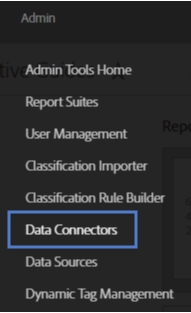
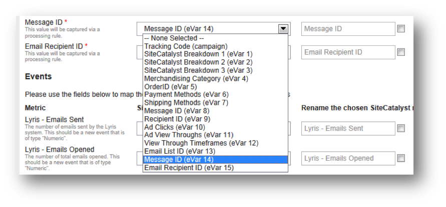

# Completing the Integration Wizard{#completing-the-integration-wizard}

Steps to use the integration wizard.

To activate the integration, you must complete the Lyris integration wizard within the Data Connectors interface. 

1. Navigate to the Data Connectors (formerly Genesis) area within the Adobe Marketing Cloud.

   

1. Under **[!UICONTROL Add Integration]**, drag and drop the Lyris plugin into the Adobe Marketing Cloud. This opens up the Lyris Data Connector Integration.

   

1. Under **[!UICONTROL General Settings]**, choose the desired Report Suite and provide a name for the integration.
1. Fill in all your Lyris account-related information under **[!UICONTROL Custom Values]**.

   

1. Choose the appropriate reserved eVars and events from the drop-down menus.

   

1. You may choose your own segments under **[!UICONTROL Your Segments]** - apart from the 3 automated Partner segments.
1. This integration may require downloading a few data point to your Lyris account. You may choose to give access for this under **[!UICONTROL Access Request]**.
1. Under **[!UICONTROL Data Collection]**, you can choose to have an automated or a manual solution (JavaScript Plug-in) to collect query string parameters from the landing page URL. If you choose to have an automated solution, enter your query string parameter for Message ID and Recipient ID. For a JavaScript Plug-in, contact your Adobe Consultant.

   

1. You may choose to have the Lyris Dashboard and bookmarks automatically generated for you.

   

1. Review the integration summary and click **[!UICONTROL Activate]**.
