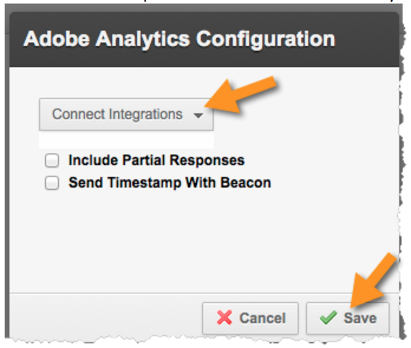
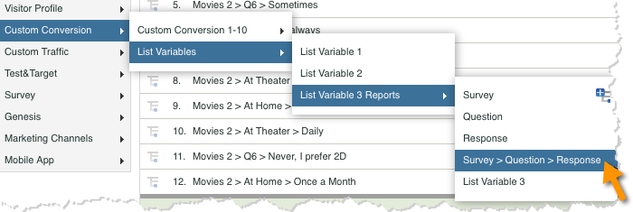
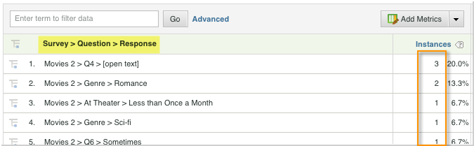

# Deploying the Integration{#deploying-the-integration}

Deploying this integration is a simple process that requires the following actions.

## Completing the Adobe Integration Wizard{#completing-the-adobe-integration-wizard}

To activate the integration you must complete the Qualtrics integration wizard within the Data Connectors interface

1. Navigate to data connectors and launch the Qualtrics integration wizard.
1. Select the report suite that you want to use for this integration and provide a name.

   Complete the integration wizard, providing the information described in the following steps. 1. **Wizard Step 1**

   |  Email Address  | The primary contact email address.  |
   |---|---|
   |  Description  | (Optional) Description for this integration setup.  |
   |  Qualtrics Organization ID  | [Looking up your Qualtrics Organization ID](../qualtrics-overview/qualtrics-org-id.md)  |
   |  Adobe SiteCatalyst Token  | [Generating your Qualtrics Adobe Analytics Token](../qualtrics-overview/qualtrics-token.md)  |

1. **Wizard Step 2 - Variable Mappings**

   |  Qualtrics Response List  | Select an available list variable from your report suite. (You may need to enable a new listVar within the Report Suite Manager.)  |
   |---|---|
   |  Qualtrics Response ID  | Select an available eVar or prop from your report suite. (You may need to enable a new listVar within the Report Suite Manager.)  |
   |  Tracking Server  |Provide the tracking server (domain) setting that you use to track Adobe Analytics data. Use the `trackingServerSecure` tracking server if it differs from your standard tracking server setting.  |
   |  Qualtrics Survey Submissions  | Select an available event from your report suite (you may need to enable a new event from within the Report Suite Manager).  |

1. **Wizard Step 3**: Nothing required, informational only.

   Step Result 1. **Wizard Step 4 - Export Settings**

   |  eVar  | Select up to five of your eVars to expose for exporting to Qualtrics  |
   |---|---|
   |  Events  | Select up to five of your custom events to expose for exporting to Qualtrics  |
   |  Props  | Select up to five of your Props to expose for exporting to Qualtrics  |
   |  Access Requests  |Check the box for any of the standard metrics and dimensions that you wish to export to Qualtrics. The `visitor_id` is required to allow the export to function properly.  |

1. **Wizard Step 5**: Review configuration and then click **[!UICONTROL Activate Now]**.

## Enabling the Integration in Qualtrics Research Suite{#enabling-the-integration-in-qualtrics-research-suite}

After completing the integration wizard, you must activate the integration for each Qualtrics survey that you want connected.

1. Log in to the Qualtrics Research Suite.
1. On the **[!UICONTROL My Surveys]** tab, click the **[!UICONTROL Edit]** button for the survey that you want to integrate.
1. Click the **[!UICONTROL Advanced Options]** menu and select **[!UICONTROL Adobe Analytics]**. (if you do not see this option, ask your administrator about gaining the permissions required).

   

1. Select the Adobe Analytics Configuration, then click **[!UICONTROL Save]**. If no configurations are available then you likely have not yet completed the Adobe Integration Wizard.
   1. The **[!UICONTROL Include Partial Responses]** checkbox can be used to indicate that you'd like to capture data into Adobe Analytics after each partial survey screen is completed. If not checked, then data is transferred only for fully completed surveys.
   1. The **[!UICONTROL Send Timestamp With Beacon]** checkbox should be used only when integrating with a Report Suite that is configured to receive time-stamped data (not common).

   

## Verifying the Integration{#verifying-the-integration}

After all deployment steps have been completed you can validate that the integration is successfully transferring data.

1. **Integration Activity Log**: In the Data Connectors UI, view the **[!UICONTROL Support]** tab on the Qualtrics integration. Under the heading **[!UICONTROL Integration Activity Log]** you should see entries stating successful classification data imported.

   >[!NOTE]
   >
   >These entries should appear within 1 hour of successful deployment.

   

1. **Reporting Data**: View your Qualtrics survey reports with the marketing reports and analytics UI by navigating the Qualtrics survey reporting (under **[!UICONTROL List Variables]**).

   >[!NOTE]
   >
   >This data should appear within 24-48 hours of successful deployment assuming that the integrated survey is actively receiving responses.

    
