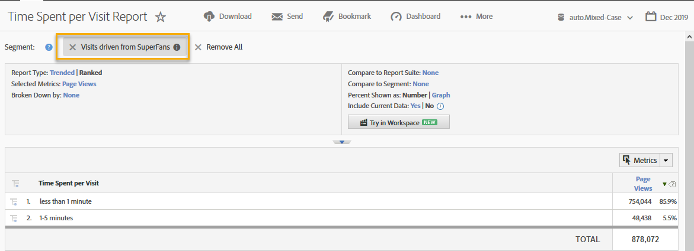
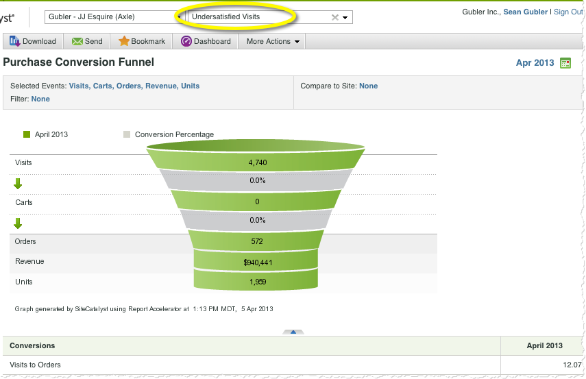

# Using the Integration{#using-the-integration}

After the deployment is complete, you can begin using the additional capabilities that this integration provides.

>[!NOTE]
>
>It can take 24-48 hours to begin seeing Qualtrics response data within your Adobe Analytics reporting.

The following are actions to take to get value from this integration from within Adobe Analytics.

1. Create a Segment using survey response data (see [Create a segment](https://experienceleague.adobe.com/docs/analytics/components/segmentation/seg-home.html)).
1. Apply the Segment to key reports.

## Example {#section-07051d0d60a44408a4e108034586c42f}

the following shows how an analyst might define an Adobe Analytics Segment using survey response data. This case assumes a survey question like "How satisfied were you with your visit today?" Using this question we can create a segment to identify "Undersatisfied" visitors. Such a segment could be used to drill into any Adobe Analytics reports - such as the Purchase Conversion Funnel, as shown below.

 
