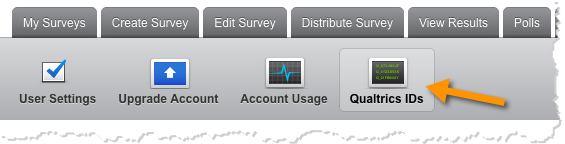
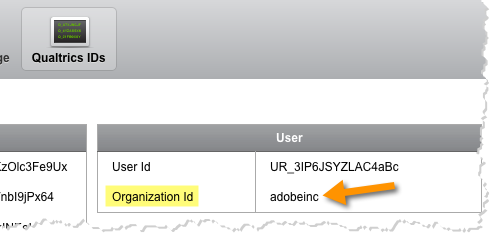

# Looking up your Qualtrics Organization ID{#looking-up-your-qualtrics-organization-id}

The Organization ID is required to complete the integration wizard. To find this ID you must do the following.

1. Log in to the Qualtrics Research Suite.
1. Click **[!UICONTROL Account Settings]** on your user menu.

   

1. Click on **[!UICONTROL Qualtrics IDs]**.

   

1. Find and save the **[!UICONTROL Organization Id]** in the **[!UICONTROL User]** section.

   
