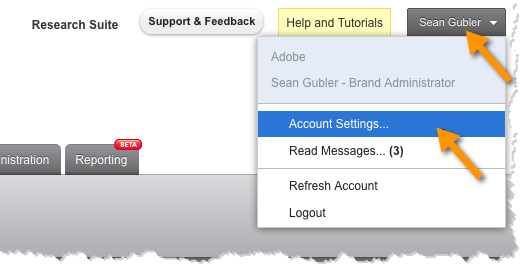
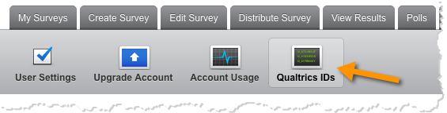

# Generating your Qualtrics Adobe Analytics Token{#generating-your-qualtrics-adobe-analytics-token}

A token is required to complete the integration wizard. To find this ID, complete the following.

1. Log in to the Qualtrics Research Suite.
1. Click **[!UICONTROL Account Settings]** on your user menu.

   

1. Click **[!UICONTROL Qualtrics IDs]**.

   

1. Click **[!UICONTROL Generate Token]** within the **[!UICONTROL Adobe SiteCatalyst]** section and save the token.

   

   >[!NOTE]
   >
   >If you do not see the option to generate an Adobe Analytics Token, please contact your Qualtrics account administrator to enable the appropriate permissions for your account.

