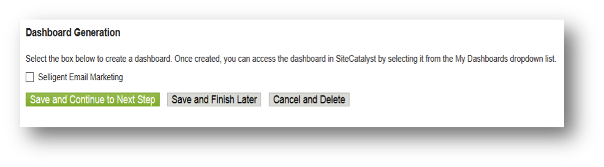

# Completing the Integration Wizard{#completing-the-integration-wizard}

To activate the integration you must complete the Selligent integration wizard within the Data Connectors interface.

1. Navigate to the Data Connectors area within the Adobe Experience Cloud.

   

1. Under **[!UICONTROL Add Integrations]**, drag and drop the Selligent plugin into Adobe Experience Cloud.

   

   This will open up the Selligent Data Connector Integration. 

1. **Integration Settings**: Choose the desired Report Suite and provide a name for the integration under **[!UICONTROL Integration Settings]**.

1. Under **[!UICONTROL Custom Values]**, fill in all your [Selligent account-related information](../../selligent-overview/selligent-activation/selligent-prereqs-seligent.md#concept-071c594b1bcc465cbce7a6fda3f1d829).

   

1. **Variable mapping**: Choose the appropriate [reserved eVars and events](../../selligent-overview/selligent-activation/selligent-configure-variables.md#concept-907c2bdbed274c11a46d4cc323ef0238) from the drop down menus:

   

1. **Data Settings**: You may choose your own segments under **[!UICONTROL Your Segments]** apart from the 3 automated **[!UICONTROL Partner]** segments. 

1. This integration may require downloading a few data point to your Selligent account. You may choose to give access for the same under **[!UICONTROL Access Request]**. 
1. Under **[!UICONTROL Data Collection]**, choose an automated or manual solution (JavaScript Plug-in) to collect query string parameters from the landing page URL. If you choose an automated solution, enter your query string parameter for Message ID and Recipient ID which is MID and RID respectively. For JavaScript Plug-in, contact your Adobe Consultant. 
1. **Report Settings**: Under **[!UICONTROL Dashboard Generation]**, check the box to have the Selligent dashboard automatically generated for you.

   

1. Review the integration summary and click **[!UICONTROL Activate]**.

