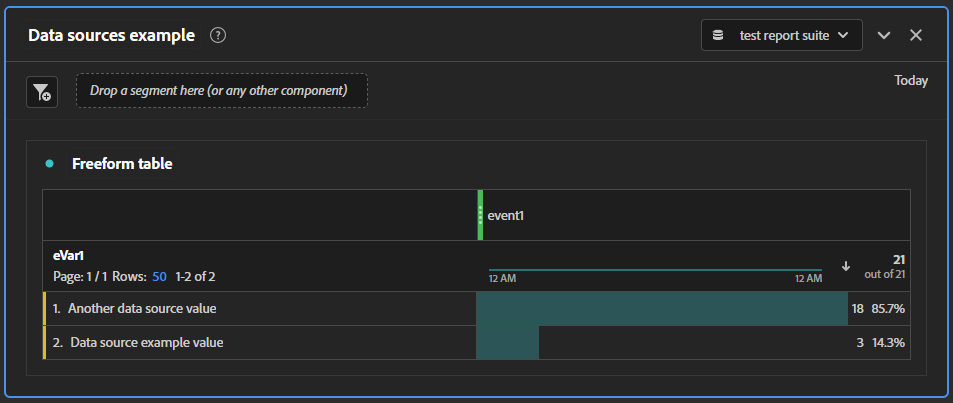

# Getting started with data sources

You can follow these steps to easily upload sample data into a development report suite to see the workflow in action. Once you understand the process, you can expand and tailor it specific to your organization's implementation.

>[!IMPORTANT]
>
>Follow these steps using a development or test report suite. Data uploaded through data sources are **permanent**. It impacts production report suite data if uploaded there.

1. Log in to Adobe Analytics through [https://experience.adobe.com](https://experience.adobe.com).
1. Navigate to **[!UICONTROL Admin]** > **[!UICONTROL All Admin]** > **[!UICONTROL Data sources]**.
1. Select a development report suite using the drop-down list in the top right.
1. Click the **[!UICONTROL Create]** button in the top left.
1. Under [!UICONTROL Select Category], choose "[!UICONTROL Generic]", and under [!UICONTROL Select Type], choose "[!UICONTROL Generic Data Source (Summary Data Only)]".
1. Click **[!UICONTROL Activate]**. A popup window opens revealing the [!UICONTROL Data Source Activation Wizard].
   1. Step 1: Give the data source a name, and click the disclaimer check box.
   1. Step 2: This step had more use in previous versions of Adobe Analytics. Click a check box, then type any value in the text field next to it.
   1. Step 3: Choose the metric to include in your data source template file. Select "Event 1" from the drop-down list.
   1. Step 4: This step had more use in previous versions of Adobe Analytics. Click a check box, then type any value in the text field next to it.
   1. Step 5: Choose the dimension to include in your data source template file. Select "eVar1" from the drop-down list.
   1. Step 6: Review the summary, showing the dimensions and metrics that are included in the template file.
   1. Step 7: Click the **[!UICONTROL Download]** button to download the data sources template file. Also note the login credentials to the FTP site, as they are used shortly.
1. The data source is now created; the next step is to give it data to process. Open the downloaded file in your desired text editor.
1. The template file contains three lines; two comment lines (starting with "`#`"), and a header row:

   ```text
   # Generic Data Source (Summary Data Only) template file (user: 123456789 ds_id: 2)
   #    eVar1    event1
   Date    Evar 1    Event 1
   ```

1. Enter in several rows of data, separating each entry by a tab. Do not use spaces or commas to separate values.
    * The first column is the date in the following format: `MM/DD/YYYY/HH/mm/SS`.
    * The second column is the text value that you want to include in eVar1.
    * The third column is the amount that you want to increase event 1.

    ```text
    # Generic Data Source (Summary Data Only) template file (user: 123456789 ds_id: 5)
    #    eVar1    event1
    Date    Evar 1    Event 1
    09/07/YYYY/11/23/00    Data source example value    3
    09/07/YYYY/15/59/00    Another data source value    18
    ```

1. Save the file. You can optionally give it a different file name, if desired. Once the file is saved, you can close the text editor.
1. In Windows Explorer, Finder, or your FTP client of choice, navigate to [ftp://ftp.omniture.com](ftp://ftp.omniture.com).
1. When prompted for login credentials, use the username and password provided in the last step of the data source creation wizard. You can reference it again by navigating to [!UICONTROL Data sources] and clicking **[!UICONTROL FTP Info]** next to the data source that you created.
1. Once you have authenticated, drag the file that you edited into the authenticated FTP window.
1. Create an empty text file in any location outside of the FTP window. Give it the same file name as the data sources file that you uploaded to the FTP site, with one exception. Instead of a `.txt` file type, give it a `.fin` file type. Make sure that your operating system settings allow you to see and change file types.
1. Drag the empty `.fin` file to the same FTP location as the data source file. The presence of the `.fin` file tells Adobe that the data source file is fully uploaded and ready to be ingested.
1. After several minutes, the file disappears from the FTP location and is visible in reporting.
1. Refresh the Data Sources page and validate that the file was ingested successfully.
1. Navigate to Analysis Workspace and create a project.
1. Drag eVar1 as a dimension to the workspace canvas, and event 1 as a metric. Make sure that the Workspace date range includes the dates that you provided in the data source.

    

## Next steps

[File format](file-format.md): Learn the details around creating a data sources file tailored to your organization.
