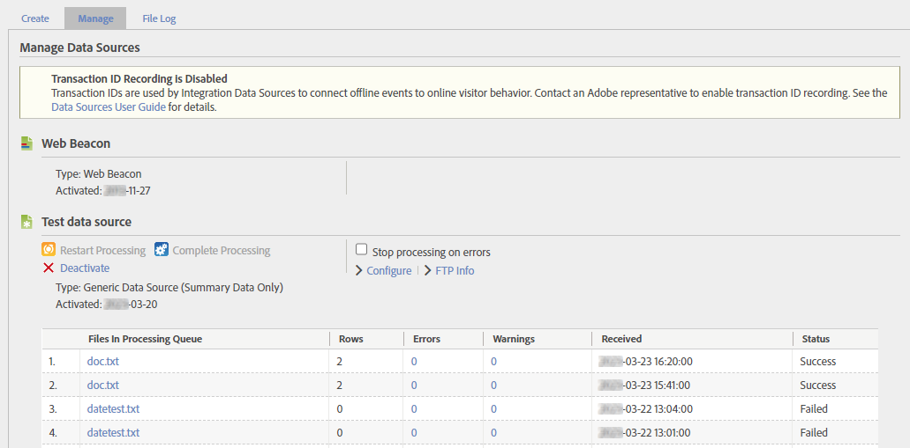
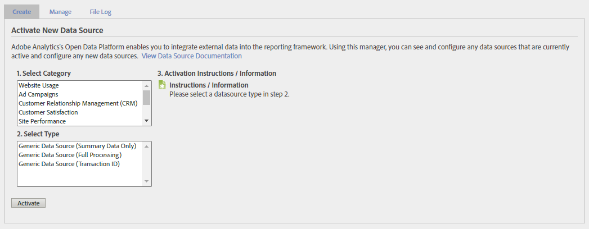
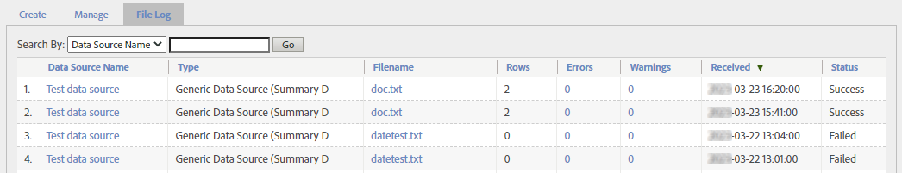

# Manage data sources

Use the data source manager to create, edit, or deactivate data sources. You can also use this interface to track the status of files uploaded to data sources FTP locations.

**[!UICONTROL Admin]** > **[!UICONTROL All Admin]** > **[!UICONTROL Data sources]**

Use the report suite selector in the top right to switch between report suites in your organization.

There are three main tabs to this interface; **[!UICONTROL Manage]**, **[!UICONTROL Create]**, and **[!UICONTROL File Log]**.

## Manage

The **[!UICONTROL Manage]** tab handles all data sources your organization has created. You can view FTP information, make edits to variables used in template files, or deactivate data sources entirely.

The topmost data source is always [!UICONTROL Web Beacon]. This is the data source that you use for typical data collection through AppMeasurement. It cannot be edited or deactivated.

Each data source has the following options:

* **[!UICONTROL Restart Processing]**: Restarts data source processing that previously stopped due to errors. Processing continues until the next error is encountered. Data Sources halts processing of a Data Sources file only when you select **[!UICONTROL Stop processing on errors]**.
* **[!UICONTROL Complete Processing]**: No longer used - this button was only used for [Full processing data sources](full-processing-eol.md).
* **[!UICONTROL Stop processing on errors]**: A checkbox that instructs the processing server to halt when it encounters an error. The data source does not resume processing until you select **[!UICONTROL Restart Processing]**. When data sources encounters a file error, it notifies you of the error. Adobe moves the file with the error into a folder called `files_with_errors` on the FTP server. After you have resolved the problem, resubmit the file for processing.
* **[!UICONTROL Configure]**: A link that takes you through the Data sources creation wizard for this data source. This wizard lets you rename the data source, or reconfigure the variables automatically included when downloading a template file.
* **[!UICONTROL FTP Info]**: A link that takes you to the last step of the Data sources creation wizard where FTP credentials are displayed.

Once a data source receives data, a table is shown containing several columns for the files uploaded.

* **[!UICONTROL Files In Processing Queue]**: The name of the file.
* **[!UICONTROL Rows]**: The total number of rows in the file.
* **[!UICONTROL Errors]**: The number of rows that contained errors and could not be ingested.
* **[!UICONTROL Warnings]**: The number of rows that contained warnings.
* **[!UICONTROL Received]**: The timestamp that the file was received in the report suite's time zone.
* **[!UICONTROL Status]**: The status of the file (`Success` or `Failed`).

## Create

The **[!UICONTROL Create]** tab gives you a starting point for the Data sources creation wizard.

The category and type of data source were more valuable in previous versions of Adobe Analytics. However, they still have limited use:

* The data source type is shown on the [Manage](#manage) tab for the data source itself, and the [File Log](#file-log) tab for each individual file
* Some data source types automatically include variables when downloading the template file. However, you can include any available dimension or metric as long as it adheres to the established [File format](file-format.md).

Beyond these reasons, all data source categories and types that you can choose are effectively identical. Pick the category and type that best represents your purpose for using data sources.

With the retiring of [Full processing data sources](full-processing-eol.md), several categories and types cannot be selected. If you select a full processing data source type, the **[!UICONTROL Activate]** button is greyed out.

## File Log

The **[!UICONTROL File Log]** tab gives you an aggregated view of all data source files uploaded for the given report suite.

A search bar is available that helps you locate a specific data source. The table shows the following columns:

* **[!UICONTROL Data Source Name]**: The name of the data source.
* **[!UICONTROL Type]**: The type of the data source.
* **[!UICONTROL Filename]**: The name of the file that was uploaded.
* **[!UICONTROL Rows]**: The total number of rows in the file.
* **[!UICONTROL Errors]**: The number of rows that contained errors.
* **[!UICONTROL Warnings]**: No longer used. The number of rows that contained warnings.
* **[!UICONTROL Received]**: The date and time of when Adobe started processing the file.
* **[!UICONTROL Status]**: The file's status, `Success` or `Failed`.
