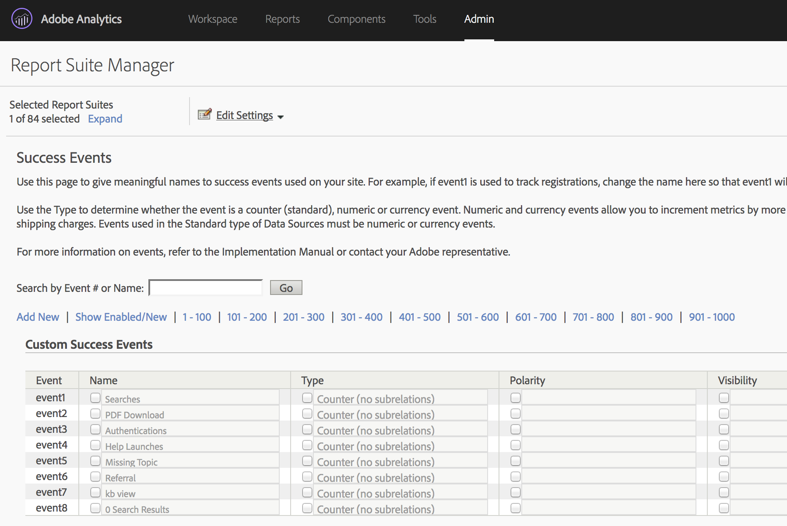
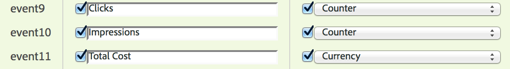
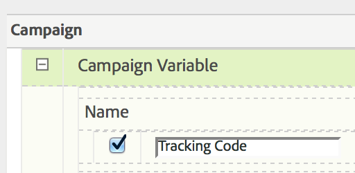
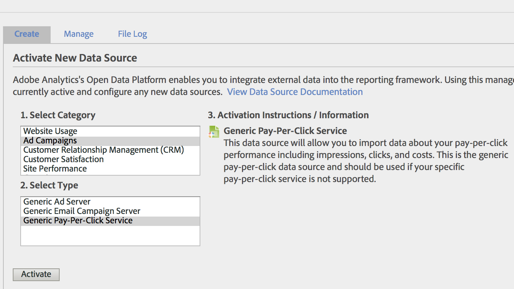
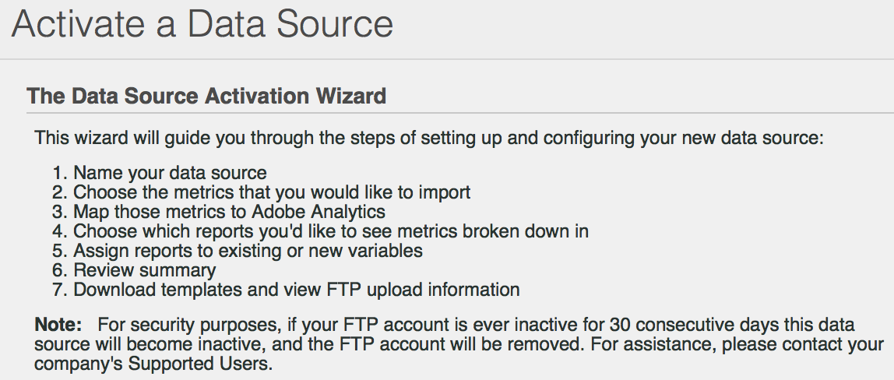
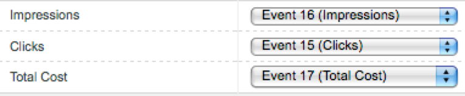
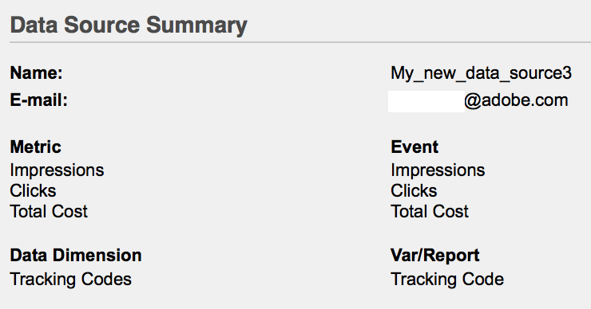
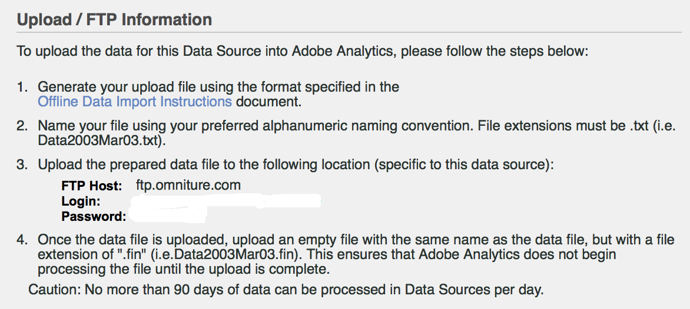

# Import [!UICONTROL Paid Search] metrics using [!UICONTROL Data Sources]

For many marketing organizations, paid search is one of the most valuable and reliable ways both​ to reach new customers and to retain existing ones. The [!UICONTROL Data Sources] capability in Adobe Analytics makes it easy to import advanced paid search data from digital advertising platforms like Google AdWords. You can integrate it with the rest of your marketing data, alongside on-site behavioral and customer attribute data, to allow you better insights into your organization's paid search efforts.

These steps show you how to configure an integration with AdWords to import keyword data as well as metrics such as impressions, clicks, cost per click, and more.

The steps explain how to set up a one-time import of Pay-Per-Click data. However, [!UICONTROL Data Sources] allows for the ongoing import of data using the file format described here. Depending on your paid search platform, you may be able to schedule periodic exports (daily, monthly, etc.), set up automated processes for transforming those exports into the file format that Adobe Analytics requires, and upload these files into Adobe Analytics for going paid search integration reporting.

## Prerequisites

* You have implemented paid search detection.
* You are capturing tracking code data.
* You have unique tracking codes for each Ad Group.

## Configure [!UICONTROL Success Events]

Our first step is to prepare Adobe Analytics to receive the metrics. To do this, you need to set up some success events.

[!UICONTROL Success events] are actions that can be tracked. You determine what a [!UICONTROL success event] is. For our purposes of tracking [!UICONTROL paid search] metrics, we want to set up [!UICONTROL success events] around [!UICONTROL clicks], [!UICONTROL impressions], [!UICONTROL total cost] and enable[!UICONTROL tracking codes].

1. Go to **[!UICONTROL Adobe Analytics > Admin > Report Suites]**.
1. Select a report suite.
1. Click **[!UICONTROL Edit Settings > Conversion > Success Events]**.

    

1. Under Custom Success Events, use **[!UICONTROL Add New]** to create 3 custom success events: [!UICONTROL Clicks] (Counter), [!UICONTROL Impressions] (Counter) and [!UICONTROL Total Cost] (Currency).

    

1. Click Save.
   You should receive a message that your saves were approved.
1. Navigate to **[!UICONTROL Admin > Report Suites > Edit Settings > Conversion > Conversion Variables]**.
1. Enable tracking codes by selecting the checkbox next to **[!UICONTROL Tracking Code]** under **[!UICONTROL Campaign > Campaign Variable]**.

    

## Set up Data Sources

[!UICONTROL Data Sources] allow you to share non-clickstream data with Adobe Analytics. In this case we use Adobe Analytics to track paid search metrics. We use the tracking code as our key to tie the two pieces of data - paid search metrics and Adobe Analytics metrics - together.

1. Navigate to **[!UICONTROL Adobe Analytics > Admin > All admin > Data sources]**.
1. Select the **[!UICONTROL Create]** tab to start activating new data sources.
1. Under **[!UICONTROL Select Category]**, select **[!UICONTROL Ad Campaign]**.

    

1. Under **[!UICONTROL Select Type]**, select **[!UICONTROL Generic Pay-Per-Click Service]**.
1. Click **[!UICONTROL Activate]**.
    The [!UICONTROL Data Source Activation Wizard] displays:

    

1. Click **[!UICONTROL Next]** and name your data source. This name appears in the Data Source Manager.
1. Accept the service agreement and click **[!UICONTROL Next]**.
1. Select the three standard metrics: [!UICONTROL Impressions], [!UICONTROL Clicks] and [!UICONTROL Total Cost] and click **[!UICONTROL Next]**.
1. Now “map” this new data source to the custom events we created in [Configure Success Events](/help/admin/admin/c-success-events/t-success-events.md).

    

1. Choose data dimensions
    Check the box next to Tracking Codes and click **[!UICONTROL Next]**.
1. Map data Dimensions.
    Map the imported data dimension (attribute) to the Adobe Analytics attribute that you want to store it in. This may be a standard dimension or an eVar. After you click **[!UICONTROL Next]**, the resulting mappings are shown in the summary:

    

1. Click **[!UICONTROL Save]**.
1. Click **[!UICONTROL Download]** to download the template file for this data source.
    The file name corresponds to the data source type you initially specified - in this case, "Generic Pay-Per-Click Service template.txt".
1. Open the template in your favorite text editor.
    The file is already populated with the metrics and dimensions and their mappings.

## Export PPC data and upload it to Analytics

Steps similar to these work for Google Adwords, MSN, Yahoo, and other PPC accounts.

### Export data

1. Log in to your PPC Account and create a new report or export.
    Ensure that the export includes the following fields: date, destination URL (landing page), impressions, clicks, and cost. The export can include other fields, but you will delete them the steps below.
1. If possible, save the report as a `.csv` or tab-delimited file. This will make it easier to work with in the following steps.
1. Open the file in Microsoft Excel.

### Edit the file in Microsoft Excel

1. In Microsoft Excel, delete all columns other than those mentioned above.
1. Delete any extra rows on top.
1. To isolate the tracking codes from the destination URLs:
    a. Copy and paste data from all columns.
    b. Click **[!UICONTROL Data > Text to Columns]**.
    c. In Step 1 of the wizard, make sure that **[!UICONTROL Delimited]** is selected and click **[!UICONTROL Next]**.
    d. In Step 2 of the wizard, specify the delimiter depending on how you have created your URLs (either ? or &) and click **[!UICONTROL Next]**.
    e. In Step 3 of the wizard, preview your data and ensure that one of the columns is "trackingcodename=trackingcode". If you have additional variables, repeat these steps (using & as the delimiter).
    f. Delete all columns except for tracking codes, impressions, clicks and cost. Add a new column called Date and organize your columns in the following order: Date :: Tracking code :: Impressions :: Clicks :: Cost.
1. Add this data to the template you downloaded in the "Set up Data Sources" section above.
    Now you are ready to upload the file.

### Upload the file to Adobe Analytics via FTP

Go back to the Data Source wizard for instructions and upload the file via FTP:

## Create Calculated Metrics

Adding calculated metrics will be helpful when making pay-per-click decisions.

For example, you could add these [calculated metrics](https://experienceleague.adobe.com/docs/analytics/components/calculated-metrics/calcmetric-workflow/cm-build-metrics.html?lang=en#calculated-metrics):

| Name | Formula | Metric Type | Description |
| --- | --- | --- | --- |
| Page Views per Visit | Page Views/Visits | Numeric | When applied at a site level: shows the average number of pages per visit. When applied in the Most Popular Pages report: shows the average number of times a specific page was viewed per visit. |
| Average Order Value | Revenue/Orders | Currency | Shows average revenue per order. |
| Revenue per Visit | Revenue/Visit | Currency | Shows average revenue per visit. |
| Click-Through Rate (CTR) | Clicks/Impressions | Numeric | Measure the ratio of clicks to impressions of an online ad or email marketing campaign. |
| Profit | Revenue - Cost | Currency | Shows the revenue of a campaign minus the cost. |
| Profit per Impression (PPI) | (Revenue - Cost)/Impression | Currency | Shows how much revenue was being generated every time an ad displayed, balanced with cost. |
| Return on Ad Spend (ROAS) | Sales amount/ad spend | Currency | (ROI) Represents the dollars earned per dollars spent on the corresponding advertising. |

## Configure and run reports

The final step is to add the data source metrics and any calculated metrics to the Tracking Code report and drill down into a campaign to get an immediate view of how each Ad Group is performing.

1. In **[!UICONTROL Adobe Analytics > Reports]**, select the report suite into which you have imported data sources.
1. Navigate to **[!UICONTROL Reports > Campaigns > Tracking Code > Tracking Code]**.
1. Select the date range.
1. Click **[!UICONTROL Metrics > Add]** and add your data source metrics (Clicks, Impressions, Total Cost) from the list of Standard Metrics.
1. Do the same for any calculated metrics you may have added. The report will update as you add metrics.
