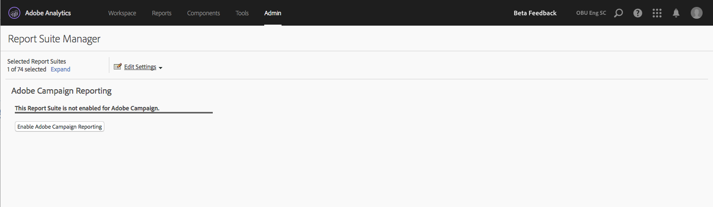

# Adobe Campaign reporting

For more information on how to configure this integration, go to the [Adobe Campaign documentation](https://helpx.adobe.com/campaign/standard/integrating/using/about-campaign-analytics-integration.html).

This integration between Adobe Analytics and Adobe Campaign

* Lets you share your KPI (Key Performance Indicator) data from Adobe Campaign Standard to Adobe Analytics.
* Enriches tracking formulas with Adobe Analytics parameters.
* Adds a new report under  **[!UICONTROL Analytics]** > **[!UICONTROL Reports]** > **[!UICONTROL Adobe Campaign.]** 
* Adds 5 new Adobe Campaign classifications.
* Adds 9 new Adobe Campaign metrics.
* Adds 6 new Adobe Campaign dimensions.
* Synchronizes data to Analytics every 15 minutes.

## Step 1. Enable Adobe Campaign Reporting {#section_C685EF10505045708A6536BB13F6CD58}

In order to view Campaign data in Analytics, you first have to enable Campaign reporting.

1. Navigate to  **[!UICONTROL Analytics]** > **[!UICONTROL Admin]** > **[!UICONTROL Report Suites]** > **`<select report suite>`** > **[!UICONTROL Edit Settings]** > **[!UICONTROL Adobe Campaign]** > **[!UICONTROL Adobe Campaign Reporting]** .
1. Click **[!UICONTROL Enable Campaign Reporting]**.

   

## Step 2. View Adobe Campaign Reports {#section_9C18A29F3CC54BD4AC5EA96417F17B33}

The integration between Adobe Campaign Standard and Adobe Analytics adds the following report under  **[!UICONTROL Analytics]** > **[!UICONTROL Reports]** 

| Report | Definition |
|--- |--- |
| Adobe Campaign Executed Delivery ID | Shows data imported from Adobe Campaign about emails that were sent from Adobe Campaign. |

## Step 3. Use Adobe Campaign Classifications {#section_74A28AF3F4CA4091943789DE4D8B2B63}

**[!UICONTROL Analytics]** > **[!UICONTROL Admin]** > **[!UICONTROL Report Suites]** > **`<select report suite>`** > **[!UICONTROL Edit Settings]** > **[!UICONTROL Adobe Campaign]** > **[!UICONTROL Adobe Campaign Classifications]**

Once your report suite is enabled for Adobe Campaign, the following classifications are available:

* Delivery ID (Internal Delivery Name that you see in Campaign) 
* Delivery Label ((Delivery in Campaign - Individual Delivery/Recurring Delivery/Transaction Delivery) 
* Campaign ID (Internal Campaign Name that you see in Campaign) 
* Campaign Label (Campaign in Adobe Campaign) 
* Executed Delivery Label (List of individual executed deliveries)

## Adobe Campaign Dimensions and Metrics available in Adobe Analytics {#section_F33385C9660644AF84172EC39601469B}

The following **metrics** are available from Campaign in Adobe Analytics report suites:

* Adobe Campaign Sent 
* Adobe Campaign Opened 
* Adobe Campaign Clicked 
* Adobe Campaign Delivered 
* Adobe Campaign Unique Open 
* Adobe Campaign Unique Click 
* Adobe Campaign Unsubscribed 
* Adobe Campaign Total Bounces 
* Adobe Campaign Executed Delivery ID Instances

The following **dimensions** are available from Campaign in Adobe Analytics report suites: 

| Dimension Name | Definition |
|--- |--- |
|Campaign ID|ID of all campaigns for which KPI's have been sent during duration|
|Campaign Label|Labels of Campaign IDs|
|Delivery ID|ID of all deliveries for which KPI's have been sent during duration. Also includes IDs of master deliveries of recurring delivery and transaction delivery. Example: A recurring delivery DM1 was scheduled and DM2, DM3, DM4 and DM5 were child deliveries of the recurring delivery.  The Delivery ID displays results for all deliveries, DM1 through DM5.|
|Delivery Label|Labels of Delivery IDs|
|Executed Delivery ID|IDs of only executed deliveries. No ID of recurring/ transactional master delivery. Example: A recurring delivery DM1 was scheduled and DM2, DM3, DM4 and DM5 were child deliveries of the recurring delivery. Executed Delivery ID displays results for all deliveries starting from DM2 to DM5 - the deliveries which have actually been executed.|
|Executed Delivery Label|Labels of Executed Delivery IDs|
