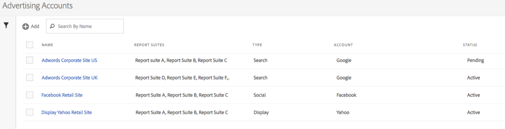

# Set up an Advertising Account

Adobe Analytics Administrators can create new advertising accounts and map multiple accounts to multiple report suites (1:1, 1:Many, Many:Many).

Administrators can also [grant access to non-admins](/help/integrate/c-advertising-analytics/overview.md#section_FCC58EB635954A32990D4E67B52B4369) for setting up advertising accounts.

1. In Adobe Analytics, navigate to **[!UICONTROL Admin]** > **[!UICONTROL Advertising Accounts]**.
1. (First-time use only) Accept the terms of the End User License Agreement.
1. Click **[!UICONTROL + Add]**.
1. The [!UICONTROL New Search Engine Account] dialog displays:

   

1. Fill in the **[!UICONTROL Search Engine Settings]** following these guidelines: 

    <table id="table_B3BE66B7D4C54766B8FFD2C6DCD657AF"> 
    <thead> 
      <tr> 
      <th colname="col1" class="entry"> Setting </th> 
      <th colname="col2" class="entry"> Description </th> 
      </tr>
    </thead>
    <tbody> 
      <tr> 
      <td colname="col1"> 
Type 
 </td> 
      <td colname="col2"> 
You have 2 options: Google AdWords and Microsoft Bing Ads. 
 
Note: Yahoo Gemini was absorbed by Microsoft Bing on March 31, 2019. As a result, the Yahoo Gemini advertising account option is no longer available.  
 </td> 
      </tr> 
      <tr> 
      <td colname="col1"> 
Account name 
 </td> 
      <td colname="col2"> 
You can choose to set this account name to any name that suits you. This is the friendly name of the account that will appear in the UI. 
 </td> 
      </tr> 
      <tr> 
      <td colname="col1"> 
OAuth Token 
 </td> 
      <td colname="col2"> 
Note:  OAuth is an open standard for access delegation, commonly used as a way to grant web sites or applications access to their information on other web sites but without giving them the passwords. 
 
Note:  You will notice that you will get routed to a third-party URL (efrontier.com). Adobe uses efrontier to power the OAuth authentication process for all three search engines. 
 
Note:  If you use Internet Explorer 11 (or earlier), you will not be able to successfully retrieve the Oauth token for any of the three search engines. Use other web browsers instead. 
 
Clicking Retrieve Token launches the OAuth2 authentication process. This means that you will be asked to sign in to your Google/Bing search account using your credentials. Depending on which search engine you chose, the process is slightly different: 

      <ul id="ul_FC9B5612F6554495B04C357CB0AB72EB"> 
       <li id="li_CD54231BFF134F83B3B5B14B34A0E1D2">Google Adwords: Provide Google Account ID. </li> 
       <li id="li_89B9D54BAA914E5DB2959B193489582E">Microsoft Bing: Provide Bing Account ID and Bing Customer ID. </li> 
       </ul> 
Refer to <a href="/help/integrate/c-advertising-analytics/c-adanalytics-workflow/aa-locate-account-id.md"  > Locate your Account ID</a> for information on these IDs. 
 
Once you have successfully logged in, the OAuth Token field will display <code>Retrieved</code>. 
 </td> 
      </tr> 
    </tbody> 
    </table>

1. In the **[!UICONTROL Tracking]** section, you provide information on how the Search Engine data is tracked by your Adobe Analytics implementation. This is a required step to properly augment the Adobe Analytics data with the Search Engine data.
   Fill in the **[!UICONTROL Tracking Settings]** following these guidelines: 

    | Setting | Description |
    |--- |--- |
    |Type|<ul><li>**Auto:** Lets the Advertising Cloud Engine decide how the tracking parameters are appended to the Search Engine's tracking templates/destination URLs. This is the simplest approach, but may not result in the best integrated dataset. **Important:** In order to configure a search engine account in 'Auto Mode', you are responsible for taking the following actions: - The "s_kwcid" parameter and value will be added to the account tracking templates or landing page URLs in the account being added. This will be inserted at the end of the URL. As a result, additional action may be required on your part if your web server requires a certain key=value pair at the end of the URL OR an update to support any new key=value pair in the URL. **Note:** Learn more on whether you should add this parameter to your [Content Security Policy](https://experienceleague.adobe.com/docs/ id-service/using/reference/csp.html). - In addition, keywords can be inserted into the landing URL as part of the "s_kwcid" value, so if they contain special characters or symbols, please confirm that your web server can support those characters (an example of a common special characters is "+" which is used in "Broad Match Modified" keywords).</li><li>**Manual:** Lets you manage how the tracking parameters are added to the Search Engine's tracking templates/destination URLs. [Refer to these manual tracking examples for each search engine](/help/integrate/c-advertising-analytics/c-adanalytics-workflow/aa-manual-vs-automatic-tracking.md).</li></ul>|

1. In the **[!UICONTROL Mapping]** section, you choose which report suite(s) to link to this search engine account. You need to provide at least one report suite before you can save the Advertising Account. You can map multiple accounts to multiple report suites (1:1, 1:Many, Many:Many). Note that the data that AMO pulls from the search engine is simply copied to any mapped report suite, so there is no splitting of data.

   >[!IMPORTANT]
   >
   >Only report suites that have been [mapped to an Experience Cloud organization](https://experienceleague.adobe.com/docs/ core-services/interface/about-core-services/report-suite-mapping.html) will be available for selection. If you do not see your report suite listed, refer to [Troubleshoot Advertising Analytics](/help/integrate/c-advertising-analytics/c-adanalytics-workflow/aa-troubleshooting.md).

   For the **[!UICONTROL Mapping Settings]** following these guidelines: 

    <table id="table_AF876DC40F97403882C0AA528BD204FF"> 
    <thead> 
      <tr> 
      <th colname="col1" class="entry"> Setting </th> 
      <th colname="col2" class="entry"> Description </th> 
      </tr>
    </thead>
    <tbody> 
      <tr> 
      <td colname="col1"> 
Report Suite Mapping 
 </td> 
      <td colname="col2"> 
The report suite mapping determines the report suite that gets linked to this search engine account. In other words, it determines into which report suite/s the search engine data gets sent. 
 
If you do not see your report suite listed, you can <a href="https://experienceleague.adobe.com/docs/ core-services/interface/about-core-services/report-suite-mapping.html"  > map your report suite to an Experience Cloud organization</a> using this tool. 
 </td> 
      </tr> 
    </tbody> 
    </table>

1. Click **[!UICONTROL Save]**.
1. After you save, a disclaimer displays a list of caveats. You are asked to confirm that you have read and you understand this agreement. Click the checkbox, then click **[!UICONTROL OK]**.

   You are now taken to the Advertising Accounts [Management UI](/help/integrate/c-advertising-analytics/c-adanalytics-workflow/aa-manage-ad-accounts.md), where your newly created account should be listed.

>[!NOTE]
>
>You should expect to wait at least 24 hours before Search engine data starts populating your Analytics reports.
