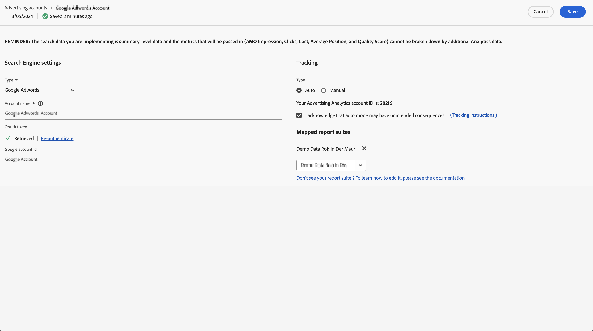

# Set up an Advertising Account

Adobe Analytics Administrators can create new advertising accounts and map multiple accounts to multiple report suites (1 : 1, 1 : Many, Many : Many).

Administrators can also [grant access to non-admins](/help/integrate/c-advertising-analytics/overview.md#section_FCC58EB635954A32990D4E67B52B4369) for setting up advertising accounts.

<!--

-->

1. In Adobe Analytics, navigate to **[!UICONTROL Admin]** > **[!UICONTROL Advertising Accounts]**.
1. (First-time use only) Accept the terms of the End User License Agreement.
1. Select **[!UICONTROL + Add]**.
1. The [!UICONTROL New search engine setting] dialog displays.

   

1. Fill in the **[!UICONTROL search engine Settings]** following these guidelines: 

   | Setting | Description|
   | --- | --- |
   | **[!UICONTROL Type]** | You have 2 options: **[!UICONTROL Google Adwords]** and **[!UICONTROL Bing Ads]**. Note: Yahoo Gemini was absorbed by Microsoft on March 31, 2019. As a result, the Yahoo Gemini advertising account option is no longer available. |
   | Account name | You can choose to set this account name to any name that suits you.  Account name is the friendly name of the account that appears in the UI.|
   | OAuth Token | **Note**: OAuth is an open standard for access delegation, commonly used as a way to grant web sites or applications access to information on web sites but without providing passwords. You notice that you get routed to a third-party URL (efrontier.com). Adobe uses Adobe Media Optimizer to power the OAuth authentication process for all three search engines. If you use Internet Explorer 11 (or earlier), you are unable to retrieve the Oauth token for any of the three search engines. Use other web browsers instead.
Select **[!UICONTROL Retrieve Token]** to launch the OAuth2 authentication process. You are asked to sign in to your Google Ads or Microsoft Advertising search account using your credentials. Depending on which you chose, the process is slightly different: <ul><li>Google Ads: Provide Google Account ID</li><li>Microsoft Advertising: Provide your Account ID and Manager account ID.</li></ul>Refer to [Locate your Account ID](aa-locate-account-id.md) for information on these IDs. Once you have successfully logged in, the **[!UICONTROL OAuth Token]** field displays **[!UICONTROL Retrieved]**. |

1. In the **[!UICONTROL Tracking]** section, you provide information on how to track the data using your Adobe Analytics implementation. Tracking is a required step to augment the Adobe Analytics data properly with the search engine data.
   Fill in the **[!UICONTROL Tracking Settings]** following these guidelines: 

    | Setting | Description |
    | --- | --- |
    | Type | <ul><li>**Auto**: Lets the Advertising Cloud Engine decide how the tracking parameters are appended to the 's tracking templates/destination URLs. [!UICONTROL Auto Type Tracking] is the simplest approach, but may not result in the best integrated dataset. **Important:** To configure a search engine account with [!UICONTROL Auto Type Tracking], you are responsible for taking the following actions:<ul><li>The `s_kwcid` parameter and value is added to the account tracking templates or landing page URLs in the account being added. The parameter and value are inserted at the end of the URL. Additional action may be required if your web server requires a certain `key=value` pair at the end of the URL. Or an update to support any new `key=value` pair in the URL is required. **Note**: Learn more on whether you should add this parameter to your [Content Security Policy](https://experienceleague.adobe.com/en/docs/id-service/using/reference/csp).</li><li>In addition, keywords can be inserted into the landing URL as part of the `s_kwcid` value. If the keywords contain special characters or symbols, please confirm that your web server can support those characters. An example of a common special characters is `+`, which is used in "Broad Match Modified" keywords.</li></ul></li><li>**Manual**: Lets you manage how the tracking parameters are added to the search engine's tracking templates/destination URLs. [Refer to these manual tracking examples for each search engine](/help/integrate/c-advertising-analytics/c-adanalytics-workflow/aa-manual-vs-automatic-tracking.md).</li></ul>|

1. Select **[!UICONTROL Save]**.
1. A disclaimer displays a list of caveats. Confirm that you have read and you understand this agreement. Select the checkbox, then select **[!UICONTROL OK]**.

   You are now taken to the Advertising Accounts [Management UI](/help/integrate/c-advertising-analytics/c-adanalytics-workflow/aa-manage-ad-accounts.md), where your newly created account should be listed.

>[!NOTE]
>
>You should expect to wait at least 24 hours before search engine data starts populating your Analytics reports.
