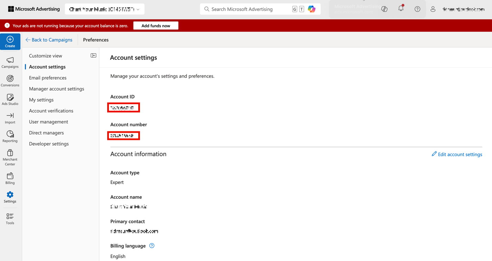

# Locate your account IDs

Learn how to locate your account IDs for Google Ads and Microsoft Advertising.

## Google Ads (AdWords)

>[!IMPORTANT]
>
>Google Ads uses two types of accounts: 
>
>- MCC (My Client Center) Account, and 
>- Standard Account. 
>
>For this integration with Adobe Analytics, **you must use a Standard Account login**, not an MCC Account login. The reason is that an MCC account acts as an "umbrella" account that can access multiple Google Ads accounts with a single login, whereas the Standard account login can access only one account per login. While Google supports linking one email to manage 5 accounts, Advertising Analytics doesn't support this feature yet. One email can be linked with only one Google Ads account.

Click the Account icon on the top right to view the Google Ads account number (Customer ID).

## Microsoft Advertising (Bing)

>[!NOTE]
>
>If your Microsoft Advertising (formerly known as Bing) account uses the Google import feature, be sure to update the correct tracking string. The tracking string is not automatically updated from the Google version to the correct Microsoft Advertising tracking string and can result in unspecified data. See [What gets imported from Google Ads](https://help.ads.microsoft.com/apex/index/3/en/50851/) in Microsoft Advertising help for more information.

The **[!UICONTROL Account ID]** and **[!UICONTROL Manager account ID]** are both required.

- The **[!UICONTROL Account ID]** is located under **[!UICONTROL Settings]** > **[!UICONTROL Account settings]** > **[!UICONTROL Account ID]**. Make sure that you use [!UICONTROL Account ID] and NOT [!UICONTROL Account number].
- The **[!UICONTROL Manager account ID]** is located under **[!UICONTROL Settings]** > **[!UICONTROL Manager account settings]** > **[!UICONTROL Manager account ID]**. Make sure that you use [!UICONTROL Manager account ID] and NOT [!UICONTROL Manager account number].

>[!CONTEXTUALHELP]
>id="adanalytics_ma_account_id"
>title="Account ID"
>abstract="The 'Account ID' is a numeric value located in the Microsoft Advertising interface. You can locate it by navigating to Settings > Account settings > Account ID.

>[!CONTEXTUALHELP]
>id="adanalytics_ma_manager_account_id"
>title="Manager account ID"
>abstract="The 'Manager account ID' is a numeric value located in the Microsoft Advertising interface. You can locate it by navigating to Settings > Manager account settings > Manager account ID."
