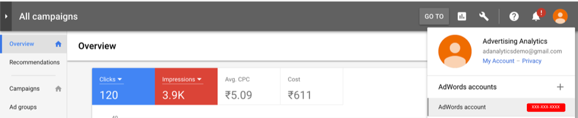

# Locate your account IDs

Here are instructions on helping you to locate your account IDs for Google and Bing.

## Google AdWords {#section_2A62AD448BD949889DB77C2AF3E04C33}

>[!IMPORTANT]
>
>Google AdWords uses two types of accounts: a) MCC (My Client Center) Account and b) Standard Account. For this integration with Adobe Analytics, **you must use a Standard Account login, not an MCC Account login**. The reason is that an MCC account acts as an "umbrella" account that can access multiple AdWords accounts with a single login, whereas the Standard account login can access only one AdWords account per login. Whereas Google supports linking one email to manage 5 Accounts, Advertising Analytics doesn't support this feature yet. One email can be linked with one Adwords account only.

Click the Account icon on the top right to view the AdWords account number (Customer ID).

## Bing {#section_F1B9C7E997444746936599732CD62665}

>[!NOTE]
>
>If your Bing account is utilizing the Google import feature, be sure to update the correct tracking string. The tracking string will not automatically update from the Google version to the correct Bing tracking string and may result in unspecified data. More details on the feature can be found [here](https://help.ads.microsoft.com/apex/index/3/en/50851/).

The Account ID and Customer ID are both required. They are listed on the Accounts tab.

>[!NOTE]
>
>The Account Number is not the same as the Account ID.

