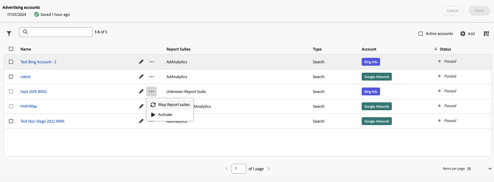

# Manage advertising accounts

You can access the Advertising accounts interface by navigating to **[!UICONTROL Admin]** > **[!UICONTROL Advertising accounts]**.

You see a table listing the advertising accounts. If no advertising accounts are available, select **[!UICONTROL Create new advertising account]**.

The table consists of the following columns:

| Name or element | Description |
|---|---|
| **[!UICONTROL Name]** | *Name of account*. You can select the name to edit the search engine settings.  |
|  | Select to rename the advertising account or edit the search engine settings. |
|  | Select to open a context menu allowing you [map report suites](#map-reporting-suites), [activate or pause advertising accounts](#activate-or-pause-advertising-accounts). |
| **[!UICONTROL Report suites]** | Lists the report suites that the advertising account is mapped to. |
| **[!UICONTROL Type]** | Shows the type of advertising account. By default the type is [!UICONTROL Search] |
| **[!UICONTROL Account]** | Show the account type, either [!UICONTROL Bing Ads] or [!UICONTROL Google Adwords]. |
| **[!UICONTROL Status]** | The status of the advertising account: *Paused* or Active. |

- To filter the list by Report suite, Type and Status, select 
- To search for your advertising account using the  search field.
- To select active accounts in the table, check **[!UICONTROL Active accounts]**.
- To define which columns to show for the table, select .  In the **[!UICONTROL Customize table]** dialog:
  - Select the columns that you want to show.
  - Select **[!UICONTROL Apply]**.

When you select one or more advertising accounts, a blue action bar, based on status of the selected accounts, allows you to  **[!UICONTROL Rename]**,  **[!UICONTROL Map Report Suites]**,  **[!UICONTROL Activate]** or  **[!UICONTROL Pause]** your advertising accounts.

## Create an advertising account

To create a new advertising account:

1. Select  **[!UICONTROL Add]**.
1. You see the [!UICONTROL Advertising Accounts] > **[!UICONTROL New account]** dialog to let you define a new advertising account. See [Set up an Advertising Account](aa-create-ad-account.md) for more information.

## Edit an advertising account

To edit the search engine settings for an advertising account:

- Select the name of the advertising account.
- Select  next to the name of the advertising account.

## Map reporting suites

To map one or more advertising account to report suites:

1. (optional) Select more than one advertising account.
1. Select  for a specific advertising account.
1. Select  **[!UICONTROL Map Report suites]** from the context menu. 
1. In the Map Report suites dialog, select one or more report suites from the drop-down menu. You can delete report suites from the mapping using .
1. Select **[!UICONTROL Save]** to save the mapping.

## Activate or pause advertising accounts

To activate one or more advertising accounts:

1. (optional) Select more than one advertising account.
1. Select  for a specific advertising account.
1. Select  **[!UICONTROL Activate]** from the context menu. 

To pause one or more advertising accounts:

1. (optional) Select more than one advertising account.
1. Select  for a specific advertising account.
1. Select  **[!UICONTROL Pause]** from the context menu. 

