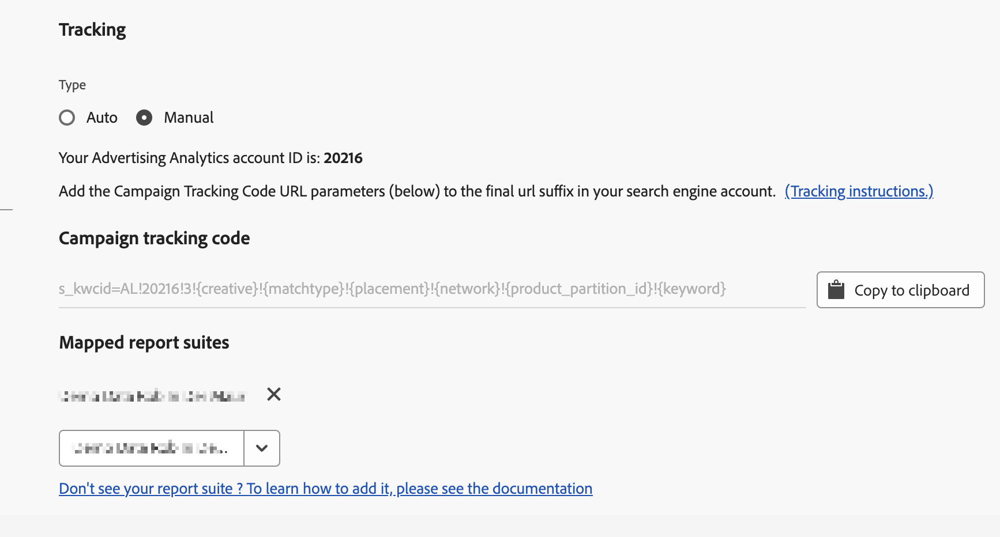
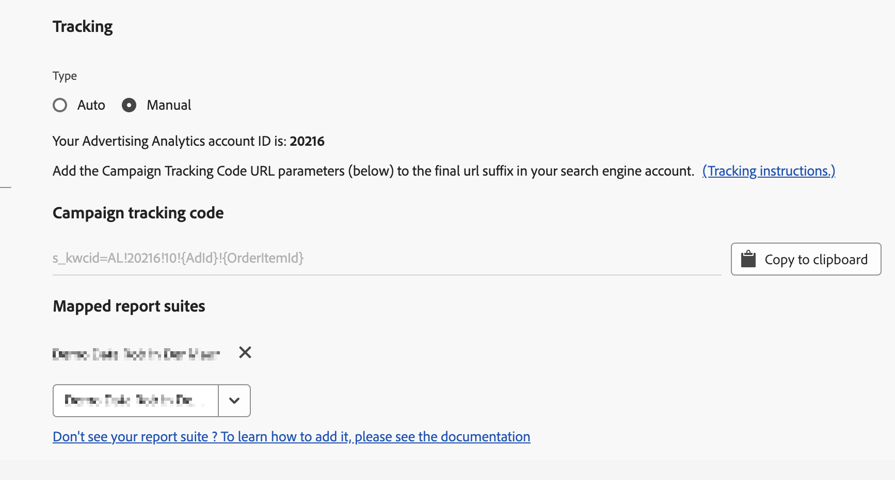

# Tracking: Manual Mode and Auto Mode

Tracking determines how Search Engine data is tracked by your Adobe Analytics implementation. This is a required step to properly augment the Adobe Analytics data with the Search Engine data.

Here is a video overview of how to implement the Advertising Analytics tracking template:

>[!VIDEO](https://video.tv.adobe.com/v/23120/?quality=12)

Two tracking modes are supported: Auto Mode and Manual Mode.

## Auto Mode Tracking {#concept_C4C6107838C947CFBB7F4E0CB94264F0}

In Auto mode, you let the Advertising Cloud Engine decide how the Search Engine data should be handled. This is the simpler approach, but it may not result in the best integrated dataset.

As a consequence, you need to check an acknowledgment checkbox when you select Auto mode, before you can save the account setting.

Note that to configure a search engine account in 'Auto Mode', you are responsible for taking the following actions: 

* The `s_kwcid` parameter and value will be added to the account tracking templates or landing page URLs in the account being added. This will be inserted at the end of the URL. Additional action may be required on your part if your web server requires a certain key=value pair at the end of the URL OR an update to support any new key=value pair in the URL. **It is your responsibility to ensure that the added URL parameters persist correctly to the final landing page.** 
* In addition, keywords can be inserted into the landing URL as part of the `s_kwcid` value. If they contain special characters or symbols, please confirm that your web server can support these characters. Example: A common special characters is "+" which is used in "Broad Match Modified" keywords.

>[!IMPORTANT]
>
>Learn more on whether you should add the `s_kwcid` parameter to your [Content Security Policy](https://experienceleague.adobe.com/docs/id-service/using/reference/csp.html).

## Manual Mode Tracking {#concept_87B28BA9E7F84BA5972F69E6F3482A33}

In Manual mode, you need to specify how the Search Engine data should be treated by the Advertising Analytics data integration process.

### Add Manual Tracking to Google Account {#section_41C1EB1AEB034544A5BC291F53C05C67}

The string that needs to be added to your Google account is shown below. You need to add the string to all your tracking templates used throughout your account.

>[!IMPORTANT]
>
>The `<Advertising Analytics ID>` value (in **bold** below) is generic and **must be replaced with your specific account ID string**. You can get your specific account ID string from the account set up screen under the "Tracking" section.

**Tracking String for Campaigns:**

```
s_kwcid=AL! 
<b><Advertising Analytics ID></b>!3!{creative}!{matchtype}!{placement}!{network}!{product_partition_id}!{keyword}
```



Examples of tracking codes in various tracking template formats: 

**`{lpurl}`**

```
{lpurl}?s_kwcid=AL!9999!3!{creative}!{matchtype}!{placement}!network}!{product_partition_id}!{keyword}
```

**`{lpurl}` with additional URL parameter**

```
{lpurl}?campaign=PPC&s_kwcid=AL!9999!3!{creative}!{matchtype}!{placement}!network}!{product_partition_id}!{keyword}
```

**3rd-party (DoubleClick) `{unescapedlpurl}`**

```
https://clickserve.dartsearch.net/link/click?{_dssagcrid}&{_dssftfiid}&ds_e_adid={creative}&ds_e_matchtype={ifsearch:search}{ifcontent:content}&ds_e_device={device}&ds_e_network={network}&{ifpla:ds_e_product_group_id={product_partition_id}&ds_e_product_id={product_id}&ds_e_product_merchant_id={merchant_id}&ds_e_product_country={product_country}&ds_e_product_language={product_language}&ds_e_product_channel={product_channel}&ds_e_product_store_id={product_store_id}}&ds_url_v=2&ds_dest_url={unescapedlpurl}?s_kwcid=AL!9999!3!{creative}!{matchtype}!{placement}!{network}!{product_partition_id}!{keyword}
```

**3rd-party (DoubleClick) `{lpurl}`**

If the URL goes through a redirect and is not using an "unescapedlpurl" value, you need to encode the string enough times so that it persists through the redirect to the final landing page URL.

```
https://clickserve.dartsearch.net/link/click?{_dssagcrid}&{_dssftfiid}&ds_e_adid={creative}&ds_e_matchtype={ifsearch:search}{ifcontent:content}&ds_e_device={device}&ds_e_network={network}&{ifpla:ds_e_product_group_id={product_partition_id}&ds_e_product_id={product_id}&ds_e_product_merchant_id={merchant_id}&ds_e_product_country={product_country}&ds_e_product_language={product_language}&ds_e_product_channel={product_channel}&ds_e_product_store_id={product_store_id}}&ds_url_v=2&ds_dest_url={lpurl}?s_kwcid%3DAL!9999!3!{creative}!{matchtype}!{placement}!{network}!{product_partition_id}!{keyword}
```

### Add Manual Tracking to Bing Account {#section_094F8ACA493C4D65B1F54A695558EBF2}

The string that needs to be added to your Bing account is shown below. You need to add the string to all the final URL suffixes used throughout your account.

>[!IMPORTANT]
>
>The `<Advertising Analytics ID>` value (in **bold** below) is generic and **must be replaced with your specific account ID string**. You can get your specific account ID string from the account set up screen under the "Tracking" section.

**Tracking String for Campaigns:** 

```
s_kwcid=AL!<Advertising Analytics ID>!10!{AdId}!{OrderItemId} 
```



Examples of tracking codes in various final URL suffix formats: 

**{lpurl}**

```
{lpurl}?s_kwcid=AL!9999!10!{AdId}!{OrderItemId}
```

**`{lpurl}` with additional URL parameter**

```
{lpurl}?campaign=PPC&
s_kwcid=AL!9999!10!{AdId}!{OrderItemId}
```

**3rd-party (DoubleClick) `{unescapedlpurl}`**

```
https://clickserve.dartsearch.net/link/click?{_dssagcrid}&{_dssftfiid}&ds_e_adid={creative}&ds_e_matchtype={ifsearch:search}{ifcontent:content}&ds_e_device={device}&ds_e_network={network}&{ifpla:ds_e_product_group_id={product_partition_id}&ds_e_product_id={product_id}&ds_e_product_merchant_id={merchant_id}&ds_e_product_country={product_country}&ds_e_product_language={product_language}&ds_e_product_channel={product_channel}&ds_e_product_store_id={product_store_id}}&ds_url_v=2&ds_dest_url={unescapedlpurl}?s_kwcid=AL!9999!10!{AdId}!{OrderItemId}
```

**3rd-party (DoubleClick) `{lpurl}`**

If the URL goes through a redirect and is not using an "unescapedlpurl" value, you need to encode the string enough times so that it persists through the redirect to the final landing page URL.

```
https://clickserve.dartsearch.net/link/click?{_dssagcrid}&{_dssftfiid}&ds_e_adid={creative}&ds_e_matchtype={ifsearch:search}{ifcontent:content}&ds_e_device={device}&ds_e_network={network}&{ifpla:ds_e_product_group_id={product_partition_id}&ds_e_product_id={product_id}&ds_e_product_merchant_id={merchant_id}&ds_e_product_country={product_country}&ds_e_product_language={product_language}&ds_e_product_channel={product_channel}&ds_e_product_store_id={product_store_id}}&ds_url_v=2&ds_dest_url={lpurl}?s_kwcid%3DAL!9999!10!{AdId}!{OrderItemId}
```
