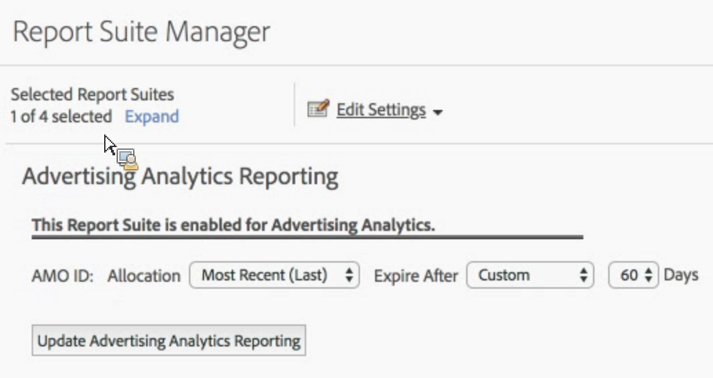

# Enable report suite for Advertising Analytics

In order to see any Advertising Analytics search data in Analytics, you need to configure each Experience Cloud-mapped report suite for Advertising Analytics reporting.

1. [Map your report suite to an organization](https://experienceleague.adobe.com/docs/ core-services/interface/about-core-services/report-suite-mapping.html).
1. Navigate to **[!UICONTROL Admin]** > **[!UICONTROL Report Suites]**.

1. Select the report suite that is mapped to your Experience Cloud organization.
1. Click **[!UICONTROL Edit Settings]** > **[!UICONTROL Advertising Analytics Configuration]**.

   

   >[!IMPORTANT]
   >
   >AMO ID refers to the Adobe Advertising Cloud variable into which the search data is going to be inserted.

1. Set the variable allocation and expiration you want the AMO ID variable to use. Conversion variables (eVars) allow Adobe Analytics to attribute success events to specific variable values. Sometimes, variables encounter more than one value before hitting a success event. For these cases, allocation determines which variable value gets credit for the event.

    | Setting | Definition |
    |--- |--- |
    |Original Value (First)|The first value seen gets full allocation credit, no matter what subsequent values for that variable are.|
    |Most Recent (Last)|The last value seen gets full allocation credit for the success event, no matter what variables were fired before it.|
    |Expire After|Lets you specify a time period, or event, after which the eVar value expires (i.e., no longer receives credit for success events).  If a success event occurs after eVar expiration, the  None value receives credit for the event (no eVar was active).|

1. Click **[!UICONTROL Enable Advertising Analytics Reporting]** (first time), or **[!UICONTROL Update Advertising Analytics Reporting]** (subsequent times). Your report suite is now ready to receive Advertising Analytics Search data. You are no ready to [create Advertising Accounts](/help/integrate/c-advertising-analytics/c-adanalytics-workflow/aa-create-ad-account.md).
