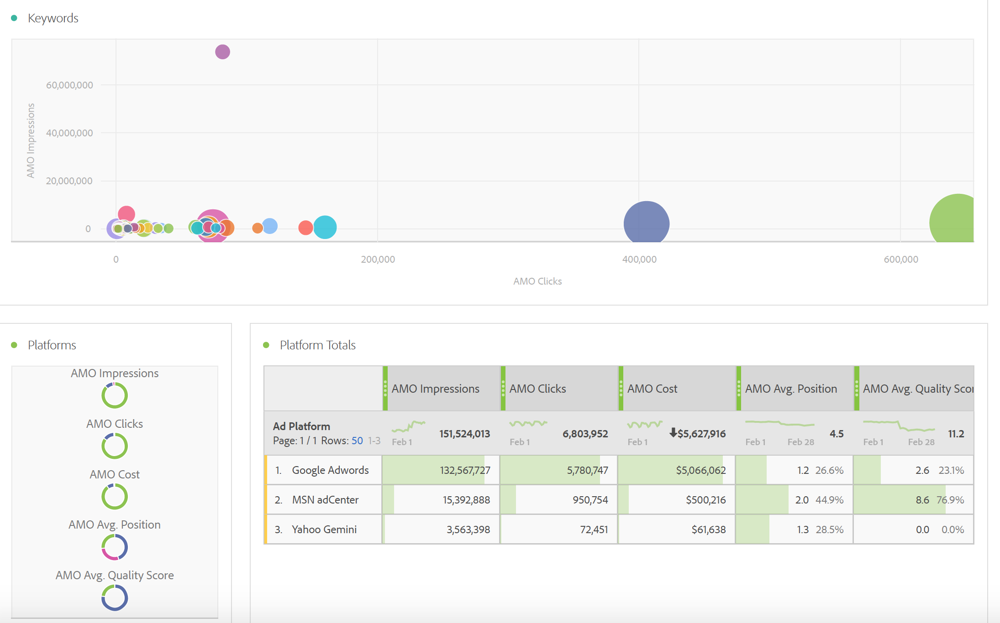
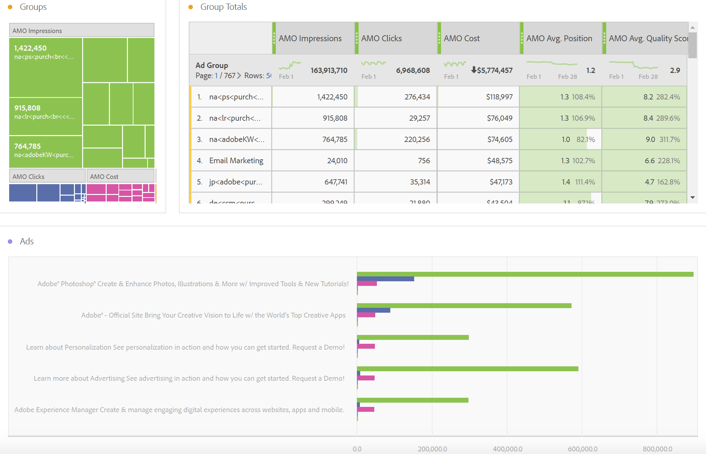

# Report on advertising data

This article provide details on the Analysis Workspace report, and the reporting in Report Builder.

>[!NOTE]
>
>Expect to wait at least 24 hours before search engine data starts populating Analytics reports. Analytics reporting does not return data for hourly granularity, because Adobe Advertising data does not support hourly granularity.

## Paid search report {#section_8173F42B2C784F41B9FD82CBB66F9ADF}

This report lets anyone who implements search engine integration get access to search engine data within Analytics. You can access it via **[!UICONTROL Workspace]** > **[!UICONTROL Reports]** > **[!UICONTROL Acquisition]** > **[!UICONTROL Advertising Analytics: paid search]**

>[!NOTE]
>
>The Paid search report is visible to all customers, even if you have not implemented any Advertising Accounts. If you try to open the Paid search report for a company that is not provisioned, an error message will explain that you have not configured any search engine account. Select **[!UICONTROL Configure Now]**, which takes you to the [Advertising Account Setup](/help/integrate/c-advertising-analytics/c-adanalytics-workflow/aa-create-ad-account.md) screen.

       

| Table/Visualization | Description |
|--- |--- |
| Advertising Trends | Daily trended overview for AMO Impressions, AMO Clicks, and AMO Cost. |
| Ad Platforms | Donut chart for cost of top 2 platforms (Google Ads, Microsoft Advertising). |
| Ad Platform Totals | Freeform table of the top platforms broken down by AMO Impressions, AMO Clicks, AMO Costs, AMO Avg. Position, AMO Avg. Quality Score. |
| Accounts | Stacked area of cost. |
| Account Totals | Freeform table of the top accounts broken down by the associated metrics. |
| Campaigns | Bar chart of campaign cost. |
| Campaign Totals | Freeform table of the top campaigns broken down by the associated metrics. |
| Groups | Tree map of cost. |
| Group Totals | Freeform table of the top advertising groups broken down by the associated metrics. |
| Ads | Horizontal bar chart of impressions, clicks, and cost. |
| Ad Totals | Freeform table of the top ads broken down by the associated metrics. |
| Keywords | Scatter chart of impressions, clicks, and cost for all keyword/match type combinations. |
| Keyword Totals | Freeform table of the top keyword/match type combinations broken down by the associated metrics. |

## Report Builder {#section_8E0371CF81144C33990D909685D1726E}

As soon as you have set up an Advertising Analytics account, the Advertising Analytics report is made available.
