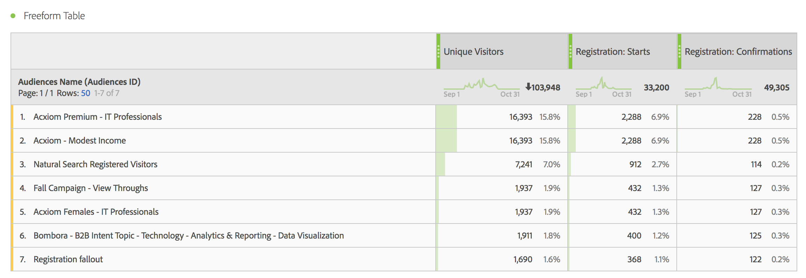
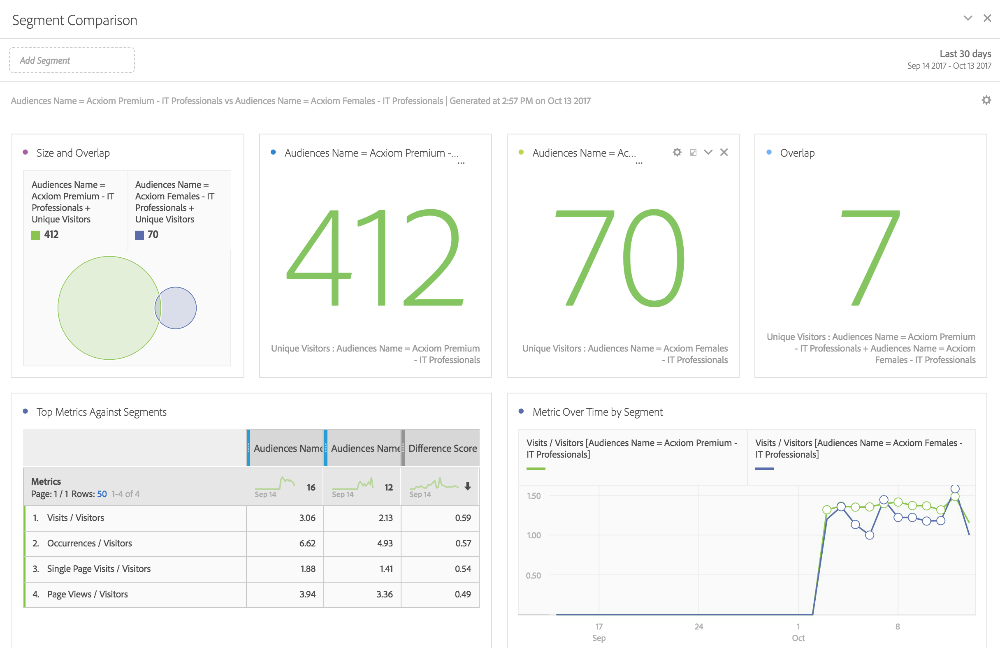
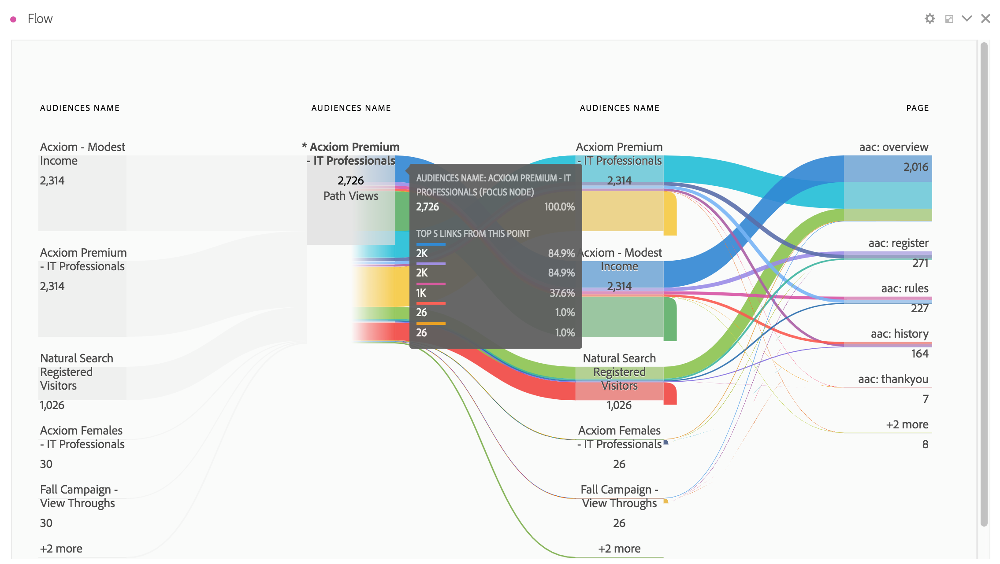
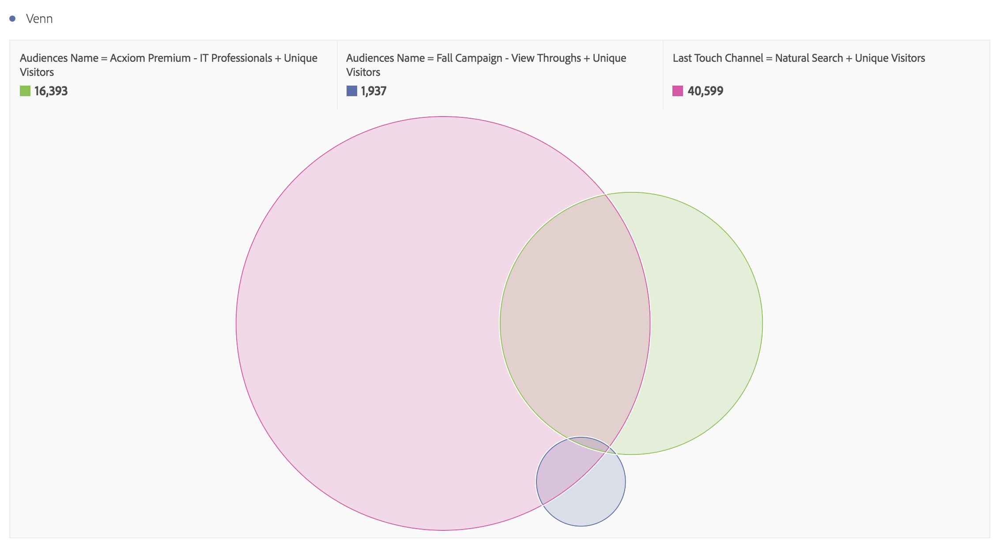
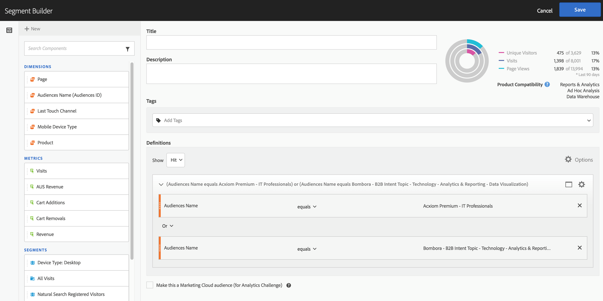
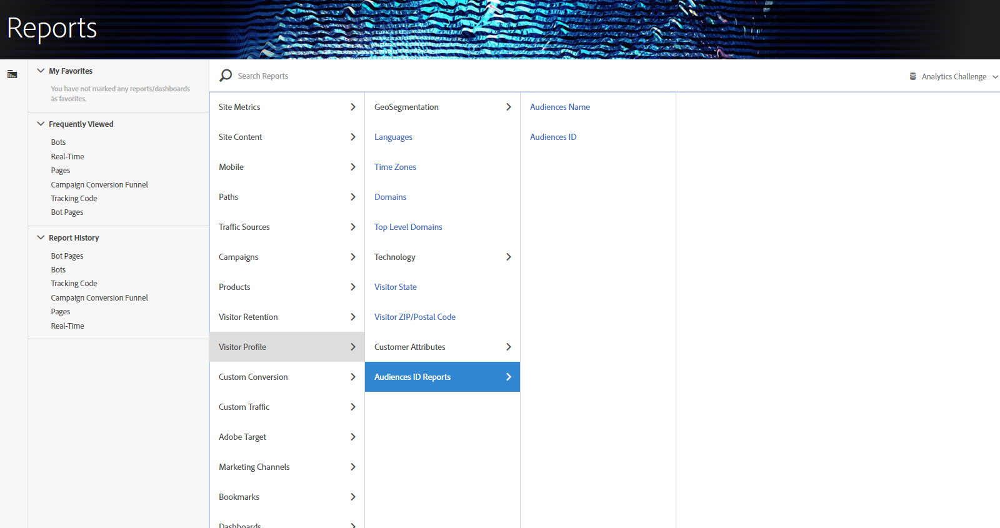

# Use the audience data in Analytics

You can use the AAM Audience dimensions throughout Analytics. The integrated segments are new Analytics dimensions called Audiences ID and Audiences Name, and can be used just like any other dimension that Analytics collects. In Data Feeds, the Audience IDs are stored in the “mc_audiences” column. These dimensions are not currently available in Data Workbench or Livestream. Some examples of how the Audiences dimensions can be leveraged include:

* [Analysis Workspace](../../../integrate/c-audience-analytics/c-workflow/use-audience-data-analytics.md#section_C70837499BEA4DED885B3486C9E02C68) 
* [Segment Comparison](../../../integrate/c-audience-analytics/c-workflow/use-audience-data-analytics.md#section_E72B80B6470C42D4B9B19BE90E6070A2) 
* [Customer Journey (Flow) in Analysis Workspace](../../../integrate/c-audience-analytics/c-workflow/use-audience-data-analytics.md#section_FC30E5795C9D4539838E30FE11FAEA6E) 
* [Venn Visualization in Analysis Workspace](../../../integrate/c-audience-analytics/c-workflow/use-audience-data-analytics.md#section_E78AB764FB5047148B51DC1526B0DF89) 
* [Segment Builder](../../../integrate/c-audience-analytics/c-workflow/use-audience-data-analytics.md#section_2AA81852A1404AB894472CA8959461B6) 
* [Reports & Analytics and Report Builder](../../../integrate/c-audience-analytics/c-workflow/use-audience-data-analytics.md#section_04E8FD30F73344D7937AD3C6CD19E34A)

## Analysis Workspace {#section_C70837499BEA4DED885B3486C9E02C68}

In Analysis Workspace, the AAM segments appear as two dimensions.

1. Go to **[!UICONTROL Workspace]**. 
1. From the list of **[!UICONTROL Dimensions]**, select the dimensions **[!UICONTROL Audience ID]** or **[!UICONTROL Audience Name]**. Name is a friendly classification of the ID.

   

## Segment Comparison {#section_E72B80B6470C42D4B9B19BE90E6070A2}

[Segment Comparison](https://marketing.adobe.com/resources/help/en_US/analytics/analysis-workspace/segment-comparison.html) discovers the most statistically significant differences between two segments. Audiences data can be used in Segment Comparison in two ways: 1) as the 2 segments that are being compared, and 2) as items in the “Top Dimension Items” table.

1. Go to **[!UICONTROL Workspace]** and select the **[!UICONTROL Segment Comparison]** panel from the left rail. 

1. Search for [!UICONTROL Audiences Name] in the **[!UICONTROL Component]** menu. 

1. Open [!UICONTROL Audiences Name]so that the related dimension items appear. 
1. Drag the audiences you want to compare into the Segment Comparison builder. 
1. (Optional): You can bring in other dimension items or segments as well, up to 2 can be compared. 
1. Click **[!UICONTROL Build]**.

   Audiences ID and Name dimensions will automatically appear in the “Top Dimension Items” table, as they are additional profile data for the two segments being compared.

   

## Customer Journey (Flow) in Analysis Workspace {#section_FC30E5795C9D4539838E30FE11FAEA6E}

AAM segment data is passed into Analytics on a hit-by-hit basis, and represents the audience membership for a visitor at that point in time. This means, a visitor could fall into one segment (e.g. “Awareness”), then later qualify for a more qualified segment (e.g. “Consideration”). You can use [Flow](https://marketing.adobe.com/resources/help/en_US/analytics/analysis-workspace/flow.html) in Analysis Workspace to visualize the journey a visitor takes between audiences.

1. Go to **[!UICONTROL Workspace]** and select the **[!UICONTROL Flow]** visualization from the left rail. 

1. Drag the [!UICONTROL Audience Name] dimension into the Flow builder. 
1. Click **[!UICONTROL Build]**. 
1. (Optional): Drag any other dimension into the Flow visualization to create an [inter-dimensional Flow](https://marketing.adobe.com/resources/help/en_US/analytics/analysis-workspace/multi-dimensional-flow.html).

Audiences can also be used in [Fallout visualizations](https://marketing.adobe.com/resources/help/en_US/analytics/analysis-workspace/fallout_flow.html).

## Venn Visualization in Analysis Workspace {#section_E78AB764FB5047148B51DC1526B0DF89}

[Venn visualizations](https://marketing.adobe.com/resources/help/en_US/analytics/analysis-workspace/venn.html) show the overlap between up to 3 segments.

1. Go to **[!UICONTROL Workspace]** and select the **[!UICONTROL Venn]** visualization from the left rail. 

1. Search for [!UICONTROL Audience Name] in the component menu. 
1. Open [!UICONTROL Audience Name] so that the related dimension items appear. 
1. Drag the audiences that you want to compare into the Venn builder. 
1. (Optional): You can bring in other dimension items or segments as well; up to 3 can be compared. 
1. Click **[!UICONTROL Build]**.

## Segment Builder {#section_2AA81852A1404AB894472CA8959461B6}

You can incorporate the Audiences dimensions in the Analytics [Segment Builder](https://marketing.adobe.com/resources/help/en_US/analytics/segment/seg_build.html), along with the behavioral information that Analytics collects.

1. Go to  **[!UICONTROL Components]** > **[!UICONTROL Segments]** . 
1. Click **[!UICONTROL Add]** to create a new segment. 
1. After naming the segment, drag the [!UICONTROL Audience Name] dimension into the Definitions panel. 
1. (Optional): Add other criteria to the segment. 
1. Save the segment.

   

## Reports & Analytics and Report Builder {#section_04E8FD30F73344D7937AD3C6CD19E34A}

1. To view the Analytics report, go to  **[!UICONTROL Reports]** > **[!UICONTROL Visitor Profile]** > **[!UICONTROL Audience ID Reports]** . 
1. From this folder, you can access both the Audience ID and Audience Name dimensions.

   

