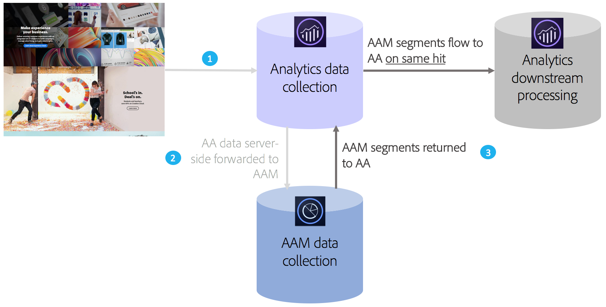

# Audience Analytics overview

Adobe Audience Manager (Adobe Audience Manager) is a powerful data management platform that helps you build unique audience profiles from first-party, second-party/partner, and third-party data integrations. For advertisers, these audience profiles help define the most valuable segments to use across any digital channel.

With the Audience Analytics integration in place, you can incorporate Adobe Audience Manager audience data such as demographic information (e.g. gender or income level), psychographic information (e.g. interests and hobbies), CRM data, and ad impression data into any Analytics workflow.

>[!VIDEO](https://video.tv.adobe.com/v/25450/?quality=12)

## Key Benefits {#section_94816D17283349E0BA28521BE55BB868}

The Audience Analytics integration features the following key benefits:

* It is the first productized integration between a Data Management Platform (DMP) and an analytics engine in the marketplace.
* Segments are shared from Adobe Audience Manager to Analytics in real time, to inform audience discovery, segmentation, and optimization.
* All Adobe Audience Manager segments are shared by default, fully enriching customer profiles in Analytics.
* Solution admins can enable the integration through the user interface, with minimal code changes required.
* Only segments that adhere to Audience Manager data export controls are shared.

## How it Works {#section_CECDF5A0FEC64264B206EFEF54F19EF2}

1. Each time a visitor comes to your digital properties, hits are collected and sent to Analytics.
1. With [server-side forwarding](/help/admin/admin/c-manage-report-suites/c-edit-report-suites/general/c-server-side-forwarding/ssf.md), each hit that Analytics receives is automatically sent to Adobe Audience Manager in real time.
1. Through the Audience Analytics integration, for each hit, a visitor's audience membership is looked up in Adobe Audience Manager and a list of segment IDs is returned to Analytics for processing in real time.

Because Adobe Audience Manager segments are inserted on a same-hit basis, you can be sure that whatever data is available in Adobe Audience Manager about a visitor will not be missed and be up to date for that hit. This is superior to an AppMeasurement plug-in, because a plug-in can make those segments available only on the next hit (rather than the current hit.)

In addition, we automatically classify the Adobe Audience Manager segment IDs to their friendly names for you, so that you won't have to look at alpha-numeric IDs in Analytics reports.

## Prerequisites {#section_A345DC31F7D44EAE9DC1AB53E824C0CC}

Ensure that the following prerequisites are in place:

* You are a customer of both Audience Manager and Adobe Analytics.
* You are an Audience Manager admin.
* You are using the Identity Service v1.5 or later.
* Adobe Audience Manager and Adobe Analytics report suites are mapped to the same Experience Cloud organization.
* You use [server-side forwarding](/help/admin/admin/c-manage-report-suites/c-edit-report-suites/general/c-server-side-forwarding/ssf.md) and have implemented the [Audience Management module](https://experienceleague.adobe.com/docs/audience-manager/user-guide/implementation-integration-guides/integration-other-solutions/audience-management-module.html) (no DIL code) - AppMeasurement 1.5 or later.

These prerequisites are described in the [Audience Analytics Workflow](/help/integrate/c-audience-analytics/c-workflow/audiences-workflow.md).
