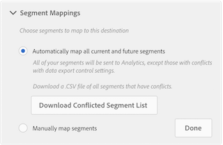

# Frequently Asked Questions

Answers to questions you might have when implementing Audience Analytics.

## Legal FAQs {#section_B51CFC961C0B45A2BE5F4A4404620764}

<table id="table_22037CCB516C4231BF5820004FBB351A"> 
 <tbody> 
  <tr> 
   <td colname="col1"> <b>Q: How do I know if I have Personally Identifiable Information (PII) in my Analytics data? And if yes, what do I do about it?</b> </td> 
   <td colname="col2"> 
    <ul id="ul_71E0ECD5981D4B65BCDA065BE07A43AA"> 
     <li id="li_F8FF61A4D7B54BA39DAA6F28DB51D749">If you have emails/addresses/etc in a prop or eVar, consider hashing the data during collection. </li> 
     <li id="li_57A8B4C7BB784FFCBC1DC363B35D9FF7">If your country considers IP address to be PII, <a href="https://experienceleague.adobe.com/docs/analytics/admin/admin-tools/exclude-ip.html"  > turn on IP obfuscation </a>. </li> 
     <li id="li_C7AA02B831AE47A59E783623126A7789">Talk to your Analytics Admin to see what you are collecting. </li> 
     <li id="li_F6AAE868141E486AB8CAB291BD8EDB71">Talk to your Legal dept to see what they consider PII. </li> 
    </ul> </td> 
  </tr> 
  <tr> 
   <td colname="col1"> <b>Q: How do I know if my report suites do onsite personalization, or offsite/onsite targeting?</b> </td> 
   <td colname="col2"> 
    <ul id="ul_F0984CEF80DB4B589716BC55549E32B8"> 
     <li id="li_9BC3819784A9408F846D60FF0F20AAF9">These don't apply to sending Adobe Analytics data to Adobe Audience Manager. </li> 
     <li id="li_050A1BF9978E436895B5C7E33A82527D">Ask yourself: Will you share an Analytics-shared segment with an MCA dimension back to the Experience Cloud? </li> 
     <li id="li_C52D969681B94F4AAA18FDEB21EC5B49">Are you exporting (e.g. via data feeds) out to a Business Intelligence (BI) system that is used for these purposes? </li> 
    </ul> </td> 
  </tr> 
 </tbody> 
</table>

## AAM-Specific FAQs {#section_6BDF746BA6464359A6A89A64EB025D12}

<table id="table_15B44592161240BDA79F3B020EA9CC9D"> 
 <tbody> 
  <tr> 
   <td colname="col1"> 
<b>Q: How do I create an Analytics destination in Audience Manager?</b> 
 </td> 
   <td colname="col2"> See <a href="https://experienceleague.adobe.com/docs/audience-manager/user-guide/features/destinations/experience-cloud-destinations/create-analytics-destination.html"  > Configure an Analytics Destination in AAM </a>. </td> 
  </tr> 
  <tr> 
   <td colname="col1"> 
<b>Q: After creating and saving an Analytics destination, how long will it take until data appears in my selected report suites?</b> 
 </td> 
   <td colname="col2"> 
It can take several hours to populate your report suites with new data. 
 </td> 
  </tr> 
  <tr> 
   <td colname="col1"> 
<b>Q: I've created a new Analytics destination, but I don't see it in the Destination Mappings section of my available segments. Where did that destination go or how do I find it?</b> 
 </td> 
   <td colname="col2"> 
An Analytics destination disappears from a segment's Destination Mappings section when you select the  Automatically map all current and future segments  option in  Segment Mappings . 
 
 
 
To prevent this, select  Manually map segments  instead of the automatic option. 
 </td> 
  </tr> 
  <tr> 
   <td colname="col1"> 
 <b>Q: Will this give me all of the information from AAM, in Analytics?</b> 
 </td> 
   <td colname="col2"> 
No, only data related to people who come to your site during or after enablement of Audience Manager Audiences and during/after segment qualification. 
 </td> 
  </tr> 
  <tr> 
   <td colname="col1"> 
 <b>Q: Will this give me a per-segment total addressable audience?</b> 
 </td> 
   <td colname="col2"> 
Not really. It will tell you the number of visitors in that segment that came to your site during or after segment qualification. 
 </td> 
  </tr> 
  <tr> 
   <td colname="col1"> 
 <b>Q: How is this different from the legacy cookie destination to Analytics?</b> 
 </td> 
   <td colname="col2"> 
Segments are qualified for and returned in real time - on the same hit. 
 
Friendly names are shown automatically. 
 </td> 
  </tr> 
  <tr> 
   <td colname="col1"> 
<b>Q: What if some of my report suites have personal data and some do not?</b> 
 </td> 
   <td colname="col2"> 
Tip: Create two destinations - add the personal data report suites to one destination and the non-personal data report suites to the other. 
 </td> 
  </tr> 
 </tbody> 
</table>

## Analytics-Specific FAQs {#section_67BFB1B1E48D4113A38B075C020931BA}

<table id="table_19AEAE0A3575423CB4F5F164DB5626D5"> 
 <tbody> 
  <tr> 
   <td colname="col1"> 
<b>Q: Will this integration surface as a dimension or segment in Analytics?</b> 
 </td> 
   <td colname="col2"> 
As dimensions: Audiences ID and Audiences Name. 
 </td> 
  </tr> 
  <tr> 
   <td colname="col1"> 
<b>Q: Where can I use these dimensions in Analytics?</b> 
 </td> 
   <td colname="col2"> 
Almost everywhere; they are treated just like any other dimension collected in Analytics. There is one exception: for now, data will not be in Data Workbench. 
 </td> 
  </tr> 
  <tr> 
   <td colname="col1"> 
<b>Q: Why don't I see data coming through in Analytics?</b> 
 </td> 
   <td colname="col2"> 
You likely have conflicting AAM privacy controls between data source &amp; destination. 
 </td> 
  </tr> 
  <tr> 
   <td colname="col1"> 
<b>Q: Why are some of my segments missing in Analytics, even though I chose to send all segments?</b> 
 </td> 
   <td colname="col2"> 
    <ul id="ul_B8938FD08C6F4F2387EDADDEF8089319"> 
     <li id="li_50A9BDF612304062913370F16BC882EF">Your AAM data export controls on the destination and in the segments' data sources may be conflicting, preventing certain segments from being sent. </li> 
     <li id="li_AF5D6F883D6F4D3192E0BF23CF12ADEA">If you are using 3rd-party data traits in your segments, those segments cannot be shared to destinations (a set of report suites) that contain personal data. </li> 
    </ul> </td> 
  </tr> 
  <tr> 
   <td colname="col1"> 
<b>Q: Why do I see "Audience limit reached" in my Analytics report? (Note: this will also be represented as Audience ID = -1 and "::max_audiences_exceeded::" in Data Warehouse)</b> 
 </td> 
   <td colname="col2"> 
By default, the Audience Analytics integration for AAM sends all segments that a visitor qualifies for, on a per-hit basis, to Analytics. If a visitor belongs to more than 150 AAM segments on a single hit, the <b>150 most recently qualified segments</b> are sent to Analytics, while the remaining list is truncated. 
 
An additional flag is sent to Analytics signifying that the segment list was truncated, and displays as "Audience limit reached" in the Audience Name dimension and "-1" in the Audience ID dimension. 
 
While it is unlikely that a visitor qualifies for more than 150 segments on a particular hit, it may happen a small percentage of the time. If you experience "Audience limit reached" in your reporting, you have two options: 
 
    <ul id="ul_8E290B2E32DC49738F6FD00CB0CE2BBB"> 
     <li id="li_12F498981EA949B5BCBD40ECC954C339"><b>Option 1</b>: Continue to let the integration work in its out-of-the-box state, sending the 150 most recently qualified segments for a particular visitor. </li> 
     <li id="li_CA4D5747AA4A4452929097807B604959"><b>Option 2</b>: In AAM, choose the 150 segments that matter most to your business for the integration. AAM then checks visitors against only those 150 segments. The disadvantage of this approach is that you only receive those 150 segments across all visitors. On the other hand, the Option 1 approach can deliver unlimited segments due to the per-hit nature of the integration. </li> 
    </ul> </td> 
  </tr> 
  <tr> 
   <td colname="col1"> 
<b>Q: Will additional server calls be billed to Analytics for this integration?</b> 
 </td> 
   <td colname="col2"> 
No. AAM Audiences are incorporated into the Analytics hit server-side. This does not incur additional server calls to Analytics (primary or secondary). 
 </td> 
  </tr> 
 </tbody> 
</table>

## Server-Side Forwarding (SSF) FAQs {#section_ADDE84ABCA0D4906B6235E92D185E0C6}

<table id="table_B7067B70FF85498896801F58D716202F"> 
 <tbody> 
  <tr> 
   <td colname="col1"> 
<b>Q: If I have legacy SSF implemented, do I have to also go to Analytics Admin and turn on report suite SSF?</b> 
 </td> 
   <td colname="col2"> 
Yes. In the AAM destination setup, you will see only report suites that have SSF turned on. 
 </td> 
  </tr> 
  <tr> 
   <td colname="col1"> 
<b>Q: Why can't I turn on certain report suites for SSF in Analytics Admin?</b> 
 </td> 
   <td colname="col2"> 
Only suites that are mapped to your Experience Cloud Org can be enabled. 
 </td> 
  </tr> 
 </tbody> 
</table>

For more FAQs on this topic, see [Server-Side Forwarding FAQ](/help/admin/admin/c-manage-report-suites/c-edit-report-suites/general/c-server-side-forwarding/ssf-faq.md).

## General FAQs {#section_E55410BBFB624AAFB87ADCF7F036DDA3}

<table id="table_1F7C0C785F9C472286A96F8C25E8440B"> 
 <tbody> 
  <tr> 
   <td colname="col1"> 
 <b>Q: Why are the segment visitor counts different between Audience Manager and Analytics?</b> 
 </td> 
   <td colname="col2"> 
See <a href="/help/integrate/c-audience-analytics/visitor-count-reconciliation.md"  > Visitor Count Differences </a>. 
 </td> 
  </tr> 
  <tr> 
   <td colname="col1"> 
<b>Q: What is the difference between "audiences" in AAM and "segments" in Analytics?</b> 
 </td> 
   <td colname="col2"> 
See <a href="/help/integrate/c-audience-analytics/aam-analytics-segments.md"  > Understand Segments in Analytics and Audience Manager </a>. 
 
AAM audiences get sent over and shared as "dimension" components to be used in Analytics. They will not show up as segments in the Segment Builder, for example, but as dimensions that you can build segments with. 
 </td> 
  </tr> 
  <tr> 
   <td colname="col1"> 
<b>Q: What is the difference between Customer Attributes and customer data integrated from AAM?</b> 
 </td> 
   <td colname="col2"> 
Customer Attributes are not time based; they apply retroactively and go-forward. AAM integrated data is time based and go-forward only. Additionally, Customer Attributes is a lookup table for Experience Cloud visitor IDs, whereas the AAM integration is data stitched into each hit for a visitor. 
 </td> 
  </tr> 
  <tr> 
   <td colname="col1"> 
<b>Q: What about legacy approaches to this problem, for example, the old beta or Consulting plug-in cookie-destinations?</b> 
 </td> 
   <td colname="col2"> 
We recommend that you implement the new integration and remove old destinations. 
 </td> 
  </tr> 
 </tbody> 
</table>
