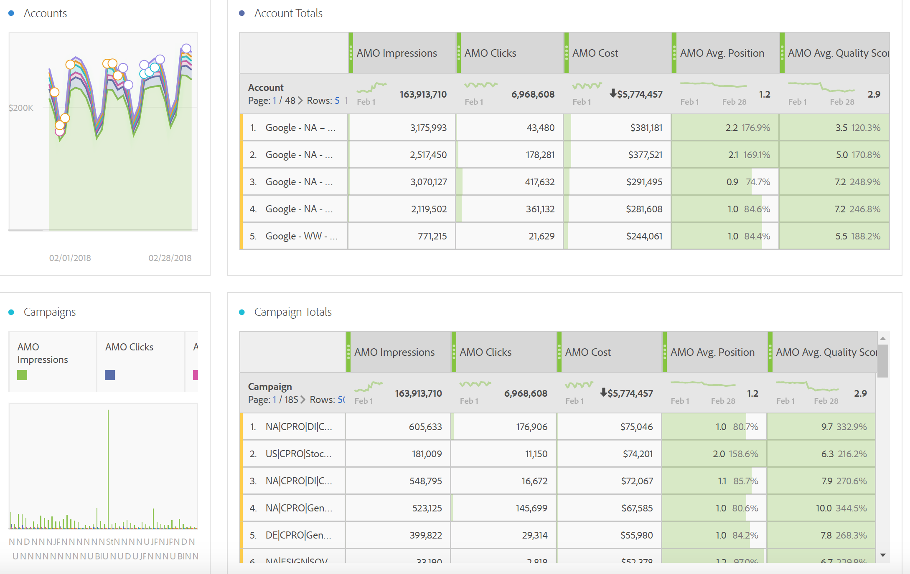
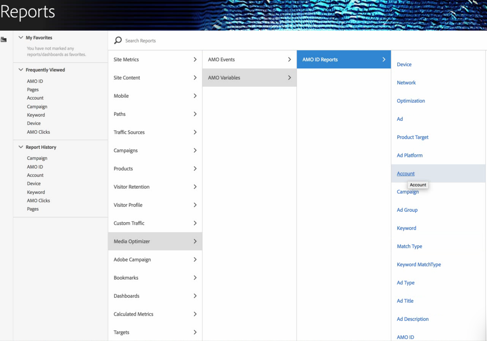

# Report on advertising data in Adobe Analytics

Details on the Analysis Workspace template, and reporting in Reports & Analytics and Report Builder.

* [Analysis Workspace: Paid Search Template](../../c_advertising_analytics/c_adanalytics_workflow/aa_report_ad_data_an.md#section_8173F42B2C784F41B9FD82CBB66F9ADF) 
* [Reports & Analytics](../../c_advertising_analytics/c_adanalytics_workflow/aa_report_ad_data_an.md#section_BB2E75DF909C49EA8D4E92D14D6DFD85) 
* [Report Builder](../../c_advertising_analytics/c_adanalytics_workflow/aa_report_ad_data_an.md#section_8E0371CF81144C33990D909685D1726E)

>[!NOTE]
>
>You should expect to wait at least 24 hours before Search engine data starts populating into your Analytics reports. Note also that Analytics reporting will not return data for hourly granularity, because the AMO data does not support hourly granularity.

## Analysis Workspace: Paid Search Template {#section_8173F42B2C784F41B9FD82CBB66F9ADF}

This template lets anyone who implements this Search Engine integration get access to copious Search engine data within Analytics. You can access it via **[!UICONTROL Workspace]** > **[!UICONTROL Templates]** > **[!UICONTROL Marketing Performance]** > **[!UICONTROL Paid Search Performance.]**

>[!NOTE]
>
>The Marketing Performance Template category is visible to all customers, even if you have not implemented any Advertising Accounts. However, if you try to open the Paid Search Performance template for a company that has not be provisioned, an error message will explain that you have not configured any Search Engine Accounts yet. In this case, click **[!UICONTROL Configure Now]**, which will take you to the [Advertising Account Setup](../../c_advertising_analytics/c_adanalytics_workflow/aa_create_ad_account.md#concept_1958E8C15C334E8B9DC510EC8D5DCA7C) screen.

       

<table id="table_3EE6A56CCE6F4AA8AA0C61FD3C0169EE"> 
 <thead> 
  <tr> 
   <th colname="col1" class="entry"> Table/Visualization </th> 
   <th colname="col2" class="entry"> Description </th> 
  </tr>
 </thead>
 <tbody> 
  <tr> 
   <td colname="col1"> 
Advertising Trends 
 </td> 
   <td colname="col2"> 
Daily trended overview for AMO Impressions, AMO Clicks, and AMO Cost. 
 </td> 
  </tr> 
  <tr> 
   <td colname="col1"> 
Ad Platforms 
 </td> 
   <td colname="col2"> 
Donut chart for cost of top 3 platforms (Google, Microsoft, Yahoo). 
 </td> 
  </tr> 
  <tr> 
   <td colname="col1"> 
Ad Platform Totals 
 </td> 
   <td colname="col2"> 
Freeform table of the top platforms broken down by AMO Impressions, AMO Clicks, AMO Costs, AMO Avg. Position, AMO Avg. Quality Score. 
 </td> 
  </tr> 
  <tr> 
   <td colname="col1"> 
Accounts 
 </td> 
   <td colname="col2"> 
Stacked area of cost. 
 </td> 
  </tr> 
  <tr> 
   <td colname="col1"> 
Account Totals 
 </td> 
   <td colname="col2"> 
Freeform table of the top accounts broken down by the associated metrics. 
 </td> 
  </tr> 
  <tr> 
   <td colname="col1"> 
Campaigns 
 </td> 
   <td colname="col2"> 
Bar chart of campaign cost. 
 </td> 
  </tr> 
  <tr> 
   <td colname="col1"> 
Campaign Totals 
 </td> 
   <td colname="col2"> 
Freeform table of the top campaigns broken down by the associated metrics. 
 </td> 
  </tr> 
  <tr> 
   <td colname="col1"> 
Groups 
 </td> 
   <td colname="col2"> 
Tree map of cost. 
 </td> 
  </tr> 
  <tr> 
   <td colname="col1"> 
Group Totals 
 </td> 
   <td colname="col2"> 
Freeform table of the top advertising groups broken down by the associated metrics. 
 </td> 
  </tr> 
  <tr> 
   <td colname="col1"> 
Ads 
 </td> 
   <td colname="col2"> 
Horizontal bar chart of impressions, clicks, and cost. 
 </td> 
  </tr> 
  <tr> 
   <td colname="col1"> 
Ad Totals 
 </td> 
   <td colname="col2"> 
Freeform table of the top ads broken down by the associated metrics. 
 </td> 
  </tr> 
  <tr> 
   <td colname="col1"> 
Keywords 
 </td> 
   <td colname="col2"> 
Scatter chart of impressions, clicks, and cost for all keyword/match type combinations. 
 </td> 
  </tr> 
  <tr> 
   <td colname="col1"> 
Keyword Totals 
 </td> 
   <td colname="col2"> 
Freeform table of the top keyword/match type combinations broken down by the associated metrics. 
 </td> 
  </tr> 
 </tbody> 
</table>

## Reports & Analytics {#section_BB2E75DF909C49EA8D4E92D14D6DFD85}

As soon as you have set up an Advertising Analytics account, the Advertising Analytics report will be made available.

## Report Builder {#section_8E0371CF81144C33990D909685D1726E}

As soon as you have set up an Advertising Analytics account, the Advertising Analytics report will be made available. 
