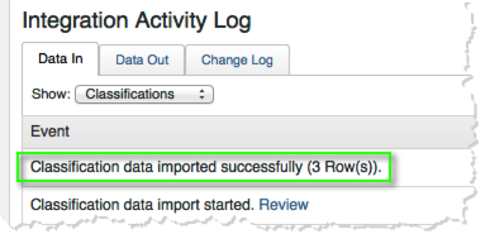
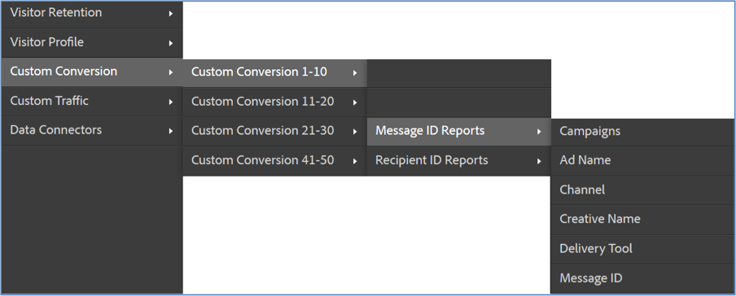

# Verifying the Integration{#verifying-the-integration}

View your ContactLab integration setup within the Adobe Marketing Cloud

1. View the integration activity log.
   1. In the Adobe Marketing Cloud, navigate to **[!UICONTROL Support]** > **[!UICONTROL Integration Activity Log]**.

         
   
   1. Look for entries like **[!UICONTROL Classification Data imported successfully]**, **[!UICONTROL Metrics Data imported successfully]**, and **[!UICONTROL Metric Data exported successfully]**. These entries should appear within 1 day of successful deployment.
1. View your reporting data within Adobe Analytics.
   1. Navigate to **[!UICONTROL Custom Conversion]** > **[!UICONTROL Custom Conversion 1-10]** > **[!UICONTROL Message ID Reports]**.

         
   
   1. Look for ContactLab reporting. This data should appear within 24-48 hours of successful deployment.
