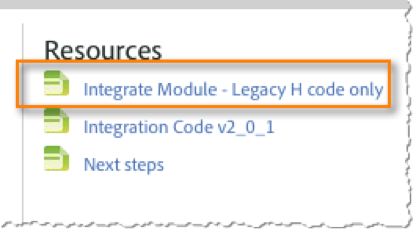

# Including the Integrate Module{#including-the-integrate-module}

The integration code requires that the Integrate Module exists within your Adobe Analytics deployment.

If you do not already have the Integrate Module as part of your deployment, please complete the following steps depending on the type of implementation you have.

## For AppMeasurement v1.0+ {#section-f28d090bf2404cabaae34cd9c66fc575}

1. Unzip the AppMeasurement zip file that you downloaded from **[!UICONTROL Analytics]** > **[!UICONTROL Admin]** > **[!UICONTROL CodeManager]**. 

1. Open the file named [!DNL AppMeasurement_Module_Integrate.js]. 
1. Copy and paste the contents of this file into your primary [!DNL AppMeasurement.js] file. 

   >[!NOTE]
   >
   >Paste it just before the DO NOT ALTER ANYTHING BELOW THIS LINE comment within the file.

## For Legacy Code (H-code) {#section-bba8ad8c715e4f97883e7de3269f681a}

1. Download the Integrate Module from the “Resources” area within the Data Connectors UI (under the Support tab).

   

1. Copy and paste the contents of that file into your [!DNL s_code] file. 

   >[!NOTE]
   >
   >Paste it just before the DO NOT ALTER ANYTHING BELOW THIS LINE comment within the file.

