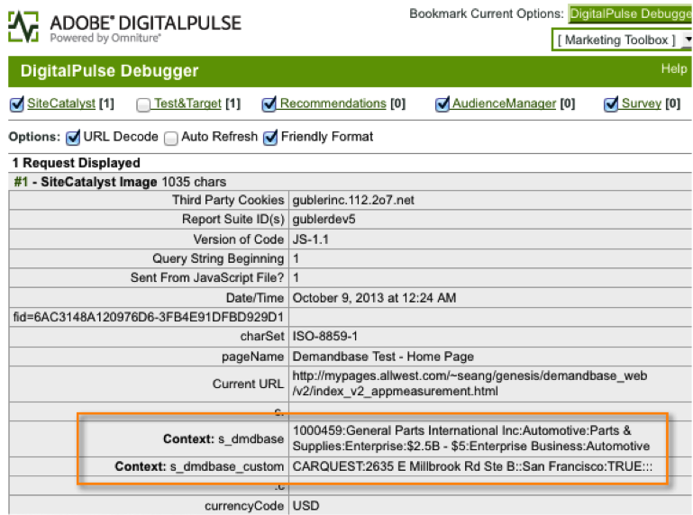
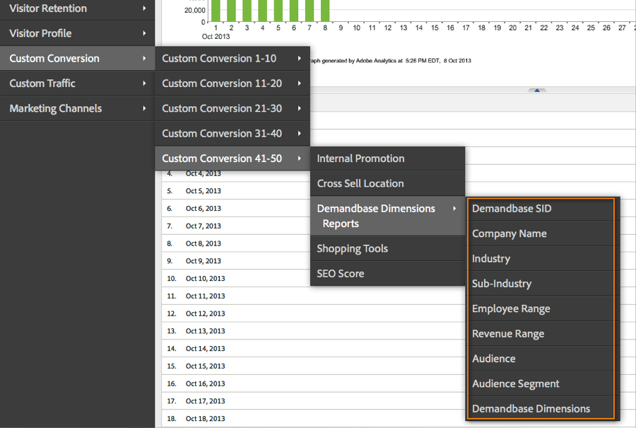
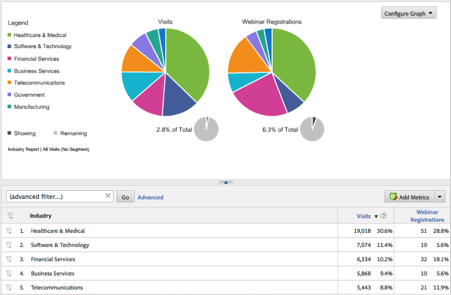

# Verifying the Integration{#verifying-the-integration}

Validate that the integration is successfully capturing data by checking live tracking and reporting.

## Live Tracking {#section-9c20e8ff6b404ae09387ee07d675c9e2}

Use the DigitalPulse debugger tool to verify that Demandbase dimension data is being sent through to Adobe Analytics. After deleting your cookies, reload a page on your website where the integration code has been deployed. Assuming that your current IP maps to an organization recognized by Demandbase, you should see results similar to the following.

**Reports & Analytics (formerly SiteCatalyst) includes the two Demandbase context data variables:**



**Target Mbox includes the Demandbase Profile parameters: **

You will see this only if you have Target implemented on the page AND you have this integration configured for Adobe Target - see Step 4 in the Adobe integration wizard.


## Reporting {#section-1792fe75dc3249d0ad063dfd87a89162}

Review your Demandbase reports within Adobe Analytics using the Dashboard that was automatically created for you using the Adobe Integration wizard (Step 7).

Alternatively, you can navigate to the Demandbase reporting within the Adobe Analytics menu structure - see screenshots below.

>[!NOTE]
>
>This data should appear within 24-48 hours of successful deployment.





## Frequently Asked Question {#section-d926b160a2ef4f07b43ea1bc67ac2a0a}

**What does "[n/a]" mean?**

The Demandbase Data Connector indicates when an attribute is “Not Available” by setting this default value. There are two common scenarios where the default is set:

* Demandbase detects that the visitor is coming from an IP address that does not belong to a company. 
* An Account Watch attribute (beginning with “watch_list”) is used, but the company is not in your Account Watch list.

**Why does “[n/a]” appear more often for certain attributes? **

Demandbase classifies all IP addresses and provides the audience and audience_segment attributes even when the visitor is not coming from a company IP. When audience returns values such as “Residential”, “Wireless”, and “Hospitality”, the rest of the attributes are likely not available.

At times, a visitor’s audience will be “SMB”, but other attributes will show “[n/a]”. This means Demandbase is able to classify the visitor as a small business, but the full company profile is not available. This typically happens for the smallest companies, when more than one small business is using the same service provider or block of IP addresses.

## Developer Considerations {#section-d33fff55bc4b4db99f82dee418ef1bc2}

If you need to adjust the default value in your implementation, update the line:

```
_db._nonOrgMatchLabel = "[n/a]";
```

