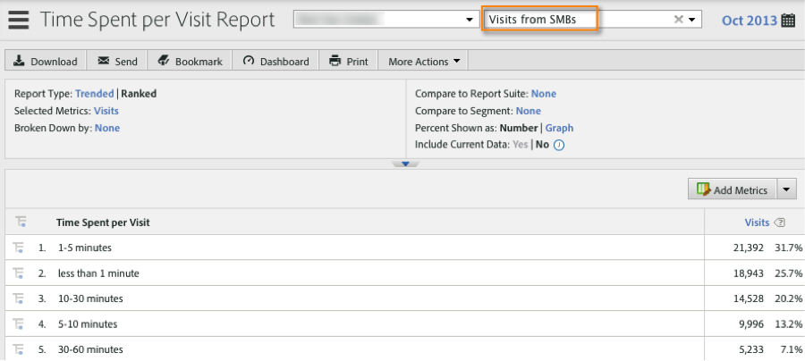

# Segmenting by Demandbase Dimensions{#segmenting-by-demandbase-dimensions}

A primary feature of this integration is the ability to create Adobe Analytics segments based on the Demandbase dimensions.

For example, you can build a segment that will include only Visits from SMB organizations. You might call this Visits from SMBs. Its definition would be:

Audience equals SMB.

For more information on how to build segments, consult the [Analytics Segmentation Guide](https://marketing.adobe.com/resources/help/en_US/analytics/segment/).

This segment can then be applied to practically any report - one example is the Time Spent per Visit Report seen here: 

