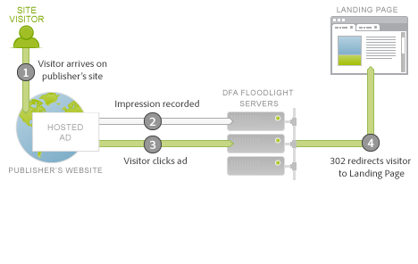
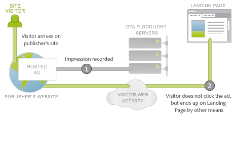

# Ad Serving Integration Overview{#ad-serving-integration-overview}

There are several ways in which this integration captures data about the ad-driven visitor. The first way is via clicking on an ad and arriving on a tagged landing page, called a click through:

 

The visitor arrives upon a publisher’s site, which hosts the Ad. This Ad has a unique identifier, called the Ad ID. Ads comprise a Placement plus a Creative, which describe where the Ad is on the Publisher’s site and what content was shown to the visitor. When the visitor fetches this Ad, placement, or creative from the DFA content servers, it tracks an Impression to the DFA Floodlight Servers for this visitor (1).

If the visitor clicks on the ad (2), the Floodlight Server is queried, which counts a click, then 302 redirects (3) the visitor to the Landing Page. When the visitor has arrived upon the Landing page, this is termed a click-through. This page contains Adobe tracking code which queries data from the DFA Floodlight Server.

If the visitor does not actually arrive on the Landing Page after the Floodlight Server has tracked a click, this is not termed a click-through. Some ads and implementations may not actually cause the visitor’s browser to obey the 302 redirect. For further discussion on this topic, see [Reconciling Metric Discrepancies](../dfa-data-connector-analytics/dfa-reconciling-metric-discrepancies/dfa-reconciling-metric-discrepancies.md#concept-8c31ebe761ca4b3fab1e3a18ef5d098f).

The next metric captured by this integration occurs when the visitor receives the Ad impression, does not click, yet sometime in the near future arrives upon the Landing page by another means.

This scenario is termed a view-through. The difference in this scenario with the click-through scenario is that the visitor does not click on the Ad, but instead continues to other activities before coming to the Landing page (2). In the simplest case, the visitor types in the landing page’s URL in the browser. In other cases, the visitor continues browsing but later uses a search engine, which drives the visitor to the landing page. In any case, the user arrives upon the landing page. 
