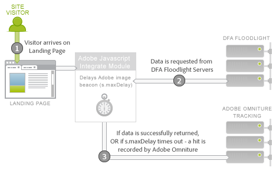

# Adobe Integration: Real-Time Data Collection{#adobe-integration-real-time-data-collection}

The following figure shows how data collection works.

 

The data collection portion of the Adobe integration begins when the visitor arrives to the landing page (1). The Adobe data collection code running on the landing page has no knowledge of the history the visitor has had with served ads. The Google DFA team has coordinated a service running on the DFA Floodlight Server to allow the Adobe code to query ad information about the visitor currently on the site (2). To obtain this data, it temporarily delays the Adobe image beacon, and requests the data from the Floodlight Server.

Once the data arrives, or takes too long, it fires the hit to the Adobe tracking servers (3).

The Integrate module is a special core Adobe JavaScript module which causes the Adobe image beacon to delay, waiting on a 3rd party request for a specific amount of time ( *`s.maxDelay`*). *`s.maxDelay`* defines how long the Integrate module will wait for data from the DFA Floodlight Server before firing the image tag to the visitor’s browser. This behavior is important so that basic visitor data is still collected, even when the DFA Floodlight Servers are down or heavily loaded. If the Floodlight data arrives before *`s.maxDelay`* has expired, the Adobe tracking data will be fired immediately, and will contain the additional DFA data.

When a timeout occurs, the page code can specify an Adobe Reports & Analytics Event to be used as a Timeout Event. This event is useful when diagnosing problems with the integration, or when adjusting *`s.maxDelay`*. In cases where there are excessive timeouts, increase *`s.maxDelay`*. *`s.maxDelay`* can be set too high, however, in which cases visitors could have the potential of leaving the site prior to the *`s.maxDelay`* timer expiring. For more discussion on this topic, see [Tuning s.maxDelay](../dfa-data-connector-analytics/dfa-integration/dfa-tuning-s-maxlelay.md#concept-6deb28eee18e414db220d6009d449f0d).

Sometimes the Floodlight Server responds with errors about the visitor. This usually occurs when the Floodlight Server does not know anything about the visitor, because the visitor has not yet seen any ads, or does not have a DFA visitor cookie. The page code can specify a Custom Conversion variable (eVar) which will collect these errors, and can aide in troubleshooting implementation problems or point out issues with the Google transaction. The most common errors are No History, No Cookie, Query Error, and Opted Out, as described in the following table: 

|  Error  | Name  | Description  |
|---|---|---|
|  nh  | No History  | The visitor has not viewed or clicked any ads.  |
|  nc  | No Cookie  | The visitor does not have a DFA visitor cookie.  |
|  qe  | Query Error  | There was an error querying data for the Floodlight Server.  |
|  oo  | Opted Out  | The visitor opted-out of Google impression/click tracking.  |

