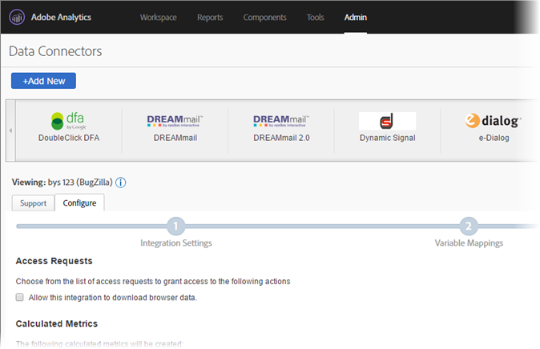

# DFA Data Connector for Adobe Analytics{#dfa-data-connector-for-adobe-analytics}

In today’s increasingly complex and competitive online marketplace, online advertisers and agencies must continually improve their understanding of the online marketing environment, and their return on advertising spend. Although advertisers, agencies, and publishers all possess individual tools to help accomplish these objectives, manually aggregating data from disparate data systems and processes can severely hamper the effectiveness of on-line marketing campaigns, resulting in less-than-optimal campaign performance, data discrepancies and confusion.

The DoubleClick for Advertisers (DFA) integration solves this problem by using Adobe® Data Connectors™ to allow DoubleClick DFA to automatically pass data to Reports & Analytics.

**[!UICONTROL Analytics]** > **[!UICONTROL Admin]** > **[!UICONTROL Data Connectors]**

