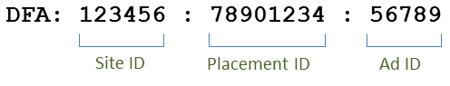

# Integration Features{#integration-features}

Once activated, the Data Connectors DFA integration provides the following metrics for your Adobe Analytics reports:

* View-throughs 
* DFA Clicks 
* Impressions 
* (optional) DFA Cost Data 
* (optional) DFA Query errors, Timeouts

>[!NOTE]
>
>This integration does not provide support for click trackers (formerly click commands). Click trackers are used to record the number of clicks on text links, links in email messages, or on other elements that are hard-coded on a Web site.

The Data Connectors DFA integration automatically constructs DFA tracking codes from the data returned by DFA. These tracking codes are constructed to uniquely identify an Ad along with its associated Placement and Creative. The following outlines the structure of the tracking code, depending on version of the integration. Version 1.5 looks like this:

Version 2.0 looks like this:

These IDs serve as a shared key between Genesis and DFA to associate the correct classifications and metrics. 

|  Site ID  | The 3rd party site on which the ad was hosted. The Site Name classification provides a descriptive name of this Site ID.  |
|---|---|
|  Ad ID  |An ID for the commercial message that is delivered to a user. The Ad Name classification contains the name of the ad as defined by your organization in the DFA system. For example: `Hybrid Coup Textlink - Build`.  |
|  Placement ID  | A representation in your DFA account of a Web site, portion of a Web site, or group of Web sites where you have purchased ad space.  |
|  Creative ID  | The image, Flash SWF, or other resource that is intended to be shown to the visitor. The Creative Name classification contains the name you have provided to this creative in the DFA interface.  |

The other two classifications, Delivery Tool (DoubleClick for Advertisers) and Channel (Banner Ad) have the same values for any DFA campaign and help to distinguish DFA imported data.

## SearchCenter De-Duplication {#section-f809b3bb5e5142aa8ff89bcd5f0d0e49}

The DFA integration is now Adobe SearchCenter aware. By enabling SearchCenter de-duplication via the Data Connectors wizard, search driven visitors will not cause data to be pulled from DFA’s Floodlight Server, and *`s.campaign`* will not be filled in by DFA, thus allowing SearchCenter to populate it. Also, DFA and SearchCenter now populate de-duplication values into the variables for each product.

The list below outlines the logic that is enabled when SearchCenter de-duplication is enabled:

If **[!UICONTROL DFA]** > **[!UICONTROL SearchCenter deduplication]** is selected in the wizard:

* In the case of a DFA click-through, the integration will populate the string “DFA Clickthrough” to the configured SCM eVar. 
* In the case of a DFA view-through, the integration will populate the string “DFA Viewthrough” to the SCM eVar.

If **[!UICONTROL SearchCenter]** > **[!UICONTROL DFA deduplication]** is selected in the wizard:

* In the case of a DFA view-through, the integration will populate the string “DFA Viewthrough” to the SCM eVar.

>[!NOTE]
>
>If SearchCenter > DFA de-duplication is enabled and the SearchCenter query string parameter is set, the visit will not be considered for DFA processing. This means that the SearchCenter query string parameter should be different from the DFA click-through parameter, and no Display ads should set the SearchCenter query string parameter.

