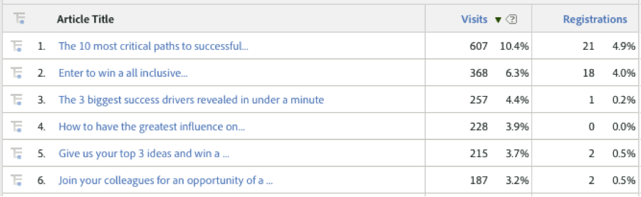

# Viewing Traffic and Conversion Metrics by Dynamic Signal Dimensions{#viewing-traffic-and-conversion-metrics-by-dynamic-signal-dimensions}

Example of a report in Adobe Analytics.

This integration provides new dimensions that become available as Adobe Analytics reports - see [Integrated Reporting Dimensions](../../dynamic-signal-for-analytics/dynamic-signal-use-integration/dynamic-signal-reporting-dimensions.md#concept-19c4c9a55d7747698701e771541144be) for more information. The report below is an example of analyzing both Visits and a conversion metric (Registrations) that have been broken down by Article Title.

