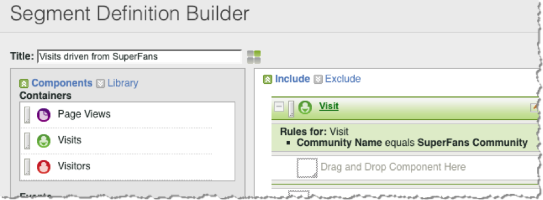

# Segmenting by Dynamic Signal Dimensions{#segmenting-by-dynamic-signal-dimensions}

Examples of segments based on Dynamic Signal dimensions.

A primary feature of this integration is the ability to create Adobe Analytics segments based on the integrated reporting dimensions. For example, you can build a segment that includes only Visits originating from a specific VoiceStorm Community. You might call this “Visits driven from SuperFans”. This segment definition might look like the following.

