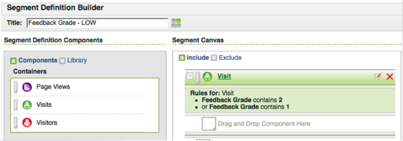

# Segment by Feedback Dimension{#segment-by-feedback-dimension}

You can create segments based on feedback dimensions.

A primary feature of this integration is the ability to create Adobe Analytics segments based on the Kampyle feedback dimensions. For example, you can build a segment that will include only Visits where a Grade of 1 or 2 was given. You might call this “Feedback Grade - LOW”. This segment definition would look like this:

This segment can then be applied to practically any report - one example is the Time Spent per Visit Report seen here.

