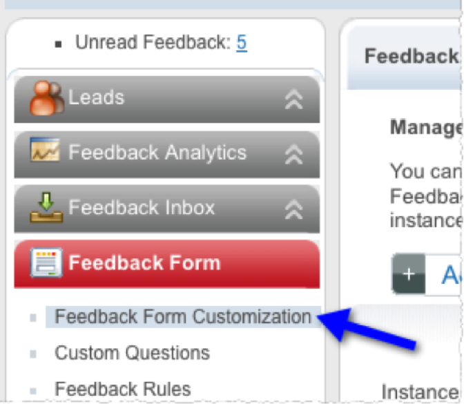

# Retrieve the Kampyle Private Key{#retrieve-the-kampyle-private-key}

Steps to retrieve the key within the Kampyle interface.

1. Log in to your Kampyle account at [https://www.kampyle.com/login](https://www.kampyle.com/login).
1. In the left navigation, go to **[!UICONTROL Feedback Form]** > **[!UICONTROL Feedback Form Customization]**.

   

1. Find the Private Key listed on the lower portion of the main content pane.

   

