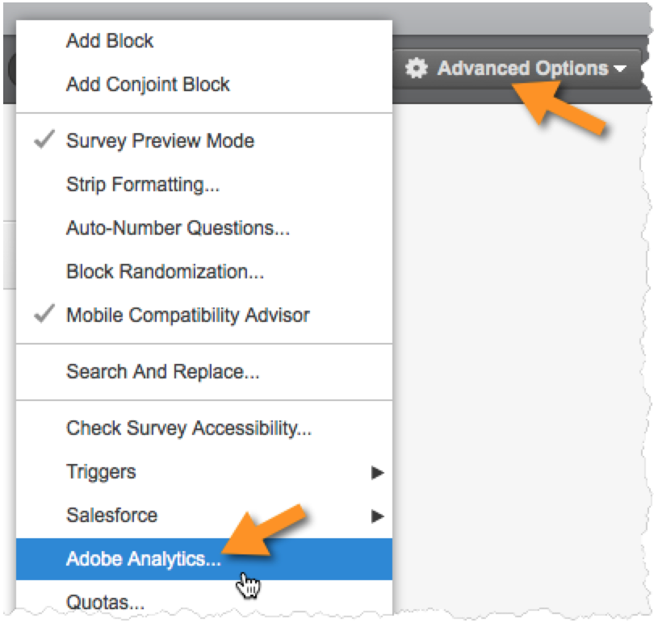
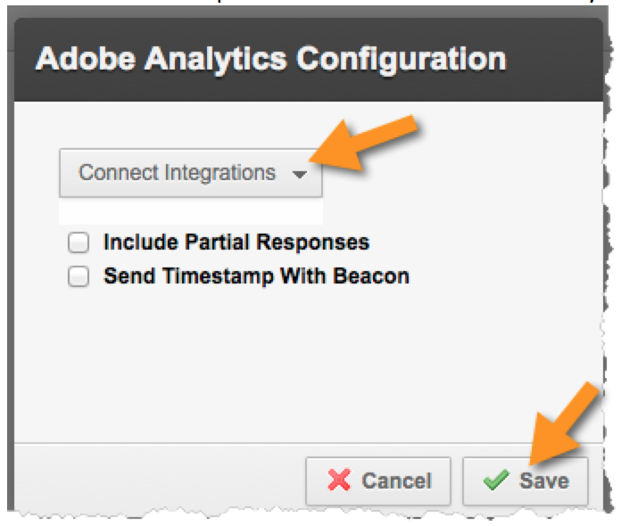

# Enabling the Integration in Qualtrics Research Suite{#enabling-the-integration-in-qualtrics-research-suite}

After completing the integration wizard, you must activate the integration for each Qualtrics survey that you want connected.

1. Log in to the Qualtrics Research Suite.
1. On the **[!UICONTROL My Surveys]** tab, click the **[!UICONTROL Edit]** button for the survey that you want to integrate.
1. Click the **[!UICONTROL Advanced Options]** menu and select **[!UICONTROL Adobe Analytics]**. (if you do not see this option, ask your administrator about gaining the permissions required).

   

1. Select the Adobe Analytics Configuration, then click **[!UICONTROL Save]**. If no configurations are available then you likely have not yet completed the Adobe Integration Wizard.
   1. The **[!UICONTROL Include Partial Responses]** checkbox can be used to indicate that you’d like to capture data into Adobe Analytics after each partial survey screen is completed. If not checked, then data is transferred only for fully completed surveys.
   1. The **[!UICONTROL Send Timestamp With Beacon]** checkbox should be used only when integrating with a Report Suite that is configured to receive time-stamped data (not common).

   

