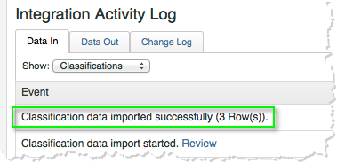
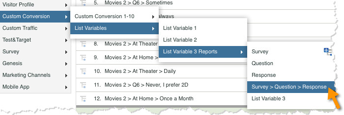
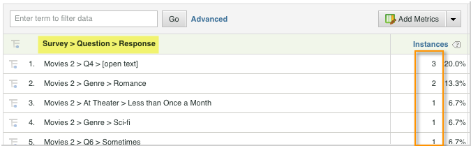

# Verifying the Integration{#verifying-the-integration}

After all deployment steps have been completed you can validate that the integration is successfully transferring data.

1. **Integration Activity Log**: In the Data Connectors UI, view the **[!UICONTROL Support]** tab on the Qualtrics integration. Under the heading **[!UICONTROL Integration Activity Log]** you should see entries stating successful classification data imported.

   >[!NOTE]
   >
   >These entries should appear within 1 hour of successful deployment.

   

1. **Reporting Data**: View your Qualtrics survey reports with the marketing reports and analytics UI by navigating the Qualtrics survey reporting (under **[!UICONTROL List Variables]**).

   >[!NOTE]
   >
   >This data should appear within 24-48 hours of successful deployment assuming that the integrated survey is actively receiving responses.

    

