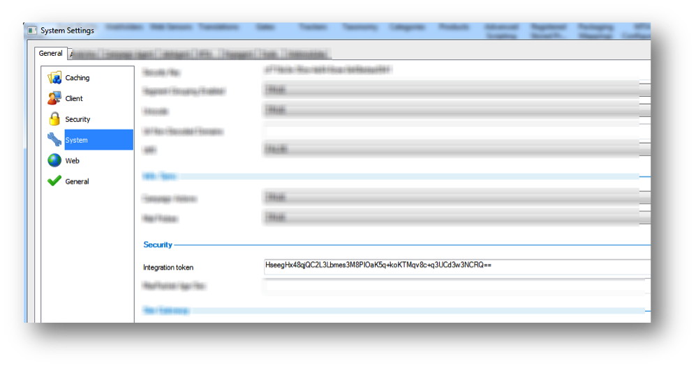

# Prerequisites for Selligent{#prerequisites-for-selligent}

Lists the necessary information to supply from your Selligent account before you can deploy the integration.

**Valid Selligent Account**

In order to use this Data Connectors integration, you must have a valid Selligent account.

**Account Information**

You will require the following information about your Selligent account during this integration setup:

* **Adobe Service URL**:

  The URL can be derived from the URL used to log on to the Selligent Marketing solution. Replace the “/simweb/login.aspx” part of the url with “/automation/omniture.asmx”

  E.g: http://<client-specific install url>/automation/omniture.asmx 

* **Query String Parameters:** These are appended in the landing page URL for Message ID and Recipient ID(Visitor ID). These are always MID and RID for Message ID and Recipient ID respectively. 

* **Integration Token** Launch the Manager tool from inside Simweb and go to **[!UICONTROL Configuration]** > **[!UICONTROL System Settings]** > **[!UICONTROL General]** tab > **[!UICONTROL System]**. Under **[!UICONTROL Security]**, you can find the Integration token.

  

