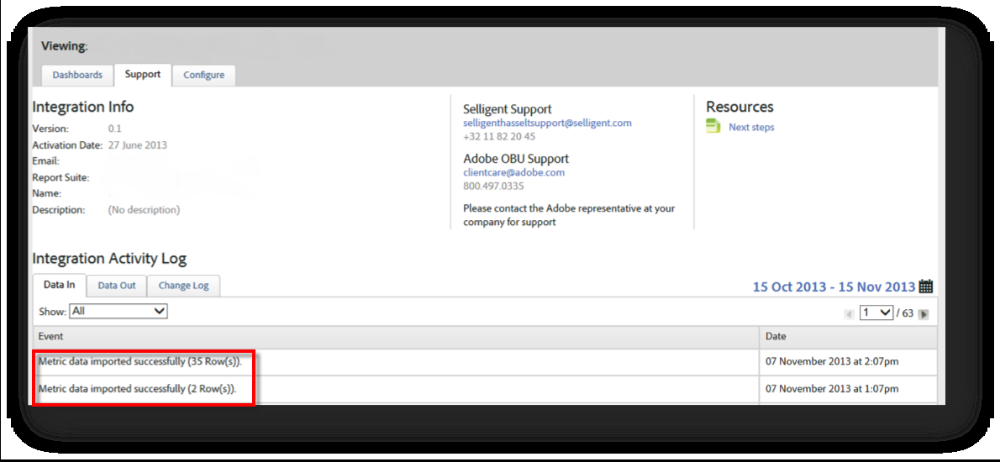

# Verifying the Integration{#verifying-the-integration}

Once all deployment steps have been completed you can validate that the integration is successfully transferring data.

It will take a few days for the data exchange to begin. Please make sure you contact Selligent after you activate the integration.

## Integration Activity Log {#section-927e270495db479fba9578915d9ae9c9}

Navigate to your Selligent Integration within Data Connectors. Under the **[!UICONTROL Support]** tab, you should see events like Metric Data imported and/or Classification Data imported successfully :

## Reporting Data {#section-ebd481a162324e66bd6dc8cb4b8d2424}

View your Selligent Message reports with appropriate metrics.

1. Go to Report & Analytics under Adobe Marketing Cloud. 
1. Select the appropriate Report Suite. 
1. Under **[!UICONTROL Custom Conversion]**, select the **[!UICONTROL Message ID Reports]** and choose **[!UICONTROL Message ID/Message Name]**.

