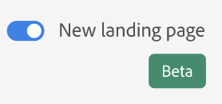
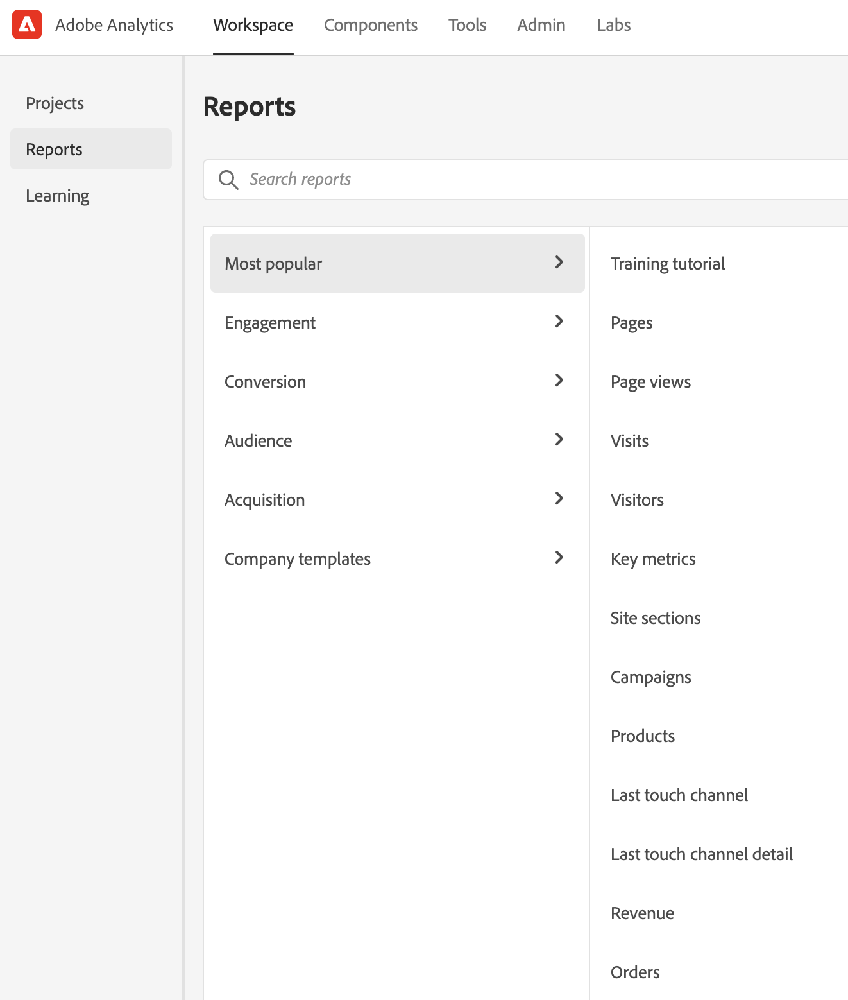

# New Adobe Analytics landing page

The new landing page for Adobe Analytics brings together both Analysis Workspace and Reports & Analytics in a single interface and access point under the Workspace umbrella. It features a new project manager home page, an updated reports menu, modernized reports, and a new learning section to help you with getting started more effectively.

The new page improves discoverability and guides Reports & Analytics users to an improved reporting experience in Workspace.

>[!IMPORTANT]
>
>This landing page will be in Open Beta starting on July 21, 2021. It is an optional starting point. If you prefer, you may use your existing landing page, whether that is Workspace or Reports. If you do decide to opt in to the beta program, access the page and click **[!UICONTROL Provide feedback]** at the top of the screen to log your feedback and any bugs you may encounter. You can opt out of and back in to the beta program at any time. Any work done in the beta user interface carries over into the existing/current Workspace experience.

>[!VIDEO](https://video.tv.adobe.com/v/334278/?quality=12)

## Access the new landing page {#access-landing}

After you log in to Adobe Experience Cloud and Analytics, enable the [!UICONTROL New landing page - Beta] toggle button in the lower left corner. Access to the toggle button is user specific per Organization, not company specific.

## Notice the new menu structure

The top menu and the left rail have changed.

* Top Analytics menu changes: The **[!UICONTROL Reports]** top menu is no longer there. Most of the reports are now in the [!UICONTROL Reports] menu in the left rail.
* The left rail has three tabs: [!UICONTROL Projects], [!UICONTROL Reports], and [!UICONTROL Learning]. We discuss each of them in more detail in the following sections.

### Terminology

Note some changes to terminology:

* **[!UICONTROL Projects]** are things that you have built or that someone else has built and shared with you. [!UICONTROL Projects] also refers to blank projects and blank mobile scorecards.
* **[!UICONTROL Reports]** refers to anything that was pre-built by Adobe, such as reports in Reports & Analytics and templates in Workspace. [!UICONTROL Reports] are also report templates that your company has built for you.
* **[!UICONTROL Templates]** is no longer used as a term for Adobe's pre-built Workspace projects. They are now under [!UICONTROL Reports].

## Navigate the [!UICONTROL Projects] tab {#navigate-projects}

[!UICONTROL Projects] serves as the [!UICONTROL Workspace] home page. Any Workspace projects show up here, including Mobile scorecards.

>[!NOTE]
>
>Several of the following settings persist (are remembered) both throughout the session and across sessions. Examples: Which tab you are on, which filters were selected, which columns were selected, and the column sort direction. Search results are not persisted, however.

| UI element | Definition |
| --- | --- |
| ... More | Lets you [!UICONTROL View Tutorials], and [Edit user preferences](/help/analyze/analysis-workspace/user-preferences.md). |
| Create project | The drop-down menu lets you create a [!UICONTROL Workspace project] or a [!UICONTROL Mobile project]. |
| Show less/more | Toggles between not showing and showing the banner:  |
| Blank project | Creates a blank [Workspace project](https://experienceleague.adobe.com/docs/analytics/analyze/analysis-workspace/home.html?lang=en) for you to populate. |
| Blank mobile scorecard | Creates a blank [mobile scorecard](https://experienceleague.adobe.com/docs/analytics/analyze/mobapp/curator.html?lang=en) for you to populate. |
| Open Training Tutorial | Opens the Workspace training tutorial that guides new users through building a project in a step-by-step fashion.|
| Open release notes | Opens the Adobe Analytics section of the latest Adobe Experience Cloud release notes. |
| Filter icon | You can filter on tags, report suites, owners, types, and other filters (Mine, Shared with me, Favorites, and Approved)  |
| Search bar | The search now includes all columns in the table. |
| Selection box | Clicking this box next to one or more projects displays the project management actions you can perform: Delete, Tag, Pin, Approve, Share, Rename, Copy, and Export to CSV. You may not have permissions to perform all of these actions. |
| Favorites | Favoriting a project puts a star by it and tags it as a favorite that you can filter on.  |
| Name | The name of the project. |
| Pin icon | **New** You can now pin items and they *always* appear at the top of your list. |
| Info (i) icon | Clicking the info icon shows the following info about this project: Type, Project Role, Owner, Description, and who it is shared with. It also indicates who can [edit or duplicate](https://experienceleague.adobe.com/docs/analytics/analyze/analysis-workspace/curate-share/share-projects.html) this project. |
| Ellipsis (...) | Clicking the ellipsis next to a project displays the project management actions you can perform: Delete, Tag, Pin, Approve, Share, Rename, Copy, and Export to CSV. Note that you may not have permissions to perform all of these actions. |
| Type | Indicates whether this type is a Workspace project or a Mobile scorecard. |
| Tags | You can tag reports to organize them into groups. |
| Project Role | Project roles refer to whether you are the project Owner, and whether you have permissions to Edit or Duplicate the project.  |
| Report Suite | Tables and visualizations within a panel derive data from the report suite selected in the top right of the panel. The report suite also determines what components are available in the left rail. Within a project, you can use one or many report suites depending on your analysis use cases. The list of report suites is sorted on relevance. Adobe defines relevance based on how recently and frequently the suite has been used by the current user, and how frequently the suite is used within the organization. |
| Owner | The person who created the project. |
| Last opened | When this project was last opened by you. |
| Column selector | If you want to add or remove columns from the list of projects, you can do so by selecting or deselecting them. |
| < (Back button) | This button in a Workspace project or a report takes you back to your most recent landing page configuration. Whatever page configuration you had when you left the landing page will persist when you return. |

## Navigate the [!UICONTROL Reports] tab {#navigate-reports}

The [!UICONTROL Reports] tab consolidates three sets of reports:

* The pre-built [!UICONTROL Workspace] templates that were previously located under [!UICONTROL Workspace] > [!UICONTROL Project] > [!UICONTROL New]. Adobe no longer uses the word "template" in this context.
* Most of the pre-built reports under the previous Adobe Analytics [!UICONTROL Reports] top menu. These reports are now displayed in [Analysis Workspace](https://experienceleague.adobe.com/docs/analytics/analyze/analysis-workspace/home.html?lang=en).
* Anything your company has built for you.

>[!IMPORTANT]
>
>Under Reports, a Favorites folder shows up only if you mark a new report as a favorite. No pre-existing Reports & Analytics favorites are carried forward.

As previously mentioned, only the most commonly used reports that were formerly grouped in Reports & Analytics are available here. A handful of rarely used or no-longer-relevant reports were not migrated over. See the FAQ below for more detail.

Here are the new menus and their submenus. If you cannot find a specific report, do a "Search on page" to find it.

| Menu item | Reports under this menu item | 
| --- | --- |
| **[!UICONTROL Most Popular]** | <ul><li>Training Tutorial (Pre-existing Workspace template)</li><li>Pages (What are my top pages?)</li><li>Page views (How many page views am I generating?)</li><li>Visits (How many visits am I getting?)</li><li>Visitors (How many visitors am I getting?)</li><li>Key metrics (How are my most important metrics performing?)</li><li>Site sections (Which sections of my site generated the most page views?</li><li>Next page (What are the next pages my visitors go to?)</li><li>Previous page (What are the previous pages my visitors went to?)</li><li>Campaigns (What campaigns are driving my key metrics?)</li><li>Products (What products are driving my key metrics?)</li><li>Last touch channel (Which last touch channel is performing best?</li><li>Last touch channel detail (Which specific last touch channel is outperforming others?)</li><li>Revenue (How is my revenue performing?)</li><li>Orders (How are my orders performing?)</li><li>Units (How many units am I selling?)</li></ul> |
| **[!UICONTROL Engagement]** | <ul><li>Key metrics (How are my most important metrics performing?)</li><li>Page views (How many page views am I generating?)</li><li>Pages (What are my top pages?)</li><li>Visits (How many visits am I getting?)</li><li>Visitors (How many visitors am I getting?)</li><li>Time spent per visit (How much time do my users spend per visit?)</li><li>Time prior to event (How much time do my users spend prior to a success event?)</li><li>Site sections (Which sections of my site generated the most page views?</li><li>Web content consumption (Which content is consumed most and is engaging users?)</li><li>Media content consumption (Which content is consumed most and is engaging users?)</li><li>Next and previous page flow (What are/were the next/previous paths my visitors take/took?)</li><li>Fallout (Where am I seeing fallout through my digital properties?)</li><li>Cross-device analysis (Using cross-device analysis in Analysis Workspace)</li><li>Web retention (Who are my loyal users and what do they do?)</li><li>Media audio consumption (What are trends and top metrics of audio consumption?)</li><li>Media recency, frequency, loyalty (Who are my loyal readers?)</li><li>Page analysis > Reloads (Which pages generate the most reloads?)</li><li>Page analysis > Time spent on page (How much time do my users spend on my pages?)</li><li>Entries & exits > Entry pages (What are my top entry pages?)</li><li>Entries & exits > Original entry pages (What page did my visitor originally enter from?)</li><li>Entries & exits > Single-page visits (Which pages generated the most single-page visits?)</li><li>Entries & exits > Exit pages (What are my top exit pages?)</li></ul> |
| **[!UICONTROL Conversion]** | <ul><li>Products > Products (Which products are driving my key metrics?)</li><li>Products > Product performance (Which products are performing best?)</li><li>Products > Categories (What are my best performing product categories?</li><li>Shopping cart > Carts (How many users added a product to cart?</li><li>Shopping cart > Cart views (How many times did my visitors view their carts?)</li><li>Shopping cart > Cart additions (How often are users adding a product to their cart?)</li><li>Shopping cart > Cart removals (How often are users removing a product from their cart?)</li><li>Purchases > Revenue (How is my revenue performing?)</li><li>Purchases > Orders (How are my orders performing?)</li><li>Purchases > Units (How many units am I selling?)</li><li>[Magento: marketing and commerce](https://experienceleague.adobe.com/docs/analytics/analyze/analysis-workspace/build-workspace-project/starter-projects.html?lang=en#commerce)</li></ul> |
| **[!UICONTROL Audience]** |<ul><li>People metric (How many people are interacting with my brand?)</li><li>Visitor profile > Location overview (Which locations are driving the most usage among users)</li><li>Visitor profile > Geosegmentation > Geo Counties, Geo US States, Geo Regions, Geo Cities, Geo US DMA (Which geographies are my users visiting from?)</li><li>Visitor profile > Languages (Which language do my users prefer?)</li><li>Visitor profile > Time zones (Which time zones are my users visiting from?)</li><li>Visitor profile > Domains (Which ISPs are my visitors using to access my site?)</li><li>Visitor profile > Top level domains (Which domains are driving traffic to my site?)</li><li>Visitor profile > Technology > Technology overview (What technologies are people using to access my site?)</li><li>Visitor profile > Technology > Browsers, Browser type, Browser width, Browser height (Which company's browser, browser version, and its width and height, are people using to access my site?)</li><li>Visitor profile > Technology > Operating system, Operating system types (Which OS and which version of it do my visitors use?)</li><li>Visitor profile > Technology > Mobile carrier (Which mobile carriers do my visitors use to access my site?)</li><li>Visitor retention > Return frequency (How much time passes between my user's current visit and previous visits?)</li><li>Visitor retention > Return visits (How many of my visits are returning users?)</li><li>Visitor retention > Visit number (Which visit number bucket drives most of my key metrics)</li><li>Visitor retention > Sales cycle > Customer loyalty (Which loyalty segment do my users belong to?)</li><li>Visitor retention > Sales cycle > Days before first purchase (How many days passed between my users' first visit and their first purchase?)</li><li>Visitor retention > Sales cycle > Days since last purchase (How many days have passed between my users' current visit and their last purchase? )</li><li>Visitor retention > Mobile > Devices and Device types (Which devices and device types are my visitors using?)</li><li>Visitor retention > Mobile > Manufacturer (Which mobile device manufacturer do my visitors use?)</li><li>Visitor retention > Mobile > Screen size, Screen height, Screen width (Which mobile screen size/height/width do my visitors have?)</li><li>Visitor retention > Mobile > [Mobile app usage](https://experienceleague.adobe.com/docs/analytics/analyze/analysis-workspace/build-workspace-project/starter-projects.html?lang=en#mobile)</li><li>Visitor retention > Mobile > [Mobile app journeys](https://experienceleague.adobe.com/docs/analytics/analyze/analysis-workspace/build-workspace-project/starter-projects.html?lang=en#mobile)</li><li>Visitor retention > Mobile > [Mobile app metrics](https://experienceleague.adobe.com/docs/analytics/analyze/analysis-workspace/build-workspace-project/starter-projects.html?lang=en#mobile)</li><li>Visitor retention > Mobile > [Mobile app messaging](https://experienceleague.adobe.com/docs/analytics/analyze/analysis-workspace/build-workspace-project/starter-projects.html?lang=en#mobile)</li><li>Visitor retention > Mobile > [Mobile app performance](https://experienceleague.adobe.com/docs/analytics/analyze/analysis-workspace/build-workspace-project/starter-projects.html?lang=en#mobile)</li><li>Visitor retention > Mobile > [Mobile app retention](https://experienceleague.adobe.com/docs/analytics/analyze/analysis-workspace/build-workspace-project/starter-projects.html?lang=en#mobile)</li></ul> |
| **[!UICONTROL Acquisition]** |<ul><li>Marketing channels > First touch channel, First touch channel detail (Which first touch channel, and which specific first touch channel is performing best?)</li><li>Marketing channels > First last channel, First last channel detail (Which last touch channel, and which specific last touch channel is performing best?)</li><li>Campaigns > Campaigns (Which campaigns are driving my key metrics?)</li><li>Campaigns > Campaign performance (What campaigns are driving the most revenue?)</li><li>Campaigns > Tracking code (Which campaign tracking codes perform the best?)</li><li>[Web acquisition](https://experienceleague.adobe.com/docs/analytics/analyze/analysis-workspace/build-workspace-project/starter-projects.html?lang=en#web)</li><li>[Mobile acquisition](https://experienceleague.adobe.com/docs/analytics/analyze/analysis-workspace/build-workspace-project/starter-projects.html?lang=en#mobile)</li><li>[Advertising Analytics: paid search](https://experienceleague.adobe.com/docs/analytics/analyze/analysis-workspace/build-workspace-project/starter-projects.html?lang=en#advertising)</li><li>Search keywords - all, paid, natural (Which search keywords and paid/natural search keywords drive my key metrics the best?)</li><li>Search engines - all, paid, natural (Which search engines and paid/natural search engines drive my key metrics the best?)</li><li>All search page ranking (Which search page are my users visiting from?)</li><li>Referring domains (Which domains are driving traffic to my site?)</li><li>Original referring domains (What was the first domain users were on before visiting my site?)</li><li>Referrers (Which URLs were my users on before clicking through to my site?)</li><li>Referrer types (Which category do my referring URLs belong to?)</li></ul> |
| **[!UICONTROL Company reports]** | Reports that your company created for your use. |

### Use the Reports tab

For current users of Reports & Analytics, here is a short intro on how to use the reports you are used to and that now display within Workspace. Reports act like existing templates: if you make changes to them, you get prompted to save/discard your changes when navigating away or to a different report. And if you do want to save changes, it saves the report as a new project.

1. Go to the [!UICONTROL Reports] tab.
1. Select the report you want to view, for example, under [!UICONTROL Most popular], select the [!UICONTROL Pages] report.
1. To the right, click **[!UICONTROL Open report]**.

   

1. The Pages report, as displayed in Analysis Workspace, shows two [visualizations](/help/analyze/analysis-workspace/visualizations/freeform-analysis-visualizations.md) ([Bar chart](/help/analyze/analysis-workspace/visualizations/bar.md) and [Summary number](/help/analyze/analysis-workspace/visualizations/summary-number-change.md)) and a [Freeform table](/help/analyze/analysis-workspace/visualizations/freeform-table/freeform-table.md). The metric used is Occurrences.
1. From here, you have multiple options. Here are some of those options:

   * You can use the report as is.
   * You can drag one or more segments into the Segment drop zone at the top. For example, drag the segment [!UICONTROL Mobile Customers] and watch the results change. 
   * You can change the date range by going to the calendar at the top right.
   * You can add dimension breakdowns, drag in other metrics, and generally customize the report in any way you wish.

More learning options:

* Notice that you have access to a 20-minute video overview of Analysis Workspace at the top left of any report you open.
* For new users, we recommend the [Training Tutorial](https://www.youtube.com/watch?v=lCH1Kl1q9Wk) video that walks you through building a new project.
* Here is a link to the [complete Analysis Workspace documentation](/help/analyze/analysis-workspace/home.md).
* Here is the complete [YouTube playlist for Analysis Workspace](https://www.youtube.com/playlist?list=PL2tCx83mn7GuNnQdYGOtlyCu0V5mEZ8sS).

## Navigate the Learning tab {#navigate-learning}

The Learning page contains hands-on video tours and tutorials, plus links to documentation.

## Navigate the new page

* The [!UICONTROL Workspace Fundamentals] Tour takes you directly to Workspace and walks you through the Workspace layout and where to find/perform the most common actions. This Tour can also be relaunched any time directly in Workspace via the tool tip pop-over from the panel header.

* Clicking a video/tour adds a **[!UICONTROL Viewed]** tag. This tag helps you track your progress through the learning content. You can click the tag and it disappears, in case you have not completed the content yet.

* The **[!UICONTROL Learn more]** button on the video modal takes you to an Adobe Experience League documentation page with more help content related to the video you just watched.  **[!UICONTROL View more videos]** takes you to the full Analysis Workspace YouTube playlist.

## New landing page FAQ {#landing-faq}

| Question | Answer |
| --- | --- |
| Where are the templates that I am used to seeing in Workspace? | These templates are grouped under the [!UICONTROL Reports] tab. |
| Can I opt out of the beta? | You can opt out of the beta at any time. |
| Does the work I do in the beta program UI carry over to the production Workspace experience? | Yes, any work done in the beta carries over to the old/current Workspace experience. |
| Are my current Reports & Analytics favorites carried over? | No, they are NOT carried forward. However, any Workspace Project favorites are carried over. |
| Is there a maximum number of projects I can pin? | No, there is no limit on the number of projects you can pin. |
| Can Admins designate this new landing page for their users? | No, Admins cannot designate the new landing page on behalf of users. Individual users must turn on the toggle themselves. |
| Are all reports that currently exist in Reports & Analytics still available? | No, the following reports were phased out, based on overall usage data: <ul><li>Any custom eVars/props/events/classifications<li>My Recommended Reports</li><li>Hourly/Daily/Weekly/Monthly/Quarterly/Yearly unique visitors</li><li>DailyWeekly/Monthly/Quarterly/Yearly unique customers</li><li>Action name depth</li><li>Action name summary</li><li>Add dashboard</li><li>Age</li><li>Audio support</li><li>Billing information</li><li>Clicks to page</li><li>Color depth</li><li>Cookie support</li><li>Cookies</li><li>Connection types</li><li>Creative elements</li><li>Credit card type</li><li>Cross sell</li><li>Custom event funnels</li><li>Custom links</li><li>Customer ID</li><li>Day of week</li><li>Entry action name</li><li>Exit action name</li><li>Exit links</li><li>Fallout</li><li>File downloads</li><li>Find in store</li><li>Full paths</li><li>Gender</li><li>Hit ype VISTA rule</li><li>Image support</li><li>Java</li><li>JavaScript</li><li>JavaScript version</li><li>Manage bookmarks</li><li>Manage dashboards</li><li>Monitor color depth</li><li>Monitor resolutions</li><li>Newsletter signups</li><li>Next action name</li><li>Next action name flow</li><li>Null searches</li><li>Operating system</li><li>Order review</li><li>Page of day</li><li>Pages not found</li><li>Pathfinder</li><li>Path length</li><li>Previous action name</li><li>Previous action name flow</li><li>Product activity</li><li>Product cost</li><li>Product department</li><li>Product inventory category</li><li>Product name</li><li>Product reviews</li><li>Product season</li><li>Product shares</li><li>Product zooms</li><li>Reload</li><li>Searches</li><li>Servers</li><li>Single page visits</li><li>Shipping information</li><li>Site hierarchy</li><li>Social mentions</li><li>Time of day</li><li>Time spent on action name</li><li>Video support</li><li>Visitor state</li></ul> |
