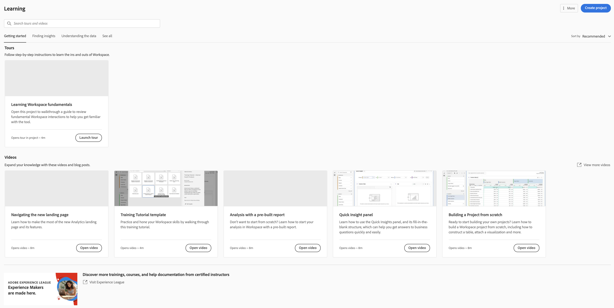

# New Adobe Analytics landing page

The new landing page for Adobe Analysis brings together both Analysis Workspace and Reports & Analytics in a single interface and access point under the Workspace umbrella. It features a new project manager home page, an updated reports menu and modernized reports, as well as a new learning section to help you with getting started more effectively.

The new page improves discoverability and guides Reports & Analytics users to an improved reporting experience in Workspace.

>[!NOTE]
>
>This landing page is currently in Public Beta - it is an optional starting point. If you prefer, you may use your existing landing page, whether that is Workspace or Reports. If you do decide to opt in to the beta program, access the page and click **[!UICONTROL Provide feedback]** at the top of the screen to log your feedback and any bugs you may encounter.

## Access the new landing page {#access-landing}

After you log in to Adobe Experience Cloud and Analytics, enable the [!UICONTROL New landing page - Beta] toggle button in the lower left corner. Note that access to the toggle button is user specific, not company specific.

## Notice the new menu structure

The top menu and the left rail have changed.

* Top Analytics menu changes: The **[!UICONTROL Reports]** top menu is no longer there. Most of the reports are now in the [!UICONTROL Reports] menu in the left rail, but more on that later. 
* The left rail has three tabs: [!UICONTROL Projects]({#navigate-projects}), [!UICONTROL Reports]({#navigate-reports}), and [!UICONTROL Learning]({#navigate-learning}). We will discuss each of them in more detail in the following sections.

### Terminology

Note some changes to terminology:

* **Projects** are things that you have built or that someone else has built and shared with you. "Project" also refers to blank projects and blank mobile scorecards.
* **Reports** refers to anything that was pre-built by Adobe, such as reports in Reports & Analytics and templates in Workspace. "Reports" are also report templates that your company has built for you.
* **Templates** is no longer used as a term for Adobe-built Workspace projects. They are now under "Reports".

## Navigate the [!UICONTROL Projects] tab {#navigate-projects}

[!UICONTROL Projects] serves as the [!UICONTROL Workspace] home page. Any Workspace projects show up here, including Mobile scorecards.

| UI element | Definition |
| --- | --- |
| **Projects** tab |   |
| ... More | Lets you [!UICONTROL View Tutorials], [!UICONTROL Manage projects], and [!UICONTROL Edit user preferences]. |
| Create new | The drop-down menu lets you create a [!UICONTROL Workspace project] or a [!UICONTROL Mobile project]. |
| Show less/more | Toggles between not showing/showing the top banner:  |
| Blank project | Creates a blank [Workspace project](https://experienceleague.adobe.com/docs/analytics/analyze/analysis-workspace/home.html?lang=en) for you to populate. |
| Blank mobile scorecard | Creates a blank [mobile scorecard](https://experienceleague.adobe.com/docs/analytics/analyze/mobapp/curator.html?lang=en) for you to populate. |
| Open Training Tutorial | Opens a training tutorial that guides new users through building a project in a step-by-step fashion.|
| Open release notes | Opens the Adobe Analytics section of the latest Experience Cloud release notes. |
| Filter icon |  |
| Search bar |  |
| Selection box |  |
| Favorites |  |
| Name |  |
| Info (i) icon |  |
| Ellipsis (...) |  |
| Type |  |
| Tags |  |
| Project Role |  |
| Report Suite |  |
| Owner | The person who created the project. |
| Last opened |  |
| Column selector |

## Navigate the [!UICONTROL Reports] tab {#navigate-reports}

The [!UICONTROL Reports] tab consolidates three sets of reports:

* The pre-built [!UICONTROL Workspace] templates that were previously located under [!UICONTROL Workspace] > [!UICONTROL Project] > [!UICONTROL New]. We will no longer use the word "template" in this context.
* Most of the pre-built reports under the previous Adobe Analytics [!UICONTROL Reports] menu located at the top.
* Anything your company has built for you.

As previously mentioned, only the most commonly used reports that were formerly grouped in Reports & Analytics are available here. A handful of rarely used or no-longer-relevant reports were not migrated over. These are:

* My Recommended Reports
* Hourly Unique Visitors
* Daily Unique Visitors
* Weekly Unique Visitors
* Monthly Unique Visitors
* Quarterly Unique Visitors
* Yearly Unique Visitors

Here are the new menus and their submenus:

| Menu item | Reports under this menu item | 
| --- | --- |
| Most Popular | <ul><li>Training Tutorial (Pre-existing Workspace template)</li><li>Pages (What are my top pages?)</li><li>Page Views (How many page views am I generating?)</li><li>Visits (How many visits am I getting?)</li><li>Visitors (How many visitors am I getting?)</li><li>Key Metrics (How are my most important metrics performing?)</li><li>Site sections (Which sections of my site generated the most interest?</li><li>Next Page (What are the next pages my visitors go to?)</li><li>Previous Page (What are the previous pages my visitors went to?)</li><li>Campaigns (What campaigns are driving my key metrics?)</li><li>Products (What products are driving my key metrics?)</li><li>

## Navigate the Learning tab {#navigate-learning}

The Learning page contains hands-on video guides and tutorials, plus links to documentation.

## New landing page FAQ {#landing-faq}

| Question | Answer |
| --- | --- |
| Are all reports that currently exist in Reports & Analytics still available? | No, the following reports were phased out, based on overall usage data: <ul><li>report 1</li><li>report 2</li><li>report 3 </li></ul> |
| Where are the templates that I am used to seeing in Workspace? | These templates are grouped under the [!UICONTROL Reports] tab. |
| What else? | Dunno. |