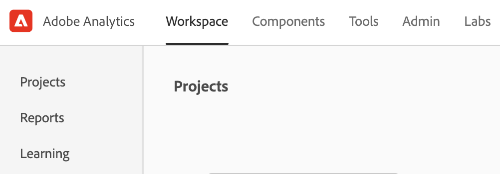

# New Adobe Analytics landing page

The new landing page for Adobe Analysis brings together both Analysis Workspace and Reports & Analytics in a single interface and access point under the Workspace umbrella. It features a new project manager home page, an updated reports menu and modernized reports, as well as a new learning section to help you with getting started more effectively.

The new page improves discoverability and guides Reports & Analytics users to an improved reporting experience in Workspace.

>[!NOTE]
>
>This landing page is currently in Public Beta - it is an optional starting point. If you prefer, you may use your existing landing page, whether that is Workspace or Reports. If you do decide to opt in to the beta program, access the page and click **[!UICONTROL Provide feedback]** at the top of the screen to log your feedback and any bugs you may encounter.

## Access the new landing page {#access-landing}

After you log in to Adobe Experience Cloud and Analytics, enable the [!UICONTROL New landing page - Beta] toggle button in the lower left corner. Note that access to the toggle button is user specific, not company specific.

## Notice the new menu structure

The top menu and the left rail have changed.

* Top Analytics menu changes: The **[!UICONTROL Reports]** top menu is no longer there. Most of the reports are now in the [!UICONTROL Reports] menu in the left rail, but more on that later. 
* The left rail has three tabs: [!UICONTROL Projects], [!UICONTROL Reports], and [!UICONTROL Learning]. We will discuss each of them in more detail in the following sections.

### Terminology

Note some changes to terminology:

* **Projects** are things that you have built or that someone else has built and shared with you. "Project" also refers to blank projects and blank mobile scorecards.
* **Reports** refers to anything that was pre-built by Adobe, such as reports in Reports & Analytics and templates in Workspace. "Reports" are also report templates that your company has built for you.
* **Templates** is no longer used as a term for Adobe-built Workspace projects. They are now under "Reports".

## Navigate the [!UICONTROL Projects] tab {#navigate-projects}

[!UICONTROL Projects] serves as the [!UICONTROL Workspace] home page. Any Workspace projects show up here, including Mobile scorecards.

| UI element | Definition |
| --- | --- |
| **Projects** tab |   |
| ... More | Lets you [!UICONTROL View Tutorials], [!UICONTROL Manage projects], and [!UICONTROL Edit user preferences]. |
| Create new | The drop-down menu lets you create a [!UICONTROL Workspace project] or a [!UICONTROL Mobile project]. |
| Show less/more | Toggles between not showing/showing the top banner:  |
| Blank project | Creates a blank [Workspace project](https://experienceleague.adobe.com/docs/analytics/analyze/analysis-workspace/home.html?lang=en) for you to populate. |
| Blank mobile scorecard | Creates a blank [mobile scorecard](https://experienceleague.adobe.com/docs/analytics/analyze/mobapp/curator.html?lang=en) for you to populate. |
| Open Training Tutorial | Opens a training tutorial that guides new users through building a project in a step-by-step fashion.|
| Open release notes | Opens the Adobe Analytics section of the latest Adobe Experience Cloud release notes. |
| Filter icon |  |
| Search bar |  |
| Selection box |  |
| Favorites |  |
| Name |  |
| Info (i) icon |  |
| Ellipsis (...) |  |
| Type |  |
| Tags |  |
| Project Role |  |
| Report Suite |  |
| Owner | The person who created the project. |
| Last opened |  |
| Column selector |

## Navigate the [!UICONTROL Reports] tab {#navigate-reports}

The [!UICONTROL Reports] tab consolidates three sets of reports:

* The pre-built [!UICONTROL Workspace] templates that were previously located under [!UICONTROL Workspace] > [!UICONTROL Project] > [!UICONTROL New]. We will no longer use the word "template" in this context.
* Most of the pre-built reports under the previous Adobe Analytics [!UICONTROL Reports] menu located at the top.
* Anything your company has built for you.

As previously mentioned, only the most commonly used reports that were formerly grouped in Reports & Analytics are available here. A handful of rarely used or no-longer-relevant reports were not migrated over. See the FAQ below for more detail.

Here are the new menus and their submenus:

| Menu item | Reports under this menu item | 
| --- | --- |
| Most Popular | <ul><li>Training Tutorial (Pre-existing Workspace template)</li><li>Pages (What are my top pages?)</li><li>Page views (How many page views am I generating?)</li><li>Visits (How many visits am I getting?)</li><li>Visitors (How many visitors am I getting?)</li><li>Key metrics (How are my most important metrics performing?)</li><li>Site sections (Which sections of my site generated the most page views?</li><li>Next p age (What are the next pages my visitors go to?)</li><li>Previous page (What are the previous pages my visitors went to?)</li><li>Campaigns (What campaigns are driving my key metrics?)</li><li>Products (What products are driving my key metrics?)</li><li>Last touch channel (Which last touch channel is performing best?</li><li>Last touch channel detail (Which specific last touch channel is outperforming others?)</li><li>Revenue (How is my revenue performing?)</li><li>Orders (How are my orders performing?)</li><li>Units (How many units are we selling?)</li></ul> |
| Engagement | <ul><li>Key metrics (How are my most important metrics performing?)</li><li>Page views (How many page views am I generating?)</li><li>Pages (What are my top pages?)</li><li>Visits (How many visits am I getting?)</li><li>Visitors (How many visitors am I getting?)</li><li>Time spent per visit (How much time do my users spend per visit?)</li><li>Time prior to event (How much time do my users spend prior to a success event?)</li><li>Site sections (Which sections of my site generated the most page views?</li><li>Web content consumption (Which content is consumed most and is engaging users?)</li><li>Media content consumption (Which content is consumed most and is engaging users?)</li><li>Next and previous page flow (What are/were the next/previous paths my visitors take/took?)</li><li>Fallout (Where am I seeing fallout through my digital properties?)</li><li>Cross-device analysis (Using cross-device analysis in Analysis Workspace)</li><li>Web retention (Who are my loyal users and what do they do?)</li><li>Media audio consumption (What are trends and top metrics of audio consumption?)</li><li>Media recency, frequency, loyalty (Who are my loyal readers?)</li><li>Page analysis > Reloads (Which pages generate the most reloads?)</li><li>Page analysis > Time spent on page (How much time do my users spend on my pages?)</li><li>Entries & exits > Entry pages (What are my top entry pages?)</li><li>Entries & exits > Original entry pages (What page did my visitor originally enter from?)</li><li>Entries & exits > Single-page visits (Which pages generated the most single-page visits?)</li><li>Entries & exits > Exit pages (What are my top exit pages?)</li></ul> |
| Conversion | <ul><li>Products > Products (Which products are driving my key metrics?)</li><li>Products > Product performance (Which products are performing best?)</li><li>Products > Categories (What are my best performing product categories?<li><li>Shopping cart > Carts (How many users added a product to cart?<li><li>Shopping cart > Cart views (How many times did my visitors view their carts?)</li><li>Shopping cart > Cart additions (How often are users adding a product to their cart?)</li><li>Shopping cart > Cart removals (How often are users removing a product from their cart?)</li><li>Purchases > Revenue (How is my revenue performing?)</li><li>Purchases > Orders (How are my orders performing?)</li><li>Purchases > Units (How many units am I selling?)</li><li>Magento: marketing and commerce (What is my marketing effectiveness on Commerce?)</li></ul> |
| Audience |<ul><li>People metric (How many people are interacting with my brand?)</li><li>Visitor profile > Location overview (Which locations are driving the most usage among users)</li><li>Visitor profile > Geosegmentation > Geo Counties, Geo US States, Geo Regions, Geo Cities, Geo US DMA (Which geographies are my users visiting from?)</li><li>Visitor profile > Languages (Which language do my users prefer?)</li><li>Visitor profile > Time zones (Which time zones are my users visiting from?)</li><li>Visitor profile > Domains (Which ISPs are my visitors using to access my site?)</li><li>Visitor profile > Top level domains (Which domains are driving traffic to my site?)</li><li>Visitor profile > Technology > Technology overview (What technologies are people using to access my site?)</li><li>Visitor profile > Technology > Browsers, Browser type, Browser width, Browser height (Which company's browser, browser version, and its width and height, are people using to access my site?)</li><li>Visitor profile > Technology > Operating system, Operating system types (Which OS and which version of it do my visitors use?)</li><li>Visitor profile > Technology > Mobile carrier (Which mobile carriers do my visitors use to access my site?)</li><li>Visitor retention > Return frequency (How much time passes between my user's current visit and previous visits?)</li><li>Visitor retention > Return visits (How many of my visits are returning users?)</li><li>Visitor retention > Visit number (Which visit number bucket drives most of my key metrics)</li><li>Visitor retention > Sales cycle > Customer loyalty (Which loyalty segment do my users belong to?)</li><li>Visitor retention > Sales cycle > Days before first purchase (How many days passed between my users' first visit and their first purchase?)</li><li>Visitor retention > Sales cycle > Days since last purchase (How many days have passed between my users' current visit and their last purchase? )</li><li>Visitor retention > Mobile > Devices and Device types (Which devices and device types are my visitors using?)</li><li>Visitor retention > Mobile > Manufacturer (Which mobile device manufacturer do my visitors use?)</li><li>Visitor retention > Mobile > Screen size, Screen height, Screen width (Which mobile screen size/height/width do my visitors have?)</li><li>Visitor retention > Mobile > Mobile app usage

## Navigate the Learning tab {#navigate-learning}

The Learning page contains hands-on video guides and tutorials, plus links to documentation.

## New landing page FAQ {#landing-faq}

| Question | Answer |
| --- | --- |
| Are all reports that currently exist in Reports & Analytics still available? | No, the following reports were phased out, based on overall usage data: <ul><li>My Recommended Reports</li><li>Hourly Unique Visitors</li><li>Daily Unique Visitors</li><li>Weekly Unique Visitors</li><li>Monthly Unique Visitors</li><li>Quarterly Unique Visitors</li><li>Yearly Unique Visitors</li></ul> |
| Where are the templates that I am used to seeing in Workspace? | These templates are grouped under the [!UICONTROL Reports] tab. |
| What else? | Dunno. |