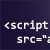

# Adobe Analytics Documentation

Welcome to the Adobe Analytics product and technical documentation home page. Here you can find self-help and support information for reporting tools like [!UICONTROL Analysis Workspace], [!UICONTROL Report Builder], Reporting API, [!UICONTROL Data Workbench], and [!UICONTROL Activity Map]. You can also access documentation for product and user administration, implementation, and all the features supported in Adobe Analytics.

&emsp;[Analytics Tools Guide](/help/analyze/home.md) &ndash; Provides access to [Analysis Workspace](/help/analyze/analysis-workspace/home.md), the premier analysis and visualization tool for Analytics. Also features all the analysis tools ([!UICONTROL Report Buidler], Reporting API, [!UICONTROL Data Workbench], and [!UICONTROL Activity Map]) that you can use in Adobe Analytics.

&emsp;[Admin Guide](/help/admin/home.md) &ndash; Learn about managing users and products in the Experience Cloud Admin Console, configuring report suites, company settings, data governance, server call usage, traffic management, and more.

&emsp;[Implementation Guide](/help/implement/home.md) &ndash; Customize what data is collected to get more out of Adobe Analytics. Includes content on [!UICONTROL Adobe Experience Platform Launch] and JavaScript implementations.

&emsp;[Components Guide](/help/components/home.md) &ndash; Understand the features that help organize your data. Components include segments, calculated metrics, virtual report suites, alerts, and more. This guide also includes a variable reference, explaining all dimensions and metrics available.

&emsp;[Export Guide](/help/export/home.md) &ndash; Get data out of Adobe Analytics: Use [!UICONTROL Data Feeds] to receive an hourly or daily export of raw data. Retrieve a spreadsheet output of data using [!UICONTROL Data Warehouse].

&emsp;[Import Guide](/help/import/home.md) &ndash; Bring data into Analytics from outside sources, either in bulk or real-time. Includes [!UICONTROL Data Sources], [!UICONTROL Data Insertion API], and [!UICONTROL Data Connectors].

&emsp;[Integration Guide](/help/integrate/home.md) &ndash; Configure integrations with other Adobe Experience Cloud solutions, such as Audience Manager, Advertising Cloud, and Target.

&emsp;[Streaming Media Analytics Guide](https://experienceleague.adobe.com/docs/ media-analytics/using/media-overview.html) &ndash; Implement Adobe Analytics for Streaming Media. Includes the Media SDK and the Media Collection API.

&emsp;[Data Workbench Guides](https://experienceleague.adobe.com/docs/ data-workbench/using/home.html) &ndash; Learn about the highly-flexible, powerful, multi-channel capabilities of [!UICONTROL Data Workbench]. Includes [!UICONTROL Data Workbench Client], Installation, [!UICONTROL Dataset Configuration] guides, and more.

&emsp;[Analytics Tech Notes](/help/technotes/home.md) &ndash; A knowledge base containing helpful articles that don't belong to a specific analytics tool or component.

| New and Featured Items | Key Analytics Resources |
| --- | --- |
| <ul><li>[Full Implementation Review](https://experienceleague.adobe.com/docs/analytics/implementation/review/full-review.html)</li><li>[Focused Implementation Review](https://experienceleague.adobe.com/docs/analytics/implementation/review/focused-review.html)</li><li>[Regional Data Collection](/help/technotes/rdc/regional-data-collection.md)</li><li>[Optimize Workspace Performance](/help/analyze/analysis-workspace/workspace-faq/optimizing-performance.md)</li><li>[Analytics Product Comparison](/help/admin/c-analytics-product-comparison/analytics-product-comparison.md)</li><li>[Which Adobe Analytics tool should I use?](/help/admin/c-analytics-product-comparison/which-analytics-tool.md)</li></ul>  See also: [2019 Documentation Updates](doc-updates.md) |<ul><li> [Release Notes](https://experienceleague.adobe.com/docs/ release-notes/experience-cloud/current.html)</li><li> [Adobe Analytics video tutorials](https://experienceleague.adobe.com/docs/ analytics-learn/tutorials/overview.html)</li><li>[Analytics Community Forum](https://forums.adobe.com/community/experience-cloud/analytics-cloud/analytics)</li><li>[In-person training and virtual classes](https://training.adobe.com/training/courses.html#solution=adobeAnalytics)</li><li>[Experience League](https://landing.adobe.com/experience-league/)</li><li>[Contact Customer Care](https://helpx.adobe.com/support/analytics.html)</li></ul>|

<!-- Keep around for now

## Analytics reporting capabilities

Here is a comprehensive list of and links to all the reporting capabilities in Adobe Analytics.

* [Analysis Workspace](/help/analyze/analysis-workspace/home.md)
* [Report Builder](/help/analyze/report-builder/home.md)
* [Data Warehouse](/help/export/data-warehouse/data-warehouse.md)
* [Mobile Services UI](https://experienceleague.adobe.com/docs/ mobile-services/using/home.html)
* [Data Workbench](https://experienceleague.adobe.com/docs/ data-workbench/using/home.html)
* [Reports & Analytics](/help/analyze/reports-analytics/getting-started.md)

### Analytics feature list

*   [Activity Map](/help/analyze/activity-map/activity-map.md)
*   [Anomaly Detection](/help/analyze/analysis-workspace/virtual-analyst/c-anomaly-detection/statistics-anomaly-detection.md)
*   [Bot filtering](/help/admin/admin/bot-removal/bot-rules.md)
*   [Calculated Metrics](/help/components/c-calcmetrics/cm-overview.md)
*   [Classifications](/help/components/classifications/c-classifications.md)
*   [Cohort Analysis](/help/analyze/analysis-workspace/visualizations/cohort-table/cohort-analysis.md)
*   [Contribution Analysis](/help/analyze/analysis-workspace/virtual-analyst/c-anomaly-detection/anomaly-detection.md)
*   [Data Connectors](https://www.adobeexchange.com/experiencecloud.html)
*   [Data Feeds](/help/export/analytics-data-feed/data-feed-overview.md)   
*   [Data Sources](/help/import/c-data-sources/datasrc-home.md)  
*   [Fallout](/help/analyze/analysis-workspace/visualizations/fallout/fallout-flow.md)
*   [Flow](/help/analyze/analysis-workspace/visualizations/c-flow/flow.md)
*   [Intelligent Alerts](/help/components/c-alerts/intellligent-alerts.md)
*   [Mobile App SDK](https://experienceleague.adobe.com/docs/ mobile-services/using/home.html)  
*   [Real-time reporting](/help/components/c-real-time-reporting/realtime.md)
*   [Segmentation](/help/components/segmentation/seg-home.md)
*   [Segment Comparison](/help/analyze/analysis-workspace/c-panels/c-segment-comparison/segment-comparison.md)
*   [Video Tracking](https://experienceleague.adobe.com/docs/ media-analytics/using/media-overview.html)
*   [Virtual Report Suites](/help/components/vrs/vrs-about.md)

## Contact options

Support delegates can get assisted support via:

**In-Product:**

1.  [Sign in to Adobe Analytics.](https://sc.omniture.com/login/)
2.  Navigate to **Help** > **Customer Care**.

**Phone:** 1-800-497-0335 (US & Canada).

Get [phone numbers for other regions](https://helpx.adobe.com/contact/dma-external/DMACustomeCareRegionalPhoneNumbers.html).

**Email:**

1.  Include [case details](https://helpx.adobe.com/experience-cloud/enterprise-email-support-guidelines.html) to open a ticket via email. 
1.  Send your case to [customercare@adobe.com](mailto:customercare@adobe.com).

Not sure if you're a **support delegate**? Find out if this [user type applies to you](https://helpx.adobe.com/experience-cloud/supported-users.html) and learn about our [enterprise support terms](https://helpx.adobe.com/support/programs/enterprise-support-terms.html).
 -->
