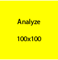
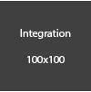
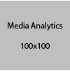
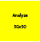
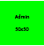
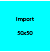
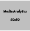
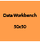

# Adobe Analytics

Banner

## Analytics User Guides Table Grid

| &nbsp; | &nbsp; | &nbsp; |
|--- |--- |--- |
|  |  |  |
|  |  |  |
|  |  |  |

## Analytics User Guides Markdown Table

| User Guide | Description |
|--- |--- |
| [Analytics Tools Guide](/help/analyze/home.md) | The Tools Guide features all the analysis tools you can use in Adobe Analytics. First and foremost, it provides thorough documentation on Analysis Workspace, the premier analysis and visualization tool for Analytics. |
| [Admin Guide](/help/admin/home.md) | The Admin guide covers all Adobe Analytics Admin configuration tasks, such as setting up report suites, users/groups, classifications, or data governance. |
| [Implementation Guide](/help/implement/home.md) | The Implementation walks you through different Adobe Analytics implementation methods, from JavaScript to Launch. |
| [Components Guide](/help/components/home.md) | Analytics components help you fine tune and empower your customer journey analysis. Examples of components include segments, calculated metrics, virtual report suites, and alerts. |
|  [Export Guide](/help/export/home.md) | The Export guide discusses various data export methods, such as data feeds and Data Warehouse. |
|  [Import Guide](/help/import/home.md) | The Import guide explains how to get data into Analytics through data sources, the insertion API, or through data connectors. |
|  [Integration Guide](/help/integrate/home.md) | The Integration guide helps you configure integrations with other Adobe Experience Cloud solutions, such as Audience Manager, Advertising Cloud, or Target. |
|  [Media Analytics Guide](https://docs.adobe.com/content/help/en/media-analytics/using/media-overview.html) | The Media Analytics guide provides instructions on the Media SDK and the Media Collection API. |
|  [Data Workbench Guides](https://marketing.adobe.com/resources/help/en_US/insight/)|The Data Workbench Guide provides instructions on the Data Workbench Client, Installation, Dataset Configuration, and more.|

## Analytics User Guides HTML Table

<table>
<thead>
<tr>
<th>User Guide</th>
<th>Description</th>
</tr>
</thead>
<tbody>
<tr>
<td> <a href="/help/analyze/home.md">Analytics Tools Guide</a></td>
<td>The Tools Guide features all the analysis tools you can use in Adobe Analytics. First and foremost, it provides thorough documentation on Analysis Workspace, the premier analysis and visualization tool for Analytics.</td>
</tr>
<tr>
<td> <a href="/help/admin/home.md">Admin Guide</a></td>
<td>The Admin guide covers all Adobe Analytics Admin configuration tasks, such as setting up report suites, users/groups, classifications, or data governance.</td>
</tr>
<tr>
<td> <a href="/help/implement/home.md">Implementation Guide</a></td>
<td>The Implementation walks you through different Adobe Analytics implementation methods, from JavaScript to Launch.</td>
</tr>
<tr>
<td> <a href="/help/components/home.md">Components Guide</a></td>
<td>Analytics components help you fine tune and empower your customer journey analysis. Examples of components include segments, calculated metrics, virtual report suites, and alerts.</td>
</tr>
<tr>
<td>  <a href="/help/export/home.md">Export Guide</a></td>
<td>The Export guide discusses various data export methods, such as data feeds and Data Warehouse.</td>
</tr>
<tr>
<td>  <a href="/help/import/home.md">Import Guide</a></td>
<td>The Import guide explains how to get data into Analytics through data sources, the insertion API, or through data connectors.</td>
</tr>
<tr>
<td>  <a href="/help/integrate/home.md">Integration Guide</a></td>
<td>The Integration guide helps you configure integrations with other Adobe Experience Cloud solutions, such as Audience Manager, Advertising Cloud, or Target.</td>
</tr>
<tr>
<td>  <a href="https://docs.adobe.com/content/help/en/media-analytics/using/media-overview.html">Media Analytics Guide</a></td>
<td>The Media Analytics guide provides instructions on the Media SDK and the Media Collection API.</td>
</tr>
<tr>
<td>  <a href="https://marketing.adobe.com/resources/help/en_US/insight/">Data Workbench Guides</a></td>
<td>The Data Workbench Guide provides instructions on the Data Workbench Client, Installation, Dataset Configuration, and more.</td>
</tr>
</tbody>
</table>

## Key Analytics resources

* [Getting Started](https://helpx.adobe.com/analytics/get-started.html)
* [Videos](https://helpx.adobe.com/analytics/kt/index/analytics-videos.html)
* [Developer](https://marketing.adobe.com/resources/help/en_US/reference/developer.html)
* [Experience Cloud Learn & Support](https://helpx.adobe.com/support/experience-cloud.html)
* [Experience League](https://landing.adobe.com/experience-league/)
* [Contact Support](https://helpx.adobe.com/contact/enterprise-support.ec.html)
* [Analytics Forum](https://forums.adobe.com/community/experience-cloud/analytics-cloud/analytics)
* [Adobe Training and Tutorials](https://helpx.adobe.com/learning.html?promoid=KAUDK)
