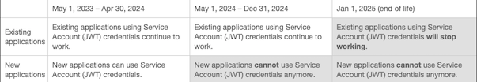

# Current Adobe Analytics release notes (June 2023)

**Last update**: June 1, 2023

Adobe Analytics releases operate on a [continuous delivery model](releases.md) which allows for a more scalable, phased approach to feature deployment. Accordingly, these release notes get updated several times a month. Please check them regularly.

## New or updated features in Adobe Analytics {#features}

| Feature | Description | [Rollout starts](releases.md) | [General Availability](releases.md) |
| ----------- | ---------- | ------- | ---- |
| **Delete rows containing dynamic dimensions from a Freeform table** | In a Freeform table in Analysis Workspace, you can now quickly delete specific rows that contain dynamic dimensions using the x icon. When doing so, a "Always exclude items" filter rule is automatically applied.
Previously, the only way to delete rows that contained dynamic dimensions was to manually create a rule in the Filter dialog. [Learn more](/help/analyze/analysis-workspace/visualizations/freeform-table/filter-and-sort.md)
 | N/A | May 17, 2023 |
| **New button to add a visualization within a panel** | A new button is now available at the bottom of each panel in Analysis Workspace, allowing you to quickly add a visualization. 
Previously, the only methods for adding a visualization to a panel were to drag a visualization from the left rail, duplicate or copy an existing visualization, or create a blank panel. [Learn more](/help/analyze/analysis-workspace/visualizations/freeform-analysis-visualizations.md)
 | N/A | May 17, 2023 |
| **Deep Linking (Mobile App)** | Allows users to send links to scorecards that will lead them directly to the scorecard project in the app. This makes it even easier to share projects and boost engagement from a less technical audience. [Learn more](https://experienceleague.adobe.com/docs/analytics/analyze/mobapp/create-scorecard.html#share-scorecards-using-a-shareable-link) | N/A | May 17, 2023 |
| **Link sharing for projects (no login required)** | You can now share read-only links to Analysis Workspace projects with people who don't have access to Adobe Analytics. This includes sharing with people outside of your organization, or those within your organization who are not provisioned for Adobe Analytics. [Learn more](https://experienceleague.adobe.com/docs/analytics/analyze/analysis-workspace/curate-share/share-projects.html?lang=en#share-public-link)
This functionality is enabled by default and can be disabled by the system administrator. [Learn more](https://experienceleague.adobe.com/docs/analytics/analyze/analysis-workspace/user-preferences.html?lang=en#company-preferences)
 | May 3, 2023 | June 7, 2023 |
| **Classification sets - consolidation** |   |  | June 7, 2023 |
| **Classification sets - rule builder** |  |  | June 7, 2023 |
| **Classification sets - automated import** |  |  | June 7, 2023 |
| **Secure destinations for data feed export** | Data feeds can now be sent to the following cloud storage destinations:<ul><li>Amazon S3</li><li>Azure RBAC</li><li>Azure SAS</li><li>Google Cloud Platform</li></ul>Destinations that were previously available (FTP, SFTP, S3, and Azure Blob) are no longer recommended. |  | June 12, 2023 |
| **Bot reporting in Workspace** | Bot reporting is now available in Analysis Workspace. This feature comes with several additions:<ul><li>A new dimension: [Bot name](/help/components/dimensions/bot-name.md)</li><li>Two new metrics: [Bot page views](/help/components/metrics/bot-page-views.md) and [Bot occurrences](bot-occurrences.md).</li><li>
A new calculated metric template: [Bot page views ratio](/help/components/c-calcmetrics/cm-reference/default-calcmetrics.md)</li><li>A new Workspace report: Bot reporting</li></ul>
The new dimension and metrics contain data that is backfilled starting in March 2023. | | June 28,2023 |
| **Dynamic drop-down filters** | We are introducing a new type of drop-down filter that determines available values based on data within the panel's reporting range and values in other drop-down filters. You can use dynamic drop-down filters by dragging a dimension into the panel dropzone while holding [!UICONTROL Shift]. Static drop-down filters remain unchanged by dragging a group of dimension items into the panel dropzone while holding [!UICONTROL Shift]. [Learn more](/help/analyze/analysis-workspace/c-panels/panels.md) |  | June 28, 2023 |
| **Updated Analytics Learning page** | The Learning tab on the Adobe Analytics landing page now contains the following enhancements:<ul><li>Improved design that shows more learning content on a single page with improved navigation</li><li>Ability to personalize learning content by experience level (Beginner, Intermediate, and Advanced)</li></ul>
[Learn more]() |  | June 30,2023 |

{style="table-layout:auto"}

## Fixes in Adobe Analytics

## Important notices for Adobe Analytics administrators {#admin}

| Notice | Date Added or Updated  | Description |
| ----------- | ---------- | ---------- |
| **37-month expiration of Purchase IDs and Event IDs (event serialization)**  | May 25,2023 | An upcoming release of the Analytics Hit processing engine, targeted for release in **late June 2023 or early July 2023**, will start enforcing a 37-month expiration of Purchase IDs and Event IDs (event serialization). Currently, Purchase IDs and Event IDs never expire in Adobe Analytics. Once a Purchase ID or Event ID is seen/used, then any future hit, no matter when, will have that purchase or event marked as a duplicate. With the new processing engine release:<ul><li>Purchase IDs and Event IDs always expire after 37 months.</li><li>If it has been 37 months since the Purchase ID or Event ID was seen, it is no longer considered a duplicate purchase or event.</li><li> If you are "reusing" Purchase IDs or Event IDs from more than 37 months ago, they are no longer considered duplicates.</li></ul> |
| **Migration to AdobeIO OAuth Server-to-Server credentials** | May 11, 2023 | Adobe Analytics API and Livestream customers using AdobeIO JWT credentials must migrate to AdobeIO OAuth Server-to-Server credentials by **January 1, 2025**. For more details and timelines, see the end-of-life notice in the table below.|
| **New IPs used by Adobe Analytics Data Feeds and Data Warehouse egress in the London Data Center** | April 27, 2023 | This concerns customers in the London Data Center that have Data Feed requests and/or Data Warehouse reports being delivered to an FTP/SFTP service. The following IP address ranges should be added to your firewall configuration in order to allow access: <ul><li>130.248.244.32/29</li><li>130.248.244.40/29</li></ul> |

{style="table-layout:auto"}

## End-of-life (EOL) notices {#eol}

| EOL Product or Feature | Date added or updated | Description |
| --- | --- | --- |
| **Migration to AdobeIO OAuth Server-to-Server credentials** | May 11, 2023 |  Adobe Analytics API and Livestream customers using AdobeIO JWT credentials must migrate to AdobeIO OAuth Server-to-Server credentials by **January 1, 2025**. AdobeIO will not allow new JWT credentials to be created beginning May 1, 2024. Customers using JWT must create a new OAuth Server-to-Server credential or migrate their existing JWT credential to an OAuth Server-to-Server credential. Customers must also update their client applications to use the new OAuth Server-to-Server credentials. <ul><li>[Migrating from Service Account (JWT) credentials](https://developer.adobe.com/developer-console/docs/guides/authentication/ServerToServerAuthentication/migration/)</li><li>[Using the new OAuth Server-to-Server credentials](https://developer.adobe.com/developer-console/docs/guides/authentication/ServerToServerAuthentication/implementation/)</li><li>[FAQs](https://developer.adobe.com/developer-console/docs/guides/authentication/ServerToServerAuthentication/faqs/)</li></ul> |
| **EOL for [!DNL Reports & Analytics]** | March 7, 2023 | Effective **December 31, 2023**, Adobe intends to discontinue [!DNL Reports & Analytics] and its accompanying reports and features. The reports, visualizations, and underlying technology that power [!DNL Reports & Analytics] no longer meet Adobe's technology standards. Most [!DNL Reports & Analytics] features are available in [Analysis Workspace](https://experienceleague.adobe.com/docs/analytics/analyze/analysis-workspace/home.html). Since the release of Analysis Workspace in 2015, [!DNL Reports & Analytics] functionality and capabilities have been moved to Analysis Workspace and a threshold of workflow parity has been reached. [This notice](https://spark.adobe.com/page/6WnF8JK6IRDhf/) explains the end-of-life process.
On December 31, 2023, we will terminate many of the associated Reports & Analytics features, including, but not limited to: Scheduled Reports, Data Extracts, and DL Reports. After Dec 31, 2023, any scheduled reports will no longer be sent. In **April 2023**, any reports that were scheduled to expire beyond Dec 31, 2023, will automatically be updated and reverted to expire on Dec 31, 2023. In addition, you can no longer schedule future reports beyond December 31, 2023.|
| **EOL of [!UICONTROL Publishing Lists] feature** | September 29, 2022 | As part of the EOL of Reports & Analytics, [!UICONTROL Publishing Lists] are slated to reach end-of-life in **December 2023**. You will not be able to create new or access existing [!UICONTROL Publishing Lists] to send or schedule [!UICONTROL Analysis Workspace] projects. |
| **EOL for Data Workbench** | September 14, 2022 | Adobe intends to end-of-life Data Workbench effective **December 31, 2023**. See [Data Workbench end-of-life announcement](https://experienceleague.adobe.com/docs/data-workbench/using/eol.html) for details. Contact your organization's Adobe Account Manager with any questions. |

{style="table-layout:auto"}

## AppMeasurement

For the latest updates on AppMeasurement releases (Version 2.23.0), please refer to [AppMeasurement for JavaScript release notes](https://experienceleague.adobe.com/docs/analytics/implementation/appmeasurement-updates.html).

## Related resources

* [Previous release notes for 2022](/help/release-notes/2022.md)
* [Customer Journey Analytics release notes](https://experienceleague.adobe.com/docs/analytics-platform/using/releases/latest.html)
* [Media Analytics release notes](https://experienceleague.adobe.com/docs/media-analytics/using/additional-resources/release-notes.html)
* The latest release updates for [Adobe Experience Cloud products](https://business.adobe.com/products/adobe-experience-cloud-products.html)
