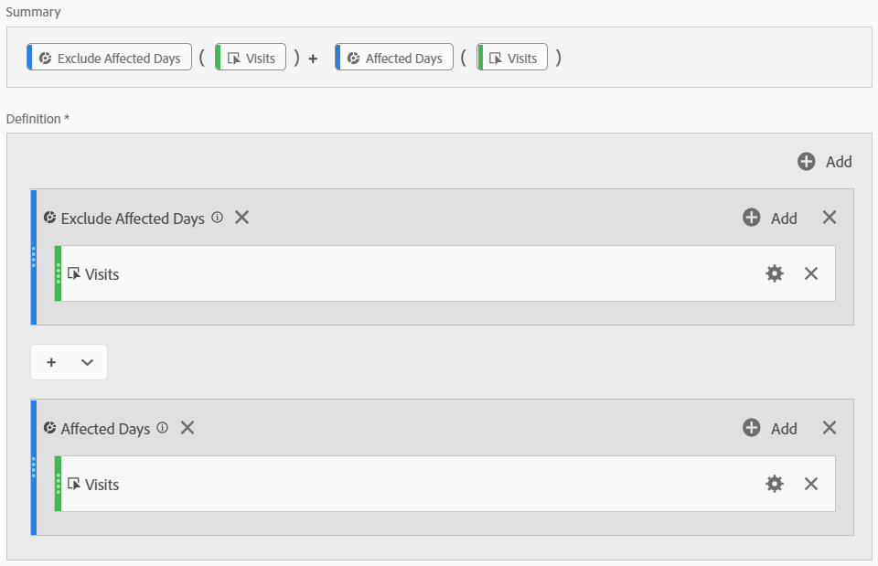
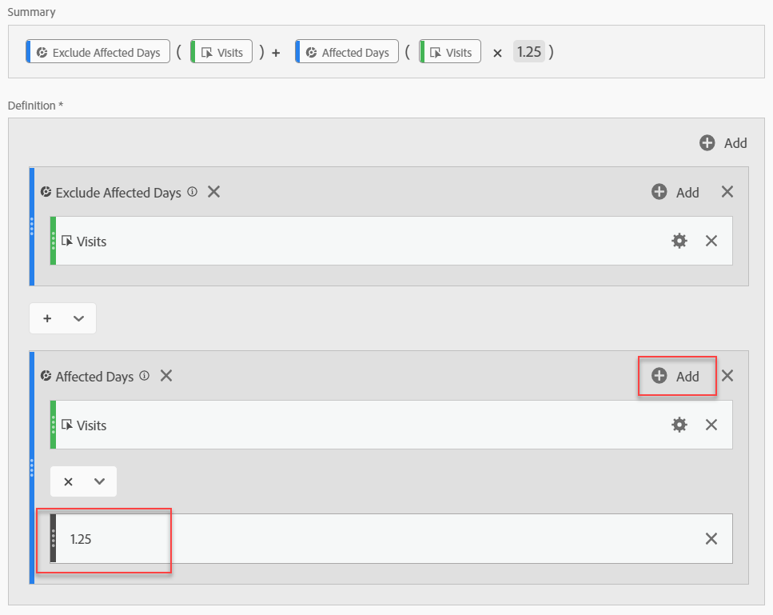
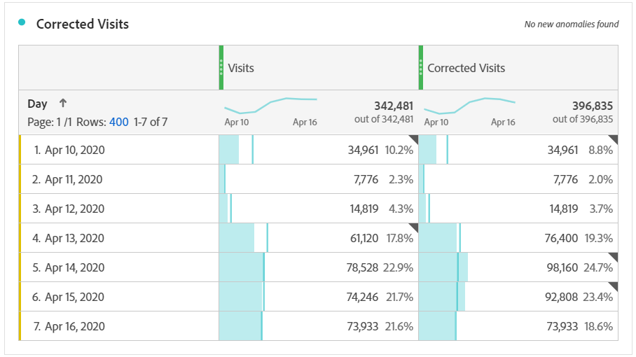
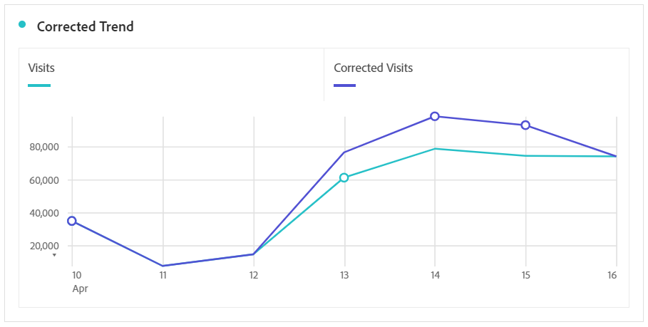

# Derive data impacted by events

If you have data [impacted by an event](overview.md), you can use calculated metrics to derive estimated values for the duration of the event. For example, if you had an event that caused a 25% drop in data, you can use that as a multiplier in a calculated metric.

These steps work best when you understand the impact of an event, both from a segmentation and date comparison perspective. Make sure to follow [Compare dates impacted by an event to previous ranges](compare-dates.md) and [Exclude specific dates in analysis](segments.md) before following this page.

>[!NOTE]
>
>This approach is an estimate based on a specific set of inputs and date ranges. It will not be a comprehensive solution for all use cases or slices of data. In addition, this approach requires that the affected date range have at least 1 hit to calculate from.

To create an estimated calculated metric for the affected time period:

1. Create two segments for 'Affected days' and 'Exclude affected days', as outlined under [Exclude specific dates in analysis](segments.md).
2. Navigate to **[!UICONTROL Components]** > **[!UICONTROL Calculated metrics]**.
3. Click **[!UICONTROL Add]**.
4. Drag both of the above segments to the definition canvas. Change the operator between them to a `+` to sum them.
5. Add the desired metric inside both segments. For example, you could use the 'Visits' metric.

   

6. Click **[!UICONTROL Add]** in the upper right of the 'Affected days' container, then click **[!UICONTROL Static number]**. Set the static number to the percent that you want to offset your data, as outlined under [Compare dates impacted by an event to previous ranges](compare-dates.md). In this example, the offset is 25%, or 1.25.

   

7. Apply the "corrected" metric side-by-side in a trended freeform table. All days outside the event reflect their normal metric count, while all affected days use the multiplier offset.

   

8. View the data in a line visualization to see the effect of your corrected metric.

   
