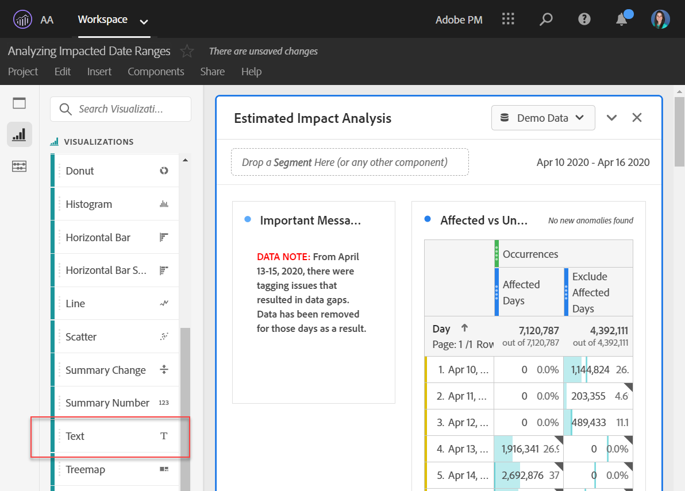
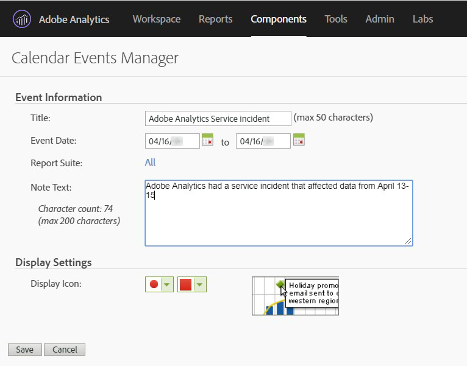

# Communicate event impact to users

If you have data [impacted by an event](overview.md), it is important to communicate that event to users in your organization. The following sections show different ways that you can communicate with users in your organization within Adobe Analytics.

## Communicate through panel or visualization descriptions

If you have a workspace project shared among users in your organization, you can communicate the impact of an event through panel or visualization descriptions. Right-click a panel or visualization title, then select **[!UICONTROL Edit description]**.

## Communicate through text box visualizations

You can also communicate impact of an event through dedicated text box visualizations. See [Text visualizations](/help/analyze/analysis-workspace/visualizations/text.md) in the Analyze user guide.

## Use a calendar event in Reports & Analytics

If you use Reports & Analytics, you can use a [calendar event](/help/components/t-calendar-event.md) to highlight affected days in any trended report. This method does not apply to Analysis Workspace.

1. Navigate to **[!UICONTROL Components]** > **[!UICONTROL Calendar events]**.
2. Enter the desired title, date range, and note text.
3. Click **[!UICONTROL Save]**.

