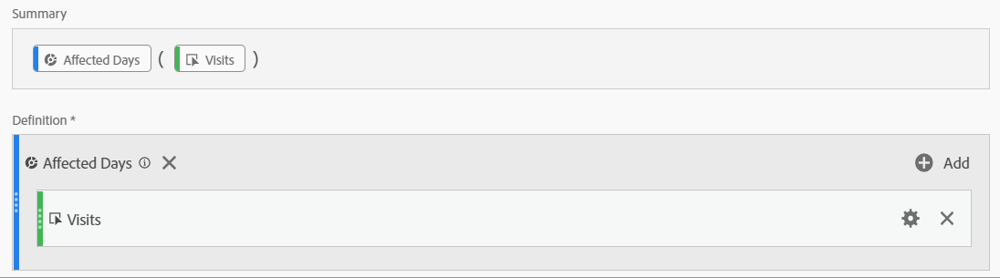

# Communicate event impact to users

If you have data [impacted by an event](overview.md), it is important to communicate that event to users in your organization.

* Develop a common disclaimer that you can use in communications for consistency
* Provide ongoing communication to Analytics users and key stakeholders during and after the event
* Place a calendar reminder for subsequent milestones, such as the following month or year. This communication in the future helps remind users viewing reports the impact in month-over-month or year-over-year reports.

Within Adobe Analytics, the following sections show different ways that you can communicate with users in your organization. You can also use other methods outside of Adobe Analytics, such as email, to communicate with users.

## Communicate through panel or visualization descriptions

If you have a Workspace project shared among users in your organization, you can communicate the impact of an event through panel or visualization descriptions. Right-click a panel or visualization header, then select **[!UICONTROL Edit description]**.

## Communicate through text visualizations

You can also communicate impact of an event through dedicated text visualizations. See [Text visualizations](/help/analyze/analysis-workspace/visualizations/text.md) in the Analyze user guide.

## Add custom calendar events to trends in Workspace

For any trended visualization in Workspace, you can add in a series that represents your impacted date range.

1. Create a calculated metric with the 'Affected days' segment by following [Exclude specific dates in analysis](segments.md).
1. Add the desired metric to calculated metric canvas.

   

1. Add a title and description informing users of the impact. You can also tag this metric as a calendar annotation if desired.

   

1. In a freeform table, add the 'Day' dimension. Add 'Visits' and your calculated metric as columns side-by-side.

   

1. Click the column settings gear icon for your calculated metric, and enable **[!UICONTROL Interpret zero as no value]**.

   

1. Add a Line visualization. Affected days are represented with a different color. Users can also click the 'Info' icon in the calculated metric for more information.

   

## Use a calendar event in Reports & Analytics

If you use Reports & Analytics, you can use a [calendar event](/help/components/t-calendar-event.md) to highlight affected days in any trended report. This method does not apply to Analysis Workspace.

1. Navigate to **[!UICONTROL Components]** > **[!UICONTROL All components]** > **[!UICONTROL Calendar events]**.
2. Enter the desired title, date range, and note text.
3. Click **[!UICONTROL Save]**.

