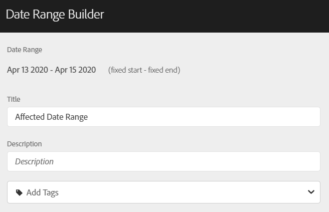
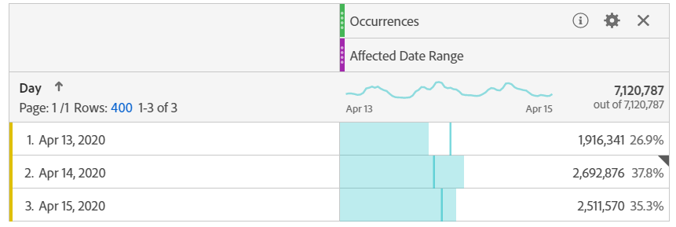
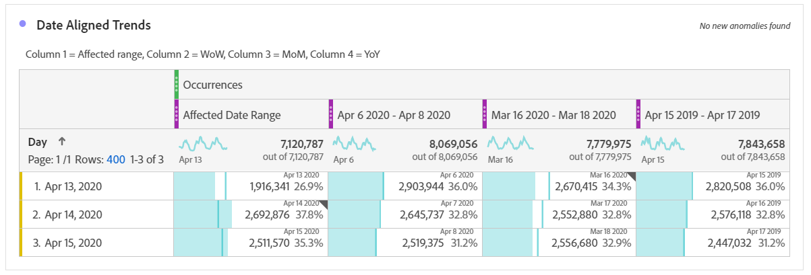
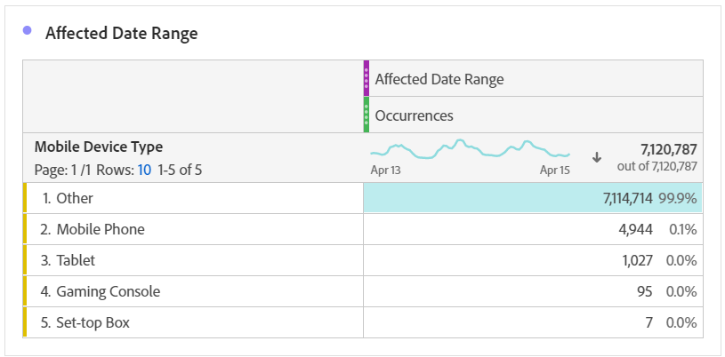
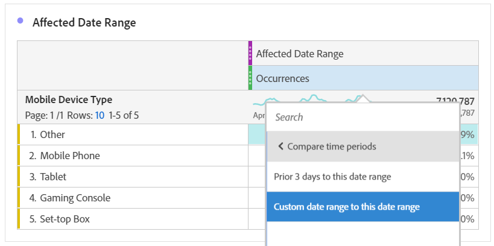
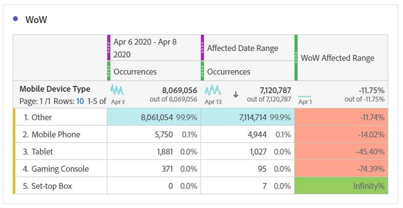
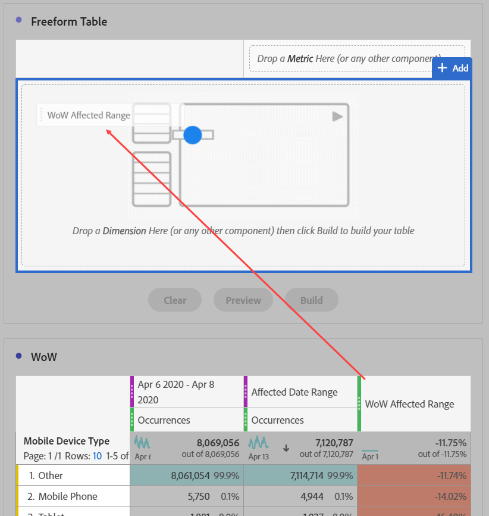
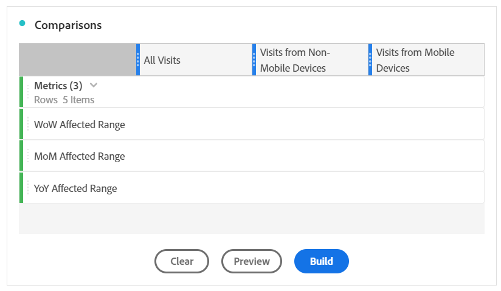
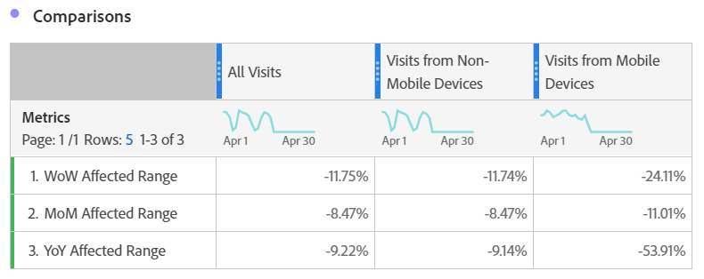

# Compare dates impacted by an event to previous ranges

If you have data [impacted by an event](overview.md), you can look at historical trends to gauge its impact. This comparison is valuable to understand just how much an event impacts your data, so you can decide whether to exclude the data, add a note to reports, or ignore it.

## Create a date range that includes the event

Create a date range that encompasses the event to begin exploring the impact of that event.

1. Navigate to **[!UICONTROL Components]** > **[!UICONTROL Date ranges]**.
2. Click **[!UICONTROL Add]**.
3. Select the date range where the event occurred. Click **[!UICONTROL Save]**.

   

## View event dates and similar prior ranges side-by-side

You can compare any metric between the date range of the event with similar prior date ranges using a freeform table visualization.

1. Open a Workspace project, and add the 'Day' dimension to the freeform table. Apply the recently created date range stacked on a metric, such as 'Occurrences'.

   

2. Right click the date range, then click **[!UICONTROL Add time period column]** > **[!UICONTROL Custom date range to this date range]**.
   * For a week-over-week comparison, select the range of the event minus 7 days. Make sure that the days of the week between the event and this date range are aligned.
   * For a month-over-month comparison, select the range of the event last month. You can also select the range of the event minus 28 days if you want to align days of the week.
   * For a year-over-year comparision, select the range of the event last year.
3. When you select the desired date range, they are added to your freeform table. You can right click and add as many date ranges as you'd like to compare.

   

## Calculate percent differences between the event and similar prior ranges

Compare dimension items between an event's date range and similar prior date ranges using a freeform table visualization. These steps illustrate a week-over-week example that you can follow.

1. Open a Workspace project, and add a **non-time dimension** to the freeform table. For example, you could use the 'Mobile device type' dimension. Apply the recently created date range stacked on a metric, such as 'Occurrences':

   

2. Right click the date range, then click **[!UICONTROL Compare time periods]** > **[!UICONTROL Custom date range to this date range]**. Select the range of the event minus 7 days. Make sure that the days of the week between the event and this date range are aligned.

   

3. Rename the resulting "Percent Change" metric to something more specific, such as "WoW Affected Range". Click the info icon then click the edit pencil to edit the metric name.

   

4. Repeat steps 3 and 4 for month-over-month and year-over-year comparisons. You can do this action in the same table or separate tables.

## Analyze comparison date ranges side-by-side as rows

If you want to further analyze the above percent changes, you can convert them to rows.

1. Add a freeform table visualization and enable the table builder. This action lets you place the percent change metrics in the desired order.
2. Hold `Ctrl` (Windows) or `Cmd` (Mac) and drag the 3 percent change metrics into the rows of the table, one at a time.

   

3. Add the 'All visits' segment to the column of the table, and any other desired segments.

   

4. Click **[!UICONTROL Build]**. From the resulting table, you can view the affected ranges versus the prior week, month, and year across any desired segments.

   
