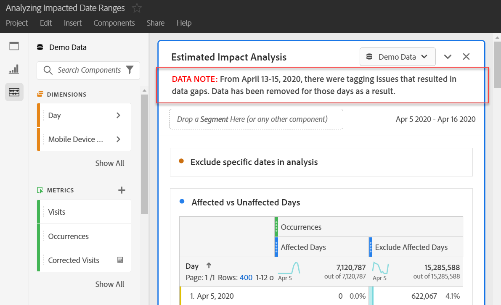
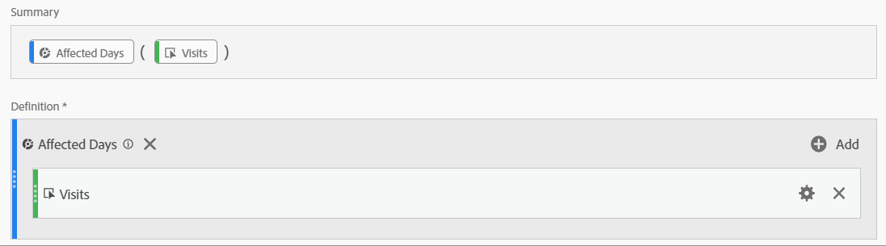
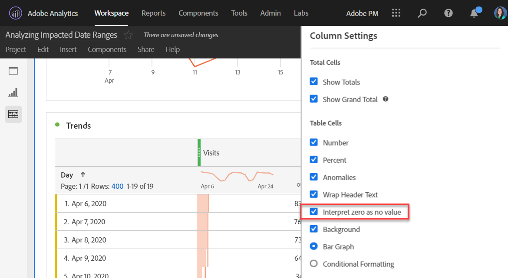

# Communicate impact to users

If you have data [impacted by an event](../event-impacted.md), it is important to communicate that event to users in your organization. The following sections show different ways that you can communicate with users in your organization.

## Communicate through panel or visualization descriptions

If you have a Workspace project shared among users in your organization, you can communicate the impact of an event through panel or visualization descriptions. Right-click a panel or visualization header, then select **[!UICONTROL Edit description]**.

## Communicate through text visualizations

You can also communicate impact of an event through dedicated text visualizations. See [Text visualizations](/help/analyze/analysis-workspace/visualizations/text.md) in the Analyze user guide.

## Add custom calendar events to trends in Workspace

For any trended visualization in Workspace, you can add in a series that represents your impacted date range.

1. Create a calculated metric with the 'Affected days' segment from following [Exclude specific dates in analysis](/help/components/c-segmentation/use-cases/exclude-date-range.md).
1. Add the desired metric to calculated metric canvas.

   

1. Add a title and description informing users of the impact. You can also tag this metric as a calendar annotation if desired.

   

1. In a freeform table, add the 'Day' dimension. Add 'Visits' and your calculated metric as columns side-by-side.

   

1. Click the column settings gear icon for your calculated metric, and enable **[!UICONTROL Interpret zero as no value]**.

   

1. Add a Line visualization. Your affected days are represented with a different color. Users can also click the 'Info' icon in the calculated metric for more information.

   

## Use a calendar event in Reports & Analytics

If you use Reports & Analytics, you can use a [calendar event](/help/components/t-calendar-event.md) to highlight affected days in any trended report. This method does not apply to Analysis Workspace.

1. Navigate to **[!UICONTROL Components]** > **[!UICONTROL Calendar events]**.
2. Enter the desired title, date range, and note text.
3. Click **[!UICONTROL Save]**.

