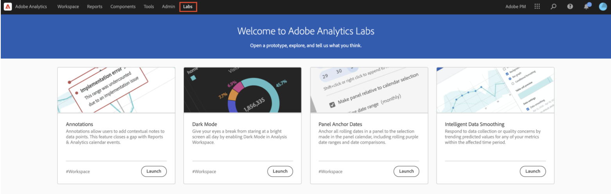
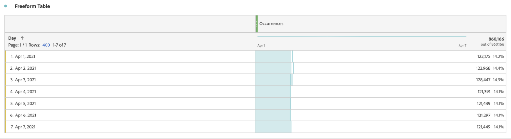
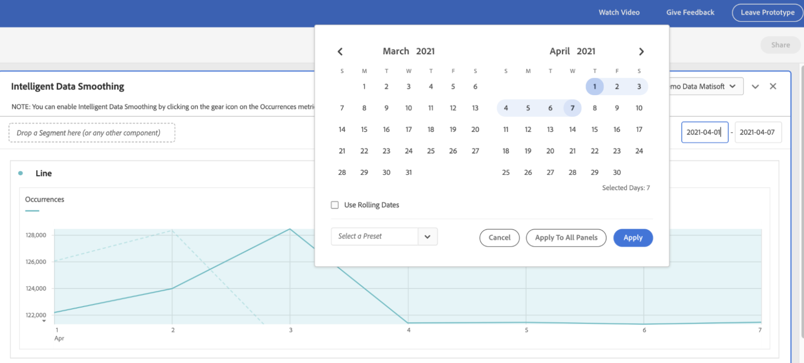
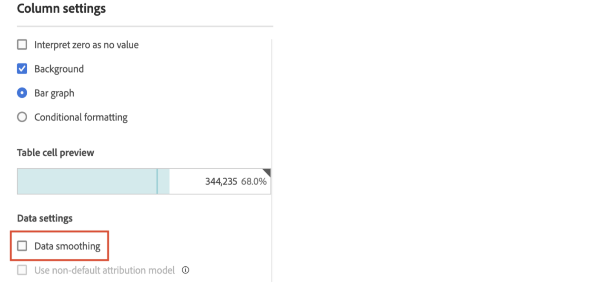
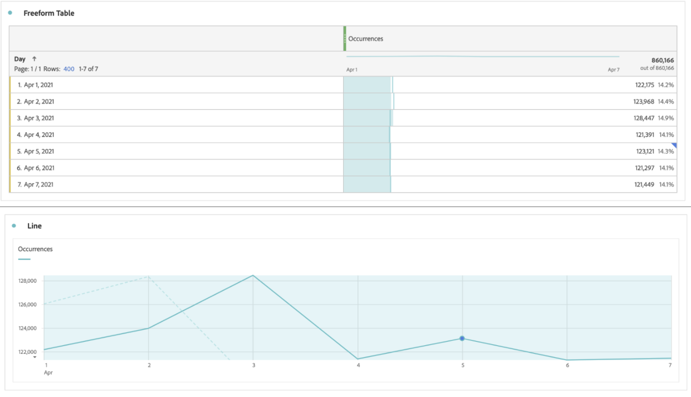

# Intelligent Data Smoothing

On rare occasions, some factors can impact data quality. Bot traffic, implementation changes, or service disruptions can all impact the integrity of the data collected. They also complicate analysis on how the event may have affected data completeness.  

Intelligent Data Smoothing is a prototype in [Analytics Labs](/help/analyze/labs.md) that can help complete this view by analyzing historical trends to predict the value of any metric within the affected time period. The prototype applies advanced machine learning algorithms to plot the expected values for metrics over the time period being analyzed.

## Run Intelligent Data Smoothing

1. Navigate to Adobe Analytics Labs:
   
1. Launch the Intelligent Data Smoothing prototype.
   
1. Add the metric that must be analyzed to the Freeform table. The prototype only works with a daily granularity, so make sure that the dimension in the table is Day.
   
1. Choose a date range that is wider than the window of the event but make sure it includes the event. 
   
1. Click the gear icon for the metric in the Freeform table.
   
1. Under [!UICONTROL Data Settings], select the [!UICONTROL Data smoothing] option.
   
1. Select the date/date range corresponding to the event and click [!UICONTROL Apply]. 
   Ensure that the data range for Data smoothing is a subset of the date range selected for the panel. The metric in the table and graph are replaced by the predicted values. 
   
